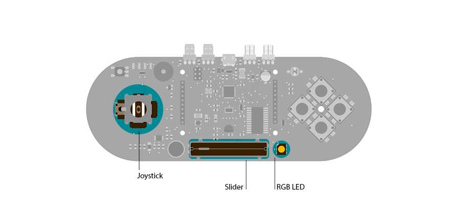

## Led Show

This example shows you how to read the values from the joystick.  The output will be displayed through the serial monitor and as a color on the RGB LED.

The joystick has two axes, X and Y. Each axis controls a color of the RGB LED: red with the X-axis, and green with the Y-axis. The brightness of the blue element will be controlled by the position of the linear potentiometer.

## Hardware Required

- Arduino Esplora

## Circuit

Only your Arduino Esplora is needed for this example.



 

## Code

The RGB LED is comprised of three colors that represent the three primary colors: red, green, and blue.
Each of these light's brightness is individually controllable with functions in the Esplora library:

- [writeRed()](https://www.arduino.cc/en/Reference/EsploraWriteRed)
- [writeGreen()](https://www.arduino.cc/en/Reference/EsploraWriteRed)
- [writeBlue()](https://www.arduino.cc/en/Reference/EsploraWriteRed)

If you want to control all the colors with one instruction you can use the [writeRGB()](https://www.arduino.cc/en/Reference/EsploraWriteRGB) function.

Moving  the joystick and changing the position of the linear potentiometer will generate different values. These values are used to produce two different outputs: one will appear by opening the serial monitor, and the other is displayed physically through the RGB led.

```arduino

/*

  Esplora LED Show

  Makes the RGB LED bright and glow as the joystick or the

  slider are moved.

  Created on 22 november 2012

  By Enrico Gueli <enrico.gueli@gmail.com>

  Modified 22 Dec 2012

  by Tom Igoe

*/
#include <Esplora.h>

void setup() {

  // initialize the serial communication:

  Serial.begin(9600);
}

void loop() {

  // read the sensors into variables:

  int xAxis = Esplora.readJoystickX();

  int yAxis = Esplora.readJoystickY();

  int slider = Esplora.readSlider();

  // convert the sensor readings to light levels:

  byte red   = map(xAxis, -512, 512, 0, 255);

  byte green = map(yAxis, -512, 512, 0, 255);

  byte blue  = slider / 4;

  // print the light levels:

  Serial.print(red);

  Serial.print(' ');

  Serial.print(green);

  Serial.print(' ');

  Serial.println(blue);

  // write the light levels to the LED.

  Esplora.writeRGB(red, green, blue);

  // add a delay to keep the LED from flickering:

  delay(10);
}
```
