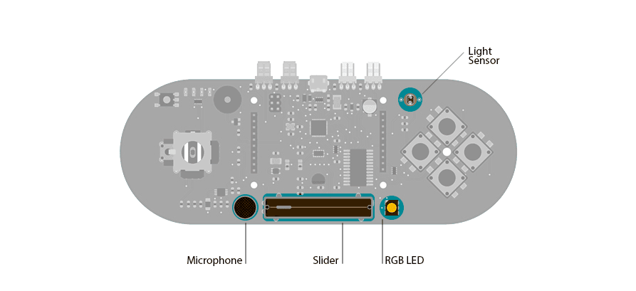

## Led Show 2

This example shows you how to read different analog sensors to change the brightness of the three colors in the RGB LED.

In this example you will read the amplitude from the microphone, the amount of light on the light sensor, and the position of the linear potentiometer. These three sensors will control the intensity of the red, blue, and green colors of the RGB LED.

## Hardware Required

- Arduino Esplora

## Circuit

Only your Arduino Esplora is needed for this example.



 

## Code

The RGB LED is comprised of three colors that represent the three primary colors: red, green, and blue.
Each of these light's brightness is individually controllable with functions in the Esplora library:

- [writeRed()](https://www.arduino.cc/en/Reference/EsploraWriteRed)
- [writeGreen()](https://www.arduino.cc/en/Reference/EsploraWriteRed)
- [writeBlue()](https://www.arduino.cc/en/Reference/EsploraWriteRed)

If you want to control all the colors with one instruction you can use the [writeRGB()](https://www.arduino.cc/en/Reference/EsploraWriteRGB) function.

In this example we use three of the sensors on the Esplora to control the brightness of the colors of the LED. The amplitude picked up by the microphone will increase the brightness of the red LED. The position of the slider on the linear potentiometer will change the brightness of the green LED. The intensity of the light on the light sensor will change the brighntess of the blue LED.

```arduino

/*

  Esplora Led/Microphone

  This simple sketch reads the microphone, light sensor, and slider.

  Then it uses those readings to set the brightness of red, green and blue

  channels of the RGB LED. The red channel will change with the loudness

  "heard" by the microphone, the green channel changes as the

  amount of light in the room and the blue channel will change

  with the position of the slider.

  Created on 22 november 2012

  By Enrico Gueli <enrico.gueli@gmail.com>

  Modified 24 Nov 2012

  by Tom Igoe

*/

#include <Esplora.h>

void setup() {

  // initialize the serial communication:

  Serial.begin(9600);
}

int lowLight = 400;   // the light sensor reading when it's covered
int highLight = 1023; // the maximum light sensor reading
int minGreen = 0;     // minimum brightness of the green LED
int maxGreen = 100;   // maximum brightness of the green LED

void loop() {

  // read the sensors into variables:

  int mic = Esplora.readMicrophone();

  int light = Esplora.readLightSensor();

  int slider = Esplora.readSlider();

  // convert the sensor readings to light levels:

  byte red   = constrain(mic, 0, 255);

  byte green = constrain(

                 map(light, lowLight, highLight, minGreen, maxGreen),

                 0, 255);

  byte blue  = slider / 4;

  // print the light levels (to see what's going on):

  Serial.print(red);

  Serial.print(' ');

  Serial.print(green);

  Serial.print(' ');

  Serial.println(blue);

  // write the light levels to the LED.

  // note that the green value is always 0:

  Esplora.writeRGB(red, green, blue);

  // add a delay to keep the LED from flickering:

  delay(10);
}
```
