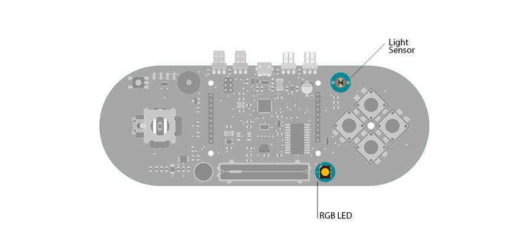

## Esplora Light Calibrator

This sketch shows you how to read and calibrate the Esplora's light sensor. Because light levels vary from one location to another, you need to calibrate the  sensor for each location. To do this, you read the sensor for a few seconds, and save the highest and lowest readings as maximum and minimum.

You'll use the sensor's reading to set the brightness of the LED by mapping the values to a smaller range, using the minimum and the maximum values you obtained in the calibration.

## Hardware Required

- Arduino Esplora

## Circuit

Only your Arduino Esplora is needed for this example. Connect the Esplora to your computer with a USB cable and open the Arduino's Serial Monitor.



 

## Code

Create some variables to hold your maximum and minimum values for the light sensor, and another one to let the Esplora know if the sensor has been calibrated or not.

To send data to your computer, you need to open a serial connection. Use [Serial.begin](https://arduino.cc/en/Serial/Begin)() to open a serial port at 9600 baud on the Esplora.

Use [Esplora.readButton](https://www.arduino.cc/en/Reference/EsploraReadButton)() to see if button 1 is being pressed. If it is, call the `calibrate()` function you'll be writing below.

To read the light sensor, use [Esplora.readLightSensor](https://www.arduino.cc/en/Reference/EsploraReadLightSensor)(). This will give you a value between 0 and 1023, which will be stored in a variable.

You'll want to map the value from the sensor to a range that is appropriate for the LED using your maximum and minimum range. The [map](https://www.arduino.cc/reference/en/language/functions/math/map/)() function takes 5 arguments, the original value, the minimum value of the sensor, the maximum value of the sensor, the minimum value of the LED (0), and the maximum value of the LED (255). Store this value in a new variable named `brightness`.

The map() function doesn't limit the values to 0 and 255. If you happen to get sensor readings outside your maximum and minimum values, map() would return values less than 0  or higher than 255. To make sure you stay in that range, call [constrain](https://www.arduino.cc/en/Reference/Constrain)().

To change the color of the LED with your new value between 0 and 255, call [Esplora.writeBlue](https://www.arduino.cc/en/Reference/EsploraWriteBlue)().

Once the light has been calibrated, send the values to the Serial Monitor by calling [Serial.print](https://arduino.cc/en/Serial/Print)(). You should start to see values reported like this :
`light sensor level: 256 blue brightness: 10`

These values will not print to the Serial Monitor until you've calibrated the sensor, and the `calibrated` variable is set to `true`.

To create your own function called `calibrate`. To do this, outside of the `loop()`, type

```arduino
void calibrate (){

}
```

This creates a function named `calibrate`. All the code you write between the brackets will now be executed whenever you call `calibrate()` in your sketch.

In `calibrate()`, use [while](https://www.arduino.cc/reference/en/language/structure/control-structure/while/)() to run the code aslong as the button is pressed.

Read the value of the sensor, and save it in a variable. Initially, you had set the minimum value high. Compare the light sensor value for anything lower than that, saving it as the new minimum. Likewise, you set the maximum low and read for anything higher as the new maximum.

Set the calibration variable to `true` while you're calibrating.

When you release the button, `calibrate()` will stop running and return to the `loop()`.

```arduino

/*

  Esplora Led calibration

 This  sketch shows you how to read and calibrate the light sensor.

 Because light levels vary from one location to another, you need to calibrate the

 sensor for each location. To do this, you read the sensor for a few seconds,

 and save the highest and lowest readings as maximum and minimum.

 Then, when you're using the sensor's reading (for example, to set the brightness

 of the LED), you map the sensor's reading to a range between the minimum

 and the maximum.

 Created on 22 Dec 2012

 by Tom Igoe

 This example is in the public domain.

 */

#include <Esplora.h>

// variables:
int lightMin = 1023;        // minimum sensor value
int lightMax = 0;           // maximum sensor value

bool calibrated = false;  // whether the sensor's been calibrated yet

void setup() {

  // initialize the serial communication:

  Serial.begin(9600);

  // print an initial message

  Serial.println("To calibrate the light sensor, press and hold Switch 1");
}

void loop() {

  // if switch 1 is pressed, go to the calibration function again:

  if (Esplora.readButton(1) == LOW) {

    calibrate();

  }

  // read the sensor into a variable:

  int light = Esplora.readLightSensor();

  // map the light level to a brightness level for the LED

  // using the calibration min and max:

  int brightness = map(light, lightMin, lightMax, 0, 255);

  // limit the brightness to a range from 0 to 255:

  brightness = constrain(brightness, 0, 255);

  // write the brightness to the blue LED.

  Esplora.writeBlue(brightness);

  // if the calibration's been done, show the sensor and brightness

  // levels in the serial monitor:

  if (calibrated == true) {

    // print the light sensor levels and the LED levels (to see what's going on):

    Serial.print("light sensor level: ");

    Serial.print(light);

    Serial.print(" blue brightness: ");

    Serial.println(brightness);

  }

  // add a delay to keep the LED from flickering:

  delay(10);
}

void calibrate() {

  // tell the user what do to using the serial monitor:

  Serial.println("While holding switch 1, shine a light on the light sensor, then cover it.");

  // calibrate while switch 1 is pressed:

  while (Esplora.readButton(1) == LOW) {

    // read the sensor value:

    int light  = Esplora.readLightSensor();

    // record the maximum sensor value:

    if (light > lightMax) {

      lightMax = light;

    }

    // record the minimum sensor value:

    if (light < lightMin) {

      lightMin = light;

    }

    // note that you're calibrated, for future reference:

    calibrated = true;

  }
}
```
