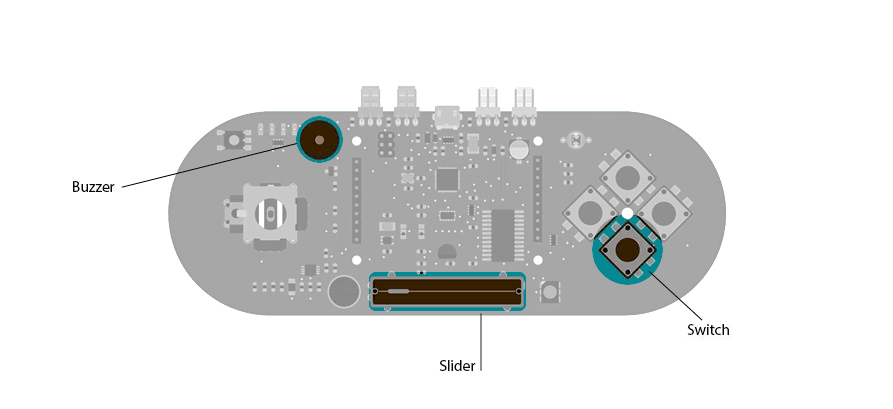

## Music

This example shows how to play notes on the buzzer mounted on the Arduino Esplora. Buzzers can generate different audio signals in audible frequency ranges. A note is an audio signal at a specific frequency. If you know the frequency of the notes you want to play, you can start to compose a melody.

In this example, you move the slider to generate different notes, and play them by pressing the down push-button.

## Hardware Required

- Arduino Esplora

## Circuit

Only your Arduino Esplora is needed for this example. Connect the Esplora to your computer with a USB cable.



 

## Code

There are 13 notes stored inside an [array](https://www.arduino.cc/reference/en/language/variables/data-types/array/). You can choose the note to play by changing the position of the slider.

The index number that selects the value in the array is mapped to the position of the linear potentiometer. This number is the frequency of the note to play. Imagine the length of the potentiometer in split into 13 sections. Moving the slider from the right to the left will change the note when it crosses into a different section. Each section corresponds to a spot in the array, and a value to play on the buzzer.

To play the note you press the down direction button; it will play as long as the button is held.

```arduino

/*

  Esplora Music

  This sketch turns the Esplora in a simple musical instrument.

  Press the Switch 1 and move the slider to see how it works.

  Created on 22 november 2012

  By Enrico Gueli <enrico.gueli@gmail.com>

  modified 22 Dec 2012

  by Tom Igoe

*/

#include <Esplora.h>

// these are the frequencies for the notes from middle C
// to one octave above middle C:

const int note[] = {

  262, // C

  277, // C#

  294, // D

  311, // D#

  330, // E

  349, // F

  370, // F#

  392, // G

  415, // G#

  440, // A

  466, // A#

  494, // B

  523  // C next octave
};

void setup() {
}

void loop() {

  // read the button labeled SWITCH_DOWN. If it's low,

  // then play a note:

  if (Esplora.readButton(SWITCH_DOWN) == LOW) {

    int slider = Esplora.readSlider();

    // use map() to map the slider's range to the

    // range of notes you have:

    byte thisNote = map(slider, 0, 1023, 0, 13);

    // play the note corresponding to the slider's position:

    Esplora.tone(note[thisNote]);

  } else {

    // if the button isn't pressed, turn the note off:

    Esplora.noTone();

  }
}
```
