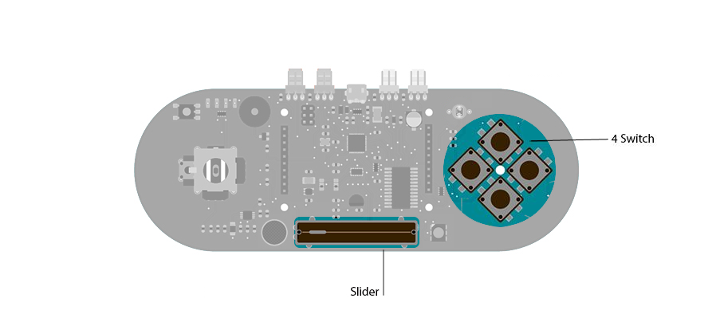

## Esplora Pong

Want to play Pong on your computer with your Esplora? This example shows you how.

This example is designed to be used with a Processing sketch. Processing is an open source programming environment. The Esplora reads the slider and buttons and sends data to the Processing sketch serially over USB, and Processing uses the incoming data to move paddles in a game of Pong.

If you don't have [Processing](http://www.processing.org) installed on your computer,  [download it](http://www.processing.org/download/) from the Processing site and follow the installation instructions.

[Download the zip file](https://arduino.cc/en/uploads/Tutorial/ProcessingPong.zip) containing the Processing sketch for this example.

You only need to unzip this folder inside your Processing sketches folder, and open the .pde file in Processing.

## Hardware Required

- Arduino Esplora

## Software Required

- [Processing](http://processing.org)

## Circuit

Only your Arduino Esplora is needed for this example.



 

## Code

This example sends the states of the slider and three pushbuttons serially to the computer.  The associated Processing sketch reads the serial data to control the paddles and the state of the game.

The data is always sent in the same order:  slider, button 1, button 3, button 4. The data are separated by commas. The [Serial.println](https://arduino.cc/en/Serial/Println)() command that sends the final button also sends a newline character. The Processing sketch looks for the newline to know when it's got all the sensor data.

**NOTE: Serial ports on a computer can only be accessed by one program at a time.** If you have the Arduino IDE's Serial Monitor open, then the Processing Sketch will not be able to access the Esplora's serial port. Likewise, if the Processing sketch is still running, you won't be able to open the Serial Monitor or reprogram your Esplora.

```arduino

/*

  Esplora Pong

 This  sketch connects serially to a Processing sketch to control a Pong game.

 It sends the position of the slider and the states of three pushbuttons to the

 Processing sketch serially, separated by commas. The Processing sketch uses that

 data to control the graphics in the sketch.

 The slider sets a paddle's height

 Switch 1 is resets the game

 Switch 2 resets the ball to the center

 Switch 3 reverses the players

 You can play this game with one or two Esploras.

 Created on 22 Dec 2012

 by Tom Igoe

 This example is in the public domain.

 */

#include <Esplora.h>

void setup() {

  Serial.begin(9600);     // initialize serial communication
}

void loop() {

  // read the slider and three of the buttons

  int slider = Esplora.readSlider();

  int resetButton = Esplora.readButton(SWITCH_1);

  int serveButton = Esplora.readButton(SWITCH_3);

  int switchPlayerButton = Esplora.readButton(SWITCH_4);

  Serial.print(slider);                // print the slider value

  Serial.print(",");                   // add a comma

  Serial.print(resetButton);           // print the reset button value

  Serial.print(",");                   // add another comma

  Serial.print(serveButton);           // print the serve button value

  Serial.print(",");                   // add another comma

  Serial.println(switchPlayerButton);  // print the last button with a newline

  delay(10);                           // delay before sending the next set
}
```
