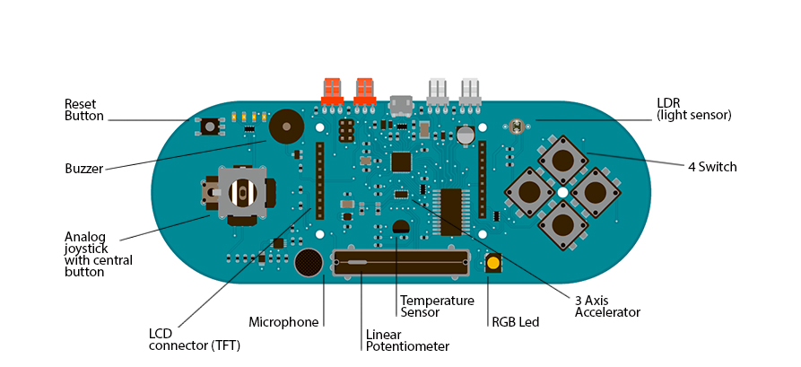

## Esplora Remote

This example is designed to be used with a Processing sketch. Processing is an open source programming environment. The application on the computer reads the sensors on the Esplora board and controls the buzzer and the RGB LED through a graphical interface. The image in the Processing application mirrors the Esplora board, so you'll see a virtual version of your board.

If you don't have [Processing](http://www.processing.org) installed on your computer, you can also test this example opening the serial monitor and interacting with the Esplora through serial commands.

There are two Processing sketches that work with this example, a simple one that prints the sensors in text, and a more complex one that shows a graphic representation of the Esplora. The former may be better for beginning Processing programmers, and the latter may be better for advanced Processing programmers.

[Download the zip file](https://arduino.cc/en/uploads/Tutorial/ProcessingEsploraSimpleRemote.zip) containing the simple Processing sketch for this example.

[Download the zip file](https://arduino.cc/en/uploads/Tutorial/ProcessingEsploraRemote.zip) containing the advanced Processing sketch for this example.

You only need to unzip this folder inside your Processing sketches folder, and open the .pde file in Processing.

## Hardware Required

- Arduino Esplora

## Software Required

- [Processing](http://processing.org)

## Circuit

Only your Arduino Espora is needed for this example.



 

## Code

This example opens a serial interface to the Esplora. You'll ask the board to read the sensors or write to the buzzer or RGB LED by sending commands over the Esplora's serial port.

The commands always starts with a character, which indicates the operation you want to perform followed by the value you want to write to the actuator or the number of samples you want to collect.

Using this sketch in combination with the application written in Processing, allows you to control the board with a graphical interface, instead of typing the commands through the serial port. It is still possible to control the board by manually entering commands in the serial monitor or serial application.

All sensor values will be displayed on the Esplora drawn on the computer screen, and you can command the buzzer and the RGB led with sliders, clicking on the component.

**NOTE: Serial ports on a computer can only be accessed by one program at a time.** If you have the Arduino IDE's Serial Monitor open, then the Processing Sketch will not be able to access the Esplora's serial port. Likewise, if the Processing sketch is still running, you won't be able to open the Serial Monitor or reprogram your Esplora.

```arduino

/*

  Esplora Remote

 This sketch allows to test all the Esplora's peripherals.

 It is also used with the ProcessingStart sketch (for Processing).

 When uploaded, you can open the Serial monitor and write one of

 the following commands (without quotes) to get an answer:

 "D": prints the current value of all sensors, separated by a comma.

 See the dumpInputs() function below to get the meaning of

 each value.

 "Rxxx"

 "Gxxx"

 "Bxxx": set the color of the RGB led. For example, write "R255"

 to turn on the red to full brightness, "G128" to turn

 the green to half brightness, or "G0" to turn off

 the green channel.

 "Txxxx": play a tone with the buzzer. The number is the

 frequency, e.g. "T440" plays the central A note.

 Write "T0" to turn off the buzzer.

 Created on 22 november 2012

 By Enrico Gueli <enrico.gueli@gmail.com>

 Modified 23 Dec 2012

 by Tom Igoe

 */

#include <Esplora.h>

void setup() {

  Serial.begin(9600);

  while (!Serial); // needed for native USB port only
}

void loop() {

  if (Serial.available()) {

    parseCommand();

  }
}

/*

 * This function reads a character from the serial line and

 * decide what to do next. The "what to do" part is given by

 * function it calls (e.g. dumpInputs(), setRed() and so on).

 */
void parseCommand() {

  char cmd = Serial.read();

  switch (cmd) {

    case 'D':

      dumpInputs();

      break;

    case 'R':

      setRed();

      break;

    case 'G':

      setGreen();

      break;

    case 'B':

      setBlue();

      break;

    case 'T':

      setTone();

      break;

  }
}

void dumpInputs() {

  Serial.print(Esplora.readButton(SWITCH_1));

  Serial.print(',');

  Serial.print(Esplora.readButton(SWITCH_2));

  Serial.print(',');

  Serial.print(Esplora.readButton(SWITCH_3));

  Serial.print(',');

  Serial.print(Esplora.readButton(SWITCH_4));

  Serial.print(',');

  Serial.print(Esplora.readSlider());

  Serial.print(',');

  Serial.print(Esplora.readLightSensor());

  Serial.print(',');

  Serial.print(Esplora.readTemperature(DEGREES_C));

  Serial.print(',');

  Serial.print(Esplora.readMicrophone());

  Serial.print(',');

  Serial.print(Esplora.readJoystickSwitch());

  Serial.print(',');

  Serial.print(Esplora.readJoystickX());

  Serial.print(',');

  Serial.print(Esplora.readJoystickY());

  Serial.print(',');

  Serial.print(Esplora.readAccelerometer(X_AXIS));

  Serial.print(',');

  Serial.print(Esplora.readAccelerometer(Y_AXIS));

  Serial.print(',');

  Serial.print(Esplora.readAccelerometer(Z_AXIS));

  Serial.println();
}

void setRed() {

  Esplora.writeRed(Serial.parseInt());
}

void setGreen() {

  Esplora.writeGreen(Serial.parseInt());
}

void setBlue() {

  Esplora.writeBlue(Serial.parseInt());
}

void setTone() {

  Esplora.tone(Serial.parseInt());
}
```
