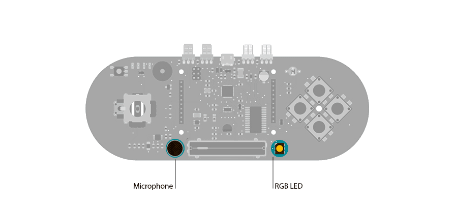

## Esplora Microphone (Sound Sensor)

This  sketch shows you how to read  the microphone sensor. The microphone will range from 0 (total silence) to 1023 (really loud).  It uses the sound level to set a brightness level for the green LED. When you're using the sensor's reading (for example, to set the brightness of the LED), you map the sensor's reading to a range between the minimum and the maximum.

## Hardware Required

- Arduino Esplora

## Circuit

Only your Arduino Esplora is needed for this example. Connect the Esplora to your computer with a USB cable and open the Arduino's Serial Monitor.



 

## Code

To send data to your computer, you need to open a serial connection. use [Serial.begin](https://arduino.cc/en/Serial/Begin)() to open a serial port at 9600 baud on the Esplora.

The [Esplora.readMicrophone](https://www.arduino.cc/en/Reference/EsploraReadMicrophone)() function gets the value from the microphone. It will give you a value between 0 and 1023.

To send the values to the Serial Monitor, you call [Serial.print](https://arduino.cc/en/Serial/Print)(). When the Esplora is connected, and the Serial Monitor is open, you should start to see values reported like this:

```arduino
sound level: 172 Green brightness: 42
sound level: 74 Green brightness: 18
sound level: 153 Green brightness: 38
sound level: 67 Green brightness: 16
sound level: 93 Green brightness: 23
sound level: 110 Green brightness: 27
```

```arduino

/*

  Esplora Sound Sensor

 This  sketch shows you how to read  the microphone sensor. The microphone

will range from 0 (total silence) to 1023 (really loud).

 When you're using the sensor's reading (for example, to set the brightness

 of the LED), you map the sensor's reading to a range between the minimum

 and the maximum.

 Created on 22 Dec 2012

 by Tom Igoe

 This example is in the public domain.

 */

#include <Esplora.h>

void setup() {

  // initialize the serial communication:

  Serial.begin(9600);
}

void loop() {

  // read the sensor into a variable:

  int loudness = Esplora.readMicrophone();

  // map the sound level to a brightness level for the LED:

  int brightness = map(loudness, 0, 1023, 0, 255);

  // write the brightness to the green LED:

  Esplora.writeGreen(brightness);

  // print the microphone levels and the LED levels (to see what's going on):

  Serial.print("sound level: ");

  Serial.print(loudness);

  Serial.print(" Green brightness: ");

  Serial.println(brightness);

  // add a delay to keep the LED from flickering:

  delay(10);
}
```
