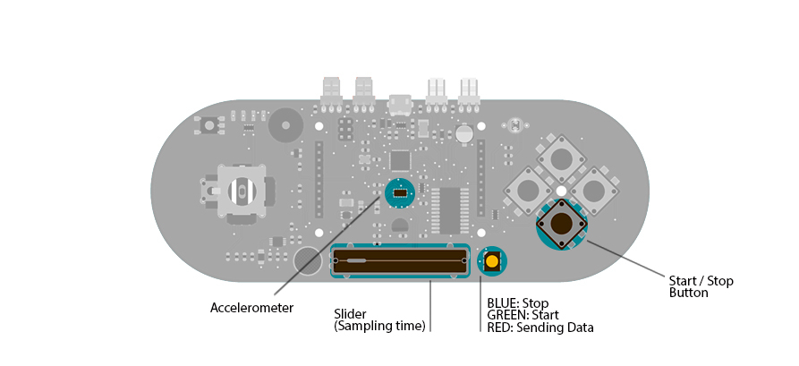

## Accelerometer Table

This example simplifies the task of collecting data from the Esplora's accelerometer and graphing it with your computer. The Esplora sends keypresses to a connected computer about the state of the accelerometer. If you open a spreadsheet application, you can log the data from the accelerometer.

To start and stop the datalogging, press the down pushbutton. The Esplora's LED will indicate the state of the logging. The slider is used to set the sampling interval.

## Hardware Required

- Arduino Esplora

## Circuit

Only your Arduino Esplora is needed for this example.



 

## Code

In this example, the Esplora acts as a keyboard; once the you press the down button, it will send characters to a connected computer.

The characters sent to the computer are formatted to fit inside a spreadsheet's rows and columns. Each row of the spreadheet will contain a timestamp and the 3 accelerometer axis readings.

To start sampling, press the direction down push-button. This begins communication as a keyboard with the computer. Changing the position of the linear potentiometer will change the rate at which samples are read from the accelerometer and written to the computer.

The RGB led is blue when the Esplora is ready, but not sending data. Once the down button is pressed, the LED will turn green. While the Esplora is sending samples to the speradsheet the LED will turn red.

Clicking the button again will stop the Esplora from sending data.

```arduino

/*

  Esplora Table

  Acts like a keyboard that prints sensor

  data in a table-like text, row by row.

  At startup, it does nothing. It waits for you to open a

  spreadsheet (e.g. Google Drive spreadsheet) so it can write

  data. By pressing Switch 1, it starts printing the table

  headers and the first row of data. It waits a bit, then it

  will print another row, and so on.

  The amount of time between each row is determined by the slider.

  If put to full left, the sketch will wait 10 seconds; at

  full right position, it will wait 5 minutes. An intermediate

  position will make the sketch wait for some time in-between.

  Clicking the Switch 1 at any time will stop the logging.

  The color LED shows what the sketch is doing:

  blue  = idle, waiting for you to press Switch 1 to start logging

  green = active; will print soon

  red   = printing data to the PC

  Created on 22 november 2012

  By Enrico Gueli <enrico.gueli@gmail.com>

  modified 24 Nov 2012

  by Tom Igoe

*/

#include <Esplora.h>

/*

 * this variable tells if the data-logging is currently active.

 */

bool active = false;

/*

 * this variable holds the time in the future when the sketch

 * will "sample" the data (sampling is the act of reading some

 * input at a known time). This variable is checked continuously

 * against millis() to know when it's time to sample.

 */
unsigned long nextSampleAt = 0;

/*

 * This variable just holds the millis() value at the time the

 * logging was activated. This is needed to enter the correct

 * value in the "Time" column in the printed table.

 */
unsigned long startedAt = 0;

/*

 * when the "active" variable is set to true, the same is done

 * with this variable. This is needed because the code that does

 * the "just-after-activation" stuff is run some time later than

 * the code that says "be active now".

 */

bool justActivated = false;

/*

 * this variable holds the last sensed status of the switch press

 * button. If the code sees a difference between the value of

 * this variable and the current status of the switch, it means

 * that the button was either pressed or released.

 */

bool lastStartBtn = HIGH;

/*

 * Initialization code. The virtual USB keyboard must be

 * initialized; the Serial class is needed just for debugging.

 */
void setup() {

  Keyboard.begin();

  Serial.begin(9600);
}

/*

 * This code is run continuously.

 */
void loop() {

  /*

   * note: we don't use Arduino's delay() here, because we can't

   * normally do anything while delaying. Our own version lets us

   * check for button presses often enough to not miss any event.

   */

  activeDelay(50);

  /*

   * the justActivated variable may be set to true in the

   * checkSwitchPress() function. Here we check its status to

   * print the table headers and configure what's needed to.

   */

  if (justActivated == true) {

    justActivated = false; // do this just once

    printHeaders();

    // do next sampling ASAP

    nextSampleAt = startedAt = millis();

  }

  if (active == true) {

    if (nextSampleAt < millis()) {

      // it's time to sample!

      int slider = Esplora.readSlider();

      // the row below maps the slider position to a range between

      // 10 and 290 seconds.

      int sampleInterval = map(slider, 0, 1023, 10, 290);

      nextSampleAt = millis() + sampleInterval * 1000;

      logAndPrint();

    }

    // let the RGB led blink green once per second, for 200ms.

    unsigned int ms = millis() % 1000;

    if (ms < 200) {

      Esplora.writeGreen(50);

    } else {

      Esplora.writeGreen(0);

    }

    Esplora.writeBlue(0);

  } else

    // while not active, keep a reassuring blue color coming

    // from the Esplora...

  {

    Esplora.writeBlue(20);

  }

}

/*

 * Print the table headers.

 */
void printHeaders() {

  Keyboard.print("Time");

  Keyboard.write(KEY_TAB);

  activeDelay(300); // Some spreadsheets are slow, e.g. Google

  // Drive that wants to save every edit.

  Keyboard.print("Accel X");

  Keyboard.write(KEY_TAB);

  activeDelay(300);

  Keyboard.print("Accel Y");

  Keyboard.write(KEY_TAB);

  activeDelay(300);

  Keyboard.print("Accel Z");

  Keyboard.println();

  activeDelay(300);
}

void logAndPrint() {

  // do all the samplings at once, because keystrokes have delays

  unsigned long timeSecs = (millis() - startedAt) / 1000;

  int xAxis = Esplora.readAccelerometer(X_AXIS);

  int yAxis = Esplora.readAccelerometer(Y_AXIS);

  int zAxis = Esplora.readAccelerometer(Z_AXIS);

  Esplora.writeRed(100);

  Keyboard.print(timeSecs);

  Keyboard.write(KEY_TAB);

  activeDelay(300);

  Keyboard.print(xAxis);

  Keyboard.write(KEY_TAB);

  activeDelay(300);

  Keyboard.print(yAxis);

  Keyboard.write(KEY_TAB);

  activeDelay(300);

  Keyboard.print(zAxis);

  Keyboard.println();

  activeDelay(300);

  Keyboard.write(KEY_HOME);

  Esplora.writeRed(0);
}

/**

 * Similar to delay(), but allows the program to do something else

 * in the meanwhile. In particular, it calls checkSwitchPress().

 * Note 1: it may wait longer than the specified amount, not less;

 * Note 2: beware of data synchronization issues, e.g. if the

 * activeDelay() function alters some variables used by the

 * caller of this function.

 */
void activeDelay(unsigned long amount) {

  unsigned long at = millis() + amount;

  while (millis() < at) {

    checkSwitchPress();

  }
}

/*

 * This function reads the status of the switch; if it sees that

 * it was pressed, toggles the status of the "active" variable.

 * If it's set to true, also the justActivated variable is set to

 * true, so the loop() function above can do the right things.

 * This function should be called as often as possible and do as

 * little as possible, because it can be called while another

 * function is running.

 */
void checkSwitchPress() {

  bool startBtn = Esplora.readButton(SWITCH_DOWN);

  if (startBtn != lastStartBtn) {

    if (startBtn == HIGH) { // button released

      active = !active;

      if (active) {

        justActivated = true;

      }

    }

    lastStartBtn = startBtn;

  }
}
```
