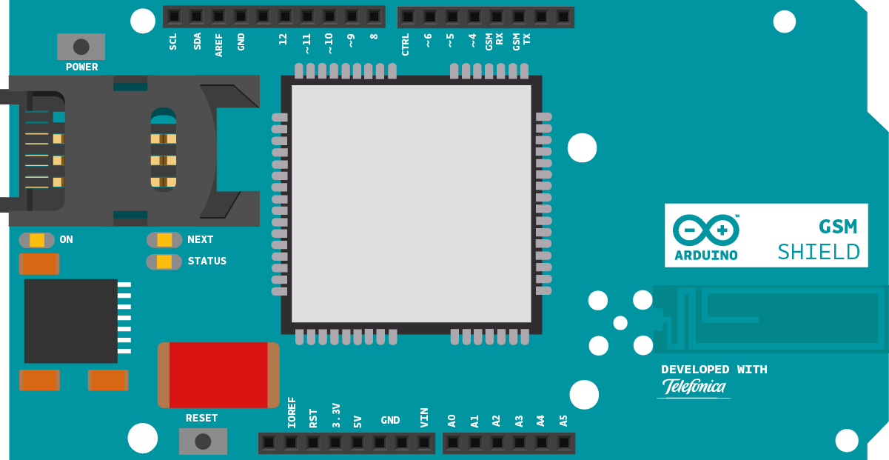

This sketch connects a voice call from your GSM shield and Arduino to a remote phone number entered through the serial monitor. You'll need to  [attach a speaker and microphone](https://www.arduino.cc/en/Guide/ArduinoGSMShield#making-voice-calls)  to hear the connected phone and transmit your voice.

## Hardware Required

- Arduino Board

- [Arduino + Telefonica GSM/GPRS Shield](/retired/shields/arduino-gsm-shield)
- Microphone and speaker [attached to the GSM shield](https://www.arduino.cc/en/Guide/ArduinoGSMShield#making-voice-calls)
- SIM card

## Circuit




## Code

First, import the GSM library

`#include <GSM.h>`

SIM cards may have a PIN number that unlocks their functionality. Define the PIN for your SIM. If your SIM has no PIN, you can leave it blank :

`#define PINNUMBER ""`

Initialize instances of the classes you're going to use. You're going to need both the GSM and GSMVoiceCall class.

```arduino
GSM gsmAccess;

GSMVoiceCall vcs;
```

Create some variables to store the phone number you want to call :

```arduino
String remoteNumber = "";
char charbuffer[20];
```

In `setup`, open a serial connection to the computer. You'll use this to send a phone number to the Arduino. After opening the connection, send a message to the Serial Monitor indicating the sketch has started.

```arduino
void setup(){

  Serial.begin(9600);

  Serial.println("Make Voice Call");
```

Create a local variable to track the connection status. You'll use this to keep the sketch from starting until the SIM is connected to the network :

```arduino
boolean notConnected = true;
```

Connect to the network by calling `gsmAccess.begin()`. It takes the SIM card's PIN as an argument. By placing this inside a `while()` loop, you can continually check the status of the connection. When the modem does connect, `gsmAccess()` will return `GSM_READY`. Use this as a flag to set the `notConnected` variable to `true` or `false`. Once connected, the remainder of `setup` will run.

```arduino
while(notConnected)

  {

    if(gsmAccess.begin(PINNUMBER)==GSM_READY)

      notConnected = false;

    else

    {

      Serial.println("Not connected");

      delay(1000);

    }

  }
```

Finish `setup` with some information to the serial monitor.

```arduino
Serial.println("GSM initialized.");

  Serial.println("Enter phone number to call.");
}
```

The `loop` will accept incoming bytes from the serial monitor and connect your voice call.

First, check the serial buffer to see if there is any information waiting to be read. If there is, store it in a local variable  :

```arduino
void loop()
{

  while (Serial.available() > 0)

  {

    char inChar = Serial.read();
```

If the buffer holds a newline character, check to see if the number entered is less than 20 digits long (theoretically, you'll never be able to dial a number with more digits than that).

```arduino
if (inChar == '\n')

    {

      if (remoteNumber.length() < 20)

      {
```

Print out the number you're calling to the serial monitor.

```arduino
Serial.print("Calling to : ");

        Serial.println(remoteNumber);

        Serial.println();
```

The number to call will be been stored in the String named `remoteNumber`. The `voiceCall()` function requires a `char` array. Copy the string to the array named `charbuffer`.

`remoteNumber.toCharArray(charbuffer, 20);`

To place the call, use `vcs.voiceCall()`, passing it the number you wish to reach. `voiceCall()` returns the status of the call; a `1` means it is connected. You can check the status of the connection with `getvoiceCallStatus()`.

To disconnect your call, send a newline character to trigger `hangCall()`.

```arduino
if(vcs.voiceCall(charbuffer))

        {

          Serial.println("Call Established. Enter line to end");

          while(Serial.read()!='\n' && (vcs.getvoiceCallStatus()==TALKING));

          vcs.hangCall();

        }
```

Once the call has been completed, clear the variable that stored the phone number :

```arduino
Serial.println("Call Finished");

        remoteNumber="";

        Serial.println("Enter phone number to call.");

      }
```

If the number you entered in the serial monitor is longer than 20 digits, clear the `remoteNumber` String and start again :

```arduino
else

      {

        Serial.println("That's too long for a phone number. I'm forgetting it");

        remoteNumber = "";

      }

    }
```

When reading information from the serial monitor, if the incoming character is not a newline or carriage return, add it to the `remoteNumber` String and close up the `loop`.

```arduino
else

    {

      // add the latest character to the message to send:

      if(inChar!='\r')

        remoteNumber += inChar;

    }

  }
}
```

Once your code is uploaded, open the serial monitor. Once you see the message "Enter phone number to call", type a phone number and press "return". Make sure the serial monitor is set to only send a newline character on return.

## Complete Sketch

The complete sketch is below.

```arduino

/*

 Make Voice Call

 This sketch, for the Arduino GSM shield, puts a voice call to

 a remote phone number that you enter through the serial monitor.

 To make it work, open the serial monitor, and when you see the

 READY message, type a phone number. Make sure the serial monitor

 is set to send a just newline when you press return.

 Circuit:

 * GSM shield

 * Voice circuit.

 With no voice circuit the call will send nor receive any sound

 created Mar 2012

 by Javier Zorzano

 This example is in the public domain.

 */

// libraries
#include <GSM.h>

// PIN Number
#define PINNUMBER ""

// initialize the library instance

GSM gsmAccess; // include a 'true' parameter for debug enabled

GSMVoiceCall vcs;

String remoteNumber = "";  // the number you will call
char charbuffer[20];

void setup() {

  // initialize serial communications and wait for port to open:

  Serial.begin(9600);

  while (!Serial) {

    ; // wait for serial port to connect. Needed for native USB port only

  }

  Serial.println("Make Voice Call");

  // connection state

  bool notConnected = true;

  // Start GSM shield

  // If your SIM has PIN, pass it as a parameter of begin() in quotes

  while (notConnected) {

    if (gsmAccess.begin(PINNUMBER) == GSM_READY) {

      notConnected = false;

    } else {

      Serial.println("Not connected");

      delay(1000);

    }

  }

  Serial.println("GSM initialized.");

  Serial.println("Enter phone number to call.");

}

void loop() {

  // add any incoming characters to the String:

  while (Serial.available() > 0) {

    char inChar = Serial.read();

    // if it's a newline, that means you should make the call:

    if (inChar == '\n') {

      // make sure the phone number is not too long:

      if (remoteNumber.length() < 20) {

        // let the user know you're calling:

        Serial.print("Calling to : ");

        Serial.println(remoteNumber);

        Serial.println();

        // Call the remote number

        remoteNumber.toCharArray(charbuffer, 20);

        // Check if the receiving end has picked up the call

        if (vcs.voiceCall(charbuffer)) {

          Serial.println("Call Established. Enter line to end");

          // Wait for some input from the line

          while (Serial.read() != '\n' && (vcs.getvoiceCallStatus() == TALKING));

          // And hang up

          vcs.hangCall();

        }

        Serial.println("Call Finished");

        remoteNumber = "";

        Serial.println("Enter phone number to call.");

      } else {

        Serial.println("That's too long for a phone number. I'm forgetting it");

        remoteNumber = "";

      }

    } else {

      // add the latest character to the message to send:

      if (inChar != '\r') {

        remoteNumber += inChar;

      }

    }

  }
}
```


*Last revision 2018/08/23 by SM*