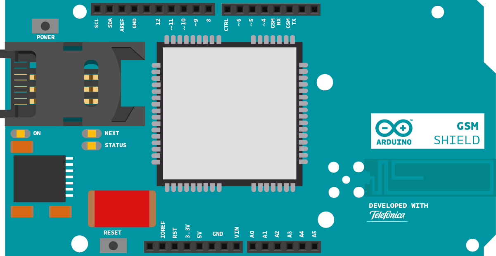

This sketch connects an Arduino board to the Arduino homepage, [http://arduino.cc](http://arduino.cc), through the GSM shield. It then prints the content of the page through the serial monitor of the Arduino Software (IDE).

## Hardware Required

- Arduino Board

- [Arduino + Telefonica GSM/GPRS Shield](/retired/shields/arduino-gsm-shield)
- SIM card enable for Data

## Circuit




## Code

First, import the GSM library

`#include <GSM.h>`

SIM cards may have a PIN number that enables their functionality. Define the PIN for your SIM. If your SIM has no PIN, you can leave it blank :

`#define PINNUMBER ""`

Define a number of constants that contain information about the GPRS network you're going to connect to. You'll need the Access Point Name (APN), login, and password. To obtain this information, contact your network provider for the most up to date information. [This page](http://forums.pinstack.com/f24/tcp_apn_wap_gateway_port_carrier_settings-360/) has some information about various carrier settings, but it may not be current.

```arduino
#define GPRS_APN       "GPRS_APN"
#define GPRS_LOGIN     "login"
#define GPRS_PASSWORD  "password"
```

Initialize instances of the classes you're going to use. You're going to need the GSM, GPRS, and GSMClient classes.

```arduino
GSMClient client;

GPRS gprs;

GSM gsmAccess;
```

Create some variables to hold the server, path, and port you wish to connect to.

```arduino
char server[] = "arduino.cc";
char path[] = "/";
int port = 80;
```

In `setup`, open a serial connection to the computer. After opening the connection, send a message indicating the sketch has started.

```arduino
void setup(){

  Serial.begin(9600);

  Serial.println("Starting Arduino web client.");
```

Create a local variable to track the connection status. You'll use this to keep the sketch from starting until the SIM is connected to the network :

```arduino
boolean notConnected = true;
```

Connect to the network by calling `gsmAccess.begin()`. It takes the SIM card's PIN as an argument.  You'll also connect to the GPRS network using `gprs.attachGPRS()`. This requires the APN, login, and password you declared earlier. By placing this inside a `while()` loop, you can continually check the status of the connection and wait for them to both become `true` before proceeding.

When the modem does connect and has attached itself to the GPRS network, `gsmAccess()` will return `GSM_READY`. Use this as a flag to set the `notConnected` variable to `true` or `false`. Once connected, the remainder of `setup` will run.

```arduino
while(notConnected)

  {

    if(gsmAccess.begin(PINNUMBER)==GSM_READY)

        (gprs.attachGPRS(GPRS_APN, GPRS_LOGIN, GPRS_PASSWORD)==GPRS_READY))

      notConnected = false;

    else

    {

      Serial.println("Not connected");

      delay(1000);

    }

  }
```

Attempt to connect to the server using `client.connect()`. `connect()` requires two arguments, the server and port. Once connected to the server, make a HTTP request by calling `client.print()`. A typical web request looks like "GET pathname HTTP/1.0". `print` will send the message, just as a browser would.

```arduino
if (client.connect(server, port))

  {

    Serial.println("connected");

    client.print("GET ");

    client.print(path);

    client.println(" HTTP/1.0");

    client.println();

  }
```

If the connection to the server failed, make a note of it in the serial monitor, and close up `setup`.

```arduino
else

  {

    Serial.println("connection failed");

  }
}
```

Inside `loop`, check to see if there are bytes returned from the server. If so, read them and print them to the serial monitor.

```arduino
if (client.available())

  {

    char c = client.read();

    Serial.print(c);

  }
```

If the server disconnects, which it will typically do once it has completed the HTTP request, stop the client locally and close the `loop`.

```arduino
if (!client.available() && !client.connected())

  {

    Serial.println();

    Serial.println("disconnecting.");

    client.stop();

    // do nothing forevermore:

    for(;;)

      ;

  }
}
```

Once your code is uploaded, open the serial monitor.  You should see the HTML of [http://arduino.cc](http://arduino.cc) print out on screen when it is received. It will takes about one minute, so don't worry if you haven't a feedback immediately!

## Complete Sketch

The complete sketch is below.

```arduino

/*

  Web client

 This sketch connects to a website through a GSM shield. Specifically,

 this example downloads the URL "http://www.arduino.cc/asciilogo.txt" and

 prints it to the Serial monitor.

 Circuit:

 * GSM shield attached to an Arduino

 * SIM card with a data plan

 created 8 Mar 2012

 by Tom Igoe

 http://www.arduino.cc/en/Tutorial/GSMExamplesWebClient

 */

// libraries
#include <GSM.h>

// PIN Number
#define PINNUMBER ""

// APN data
#define GPRS_APN       "GPRS_APN" // replace your GPRS APN
#define GPRS_LOGIN     "login"    // replace with your GPRS login
#define GPRS_PASSWORD  "password" // replace with your GPRS password

// initialize the library instance

GSMClient client;

GPRS gprs;

GSM gsmAccess;

// URL, path & port (for example: arduino.cc)
char server[] = "arduino.cc";
char path[] = "/asciilogo.txt";
int port = 80; // port 80 is the default for HTTP

void setup() {

  // initialize serial communications and wait for port to open:

  Serial.begin(9600);

  while (!Serial) {

    ; // wait for serial port to connect. Needed for native USB port only

  }

  Serial.println("Starting Arduino web client.");

  // connection state

  bool notConnected = true;

  // After starting the modem with GSM.begin()

  // attach the shield to the GPRS network with the APN, login and password

  while (notConnected) {

    if ((gsmAccess.begin(PINNUMBER) == GSM_READY) &

        (gprs.attachGPRS(GPRS_APN, GPRS_LOGIN, GPRS_PASSWORD) == GPRS_READY)) {

      notConnected = false;

    } else {

      Serial.println("Not connected");

      delay(1000);

    }

  }

  Serial.println("connecting...");

  // if you get a connection, report back via serial:

  if (client.connect(server, port)) {

    Serial.println("connected");

    // Make a HTTP request:

    client.print("GET ");

    client.print(path);

    client.println(" HTTP/1.1");

    client.print("Host: ");

    client.println(server);

    client.println("Connection: close");

    client.println();

  } else {

    // if you didn't get a connection to the server:

    Serial.println("connection failed");

  }
}

void loop() {

  // if there are incoming bytes available

  // from the server, read them and print them:

  if (client.available()) {

    char c = client.read();

    Serial.print(c);

  }

  // if the server's disconnected, stop the client:

  if (!client.available() && !client.connected()) {

    Serial.println();

    Serial.println("disconnecting.");

    client.stop();

    // do nothing forevermore:

    for (;;)

      ;

  }
}
```


*Last revision 2018/08/23 by SM*