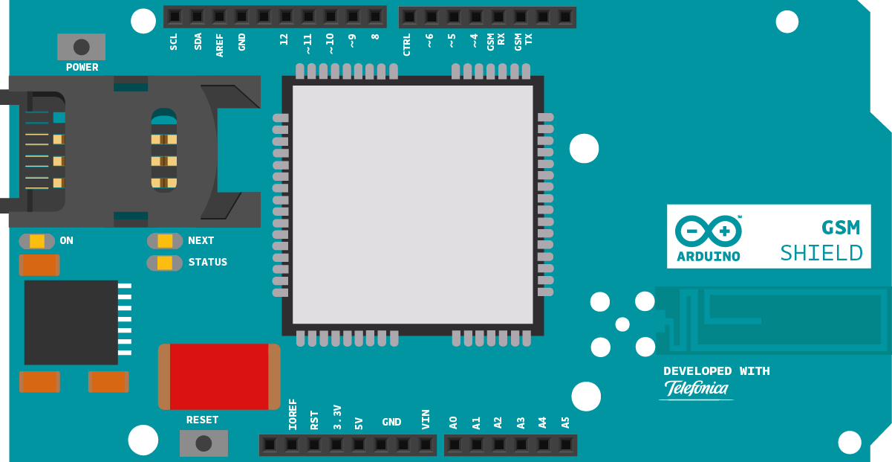

This example is part of the tools supplied for the Arduino GSM Shield and helps you change or remove the PIN of a SIM card .

## Hardware Required

- Arduino Board

- [Arduino + Telefonica GSM/GPRS Shield](/retired/shields/arduino-gsm-shield)
- SIM card

## Circuit




## Code

First, import the GSM library

`#include <GSM.h>`

Initialize an instance of the GSMPin class.

`GSMPIN PINManager;`

Create your variables, starting with a String to hold input from the serial monitor. Also make a flag for checking f the SIM has been authenticated with a valid PIN, and messages for the serial monitor.

```arduino
String user_input = "";

boolean auth = false;

String oktext = "OK";

String errortext = "ERROR";
```

In `setup`, open a serial connection to the computer. After opening the connection, send a message to the Serial Monitor indicating the sketch has started. Call `PINManager.begin()` to reset the modem.

```arduino
void setup(){

  Serial.begin(9600);

  Serial.println("Change PIN example\n");

  PINManager.begin();
```

Check to see if the SIM is locked with a PIN

```arduino
while(!auth){

    int pin_query = PINManager.isPIN();

    if(pin_query == 1)

    {
```

If locked, ask for the PIN via the serial monitor. You'll use a custom function named `readSerial()` to parse the information.

```arduino
Serial.print("Enter PIN code: ");

      user_input = readSerial();
```

If the PIN is valid, set the `auth` flag to `true`. Send a status message to the serial monitor indicating the result. If you enter the wrong PIN, you can try again. After 3 missed attempts, the PIN will be locked, and you'll need the PUK number to unlock.

```arduino
if(PINManager.checkPIN(user_input) == 0)

      {

        auth = true;

        PINManager.setPINUsed(true);

        Serial.println(oktext);

      }

      else

      {

        Serial.println("Incorrect PIN. Remember that you have 3 opportunities.");

      }

    }
```

If the SIM is in PUK lock mode, ask for the PUK code and a new PIN

```arduino
else if(pin_query == -1)

    {

      Serial.println("PIN locked. Enter PUK code: ");

      String puk = readSerial();

      Serial.print("Now, enter a new PIN code: ");

      user_input = readSerial();

      if(PINManager.checkPUK(puk, user_input) == 0)

      {

        auth = true;

        PINManager.setPINUsed(true);

        Serial.println(oktext);

      }

      else

      {

        Serial.println("Incorrect PUK or invalid new PIN. Try again!.");

      }

    }
```

If there is an error, and the PIN number and PUK are both locked, send an appropriate status message :

```arduino
else if(pin_query == -2)

    {

      Serial.println("PIN & PUK locked. Use PIN2/PUK2 in a mobile phone.");

      while(true);

    }
```

If there's no PIN number, set the `auth` flag to `true`

```arduino
else

    {

      // SIM does not requires authentication

      Serial.println("No pin necessary.");

      auth = true;

    }

  }
```

Check the registration on the GSM network, and indicate if you're connected or not, and if you're roaming.

```arduino
Serial.print("Checking register in GSM network...");

  if(PINManager.checkReg() == 0)

    Serial.println(oktext);

  else if(PINManager.checkReg() == 1)

    Serial.println("ROAMING " + oktext);

  else

  {

    Serial.println(errortext);

    while(true);

  }
}
```

You're going to create a custom function to handle serial input from the serial monitor. Make a named function of type `String`.

```arduino
String readSerial()
{
```

While there is serial information available, read it into a new String. If a newline character is encountered, return to the main program.

```arduino
String text = "";

  while(1)

  {

    while (Serial.available() > 0)

    {

      char inChar = Serial.read();

      if (inChar == '\n')

      {

        return text;

      }

      if(inChar!='\r')

        text += inChar;

    }

  }
}
```

`loop()` acts as a PIN management tool, allowing you to turn the PIN on or off, and change it.

```arduino
void loop()
{

  Serial.println("Choose an option:\n1 - On/Off PIN.");

  if(PINManager.getPINUsed())

    Serial.println("2 - Change PIN.");

  String user_op = readSerial();

  if(user_op == "1")

  {

    Serial.println("Enter your PIN code:");

    user_input = readSerial();

    PINManager.switchPIN(user_input);

  }

  else if(user_op == "2" & PINManager.getPINUsed())

  {

    Serial.println("Enter your actual PIN code:");

    String oldPIN = readSerial();

    Serial.println("Now, enter your new PIN code:");

    String newPIN = readSerial();

    PINManager.changePIN(oldPIN, newPIN);

  }

  else

  {

    Serial.println("Incorrect option. Try again!.");

  }

  delay(1000);
}
```

Once your code is uploaded, open the serial monitor to work with the PIN.

## Complete Sketch

The complete sketch is below.

```arduino

/*

 Band Management

 This sketch, for the Arduino GSM shield, checks the band

 currently configured in the modem and allows you to change

 it.

 Please check http://www.worldtimezone.com/gsm.html

 Usual configurations:

 Europe, Africa, Middle East: E-GSM(900)+DCS(1800)

 USA, Canada, South America: GSM(850)+PCS(1900)

 Mexico: PCS(1900)

 Brazil: GSM(850)+E-GSM(900)+DCS(1800)+PCS(1900)

 Circuit:

 * GSM shield

 created 12 June 2012

 by Javier Zorzano, Scott Fitzgerald

 This example is in the public domain.

 */

// libraries
#include <GSM.h>

// initialize the library instance

GSMBand band;

void setup() {

  // initialize serial communications and wait for port to open:

  Serial.begin(9600);

  while (!Serial) {

    ; // wait for serial port to connect. Needed for Leonardo only

  }

  // Beginning the band manager restarts the modem

  Serial.println("Restarting modem...");

  band.begin();

  Serial.println("Modem restarted.");

};

void loop() {

  // Get current band

  String bandName = band.getBand(); // Get and print band name

  Serial.print("Current band:");

  Serial.println(bandName);

  Serial.println("Want to change the band you're on?");

  String newBandName;

  newBandName = askUser();

  // Tell the user what we are about to do...

  Serial.print("\nConfiguring band ");

  Serial.println(newBandName);

  // Change the band

  bool operationSuccess;

  operationSuccess = band.setBand(newBandName);

  // Tell the user if the operation was OK

  if (operationSuccess) {

    Serial.println("Success");

  } else {

    Serial.println("Error while changing band");

  }

  if (operationSuccess) {

    while (true);

  }
}

// This function offers the user different options
// through the Serial interface
// The user selects one

String askUser() {

  String newBand;

  Serial.println("Select band:");

  // Print the different options

  Serial.println("1 : E-GSM(900)");

  Serial.println("2 : DCS(1800)");

  Serial.println("3 : PCS(1900)");

  Serial.println("4 : E-GSM(900)+DCS(1800) ex: Europe");

  Serial.println("5 : GSM(850)+PCS(1900) Ex: USA, South Am.");

  Serial.println("6 : GSM(850)+E-GSM(900)+DCS(1800)+PCS(1900)");

  // Empty the incoming buffer

  while (Serial.available()) {

    Serial.read();

  }

  // Wait for an answer, just look at the first character

  while (!Serial.available());

  char c = Serial.read();

  if (c == '1') {

    newBand = GSM_MODE_EGSM;

  } else if (c == '2') {

    newBand = GSM_MODE_DCS;

  } else if (c == '3') {

    newBand = GSM_MODE_PCS;

  } else if (c == '4') {

    newBand = GSM_MODE_EGSM_DCS;

  } else if (c == '5') {

    newBand = GSM_MODE_GSM850_PCS;

  } else if (c == '6') {

    newBand = GSM_MODE_GSM850_EGSM_DCS_PCS;

  } else {

    newBand = "GSM_MODE_UNDEFINED";

  }

  return newBand;
}
```


*Last revision 2018/08/23 by SM*