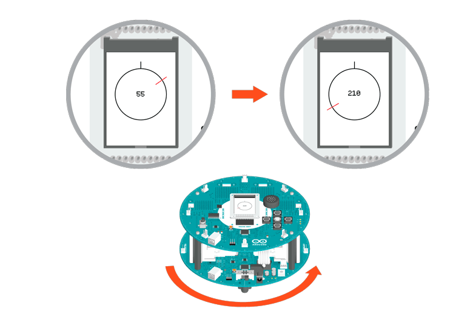

## Compass

The robot has a compass module, which it uses to find its direction. This sketch will make sure the robot goes towards a certain direction.

When you hold the robot in your hands and rotate, you will the screen change, indicating direction.

**NB : magnets will interfere with the compass. If you're getting unexpected results, check to make sure there are none around.**

## Hardware Required

- Arduino Robot

## Instruction

1. Upload the example, unplug USB and turn on power.

2. Place the robot on the ground.

3. After the starting screen, a graph will appear on-screen, representing the compass

4. The robot will start moving in a direction (in this example, it will start heading south). If you move it in a different direction,   it will turn back to the way it wants to move.

5. If you want to change the robot's heading, in the code, look for `int direc=180` at the beginning of the code. Change this value to another number, between 0 and 359. 0 represents north, 90 is east, 180 is south, and 270 is west. Where do you want to go?

## Try it out




## Code

```arduino

/* Robot Compass

 The robot has an on-board compass module, with

 which it can tell the direction the robot is

 facing. This sketch will make sure the robot

 goes towards a certain direction.

 Beware, magnets will interfere with the compass

 readings.

 Circuit:

 * Arduino Robot

 created 1 May 2013

 by X. Yang

 modified 12 May 2013

 by D. Cuartielles

 This example is in the public domain

 */

// include the robot library
#include <ArduinoRobot.h>
#include <Wire.h>

int speedLeft;
int speedRight;
int compassValue;
int direc = 180;  //Direction the robot is heading

void setup() {

  // initialize the modules

  Robot.begin();

  Robot.beginTFT();

  Robot.beginSD();

  Robot.displayLogos();
}

void loop() {

  // read the compass orientation

  compassValue = Robot.compassRead();

  // how many degrees are we off

  int diff = compassValue - direc;

  // modify degrees

  if (diff > 180) {

    diff = -360 + diff;

  } else if (diff < -180) {

    diff = 360 + diff;

  }

  // Make the robot turn to its proper orientation

  diff = map(diff, -180, 180, -255, 255);

  if (diff > 0) {

    // keep the right wheel spinning,

    // change the speed of the left wheel

    speedLeft = 255 - diff;

    speedRight = 255;

  } else {

    // keep the right left spinning,

    // change the speed of the left wheel

    speedLeft = 255;

    speedRight = 255 + diff;

  }

  // write out to the motors

  Robot.motorsWrite(speedLeft, speedRight);

  // draw the orientation on the screen

  Robot.drawCompass(compassValue);
}
```