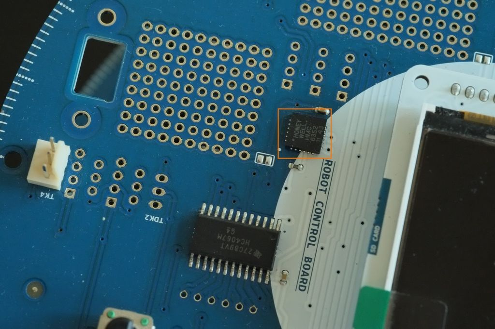

You may have noticed, the compass module on your Arduino Robot doesn't always give accurate readings. If you turn around the robot, towards certain directions the read out is more "dense" than the others. Magnetic sources near by, chassis of the robot, not to mention the earth's magnetic field distribution all affects the compass module. In this tutorial you'll learn to calibrate the compass on your robot with a few simple steps.

This is a tutorial for old models of Arduino robot. More specifically, ones with Honeywell HMC 6352 mounted. To identify which sensor your robot is using, simply look at the chip shown in pictures below.



The sensor communicates through I2C, and there're a number of things you can configure. To know its full capabilities, check out their datasheet.

Below is the sketch for calibration.

```arduino
#include <Wire.h>

#define ADDRESS 0x21

void setup(){

  Wire.begin();

  Serial.begin(9600);

  while(!Serial);

  calibrate();
}

void loop(){
}

void calibrate(){

  Serial.println("Calibration Mode");

  delay(1000);  //1 second before starting

  Serial.println("Start");

  Wire.beginTransmission(ADDRESS);

  Wire.write(0x43);

  Wire.endTransmission();

  for(int i=0;i<15;i++){        //15 seconds

   Serial.println(i);

   delay(1000);

  }

  Wire.beginTransmission(ADDRESS);

  Wire.write(0x45);

  Wire.endTransmission();

  Serial.println("done");

}
```

So basically it's about establishing I2C with the compass, send over a calibration signal, and then send an end of calibration signal when it's done. All the command signals used here can be found in the datasheet. There're a few lines of code used for printing out debug messages, they're not necessary but helps greatly for guiding through the process.

After uploading the sketch, open the serial monitor. You'll see it displaying "Calibration Mode", and 1 second later "start". At this point, the sensor will read its position and self-calibrate for the next 15 seconds. What you need to do is slowly turn the robot around a few circles within the time period. You can see the count down from serial monitor.

When the calibration is done, you see "done" printed in serial monitor.

Now the compass module should be calibrated. Run the robot example "Robot_Control->learn->compass" and see if the readings are even across 360 degrees.