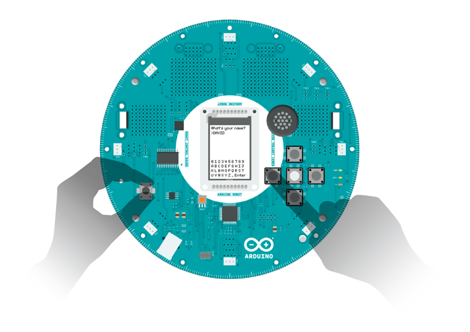

## Hello User

This sketch is the first thing you see when starting the robot. It gives you a warm welcome, shows you some of its really amazing features, and lets you personalize some data.

## Hardware Required

- Arduino Robot

## Instruction

1. Upload the example, you can keep the USB plugged.

2. After the starting screen, you'll see a sequence of slides, read through them to see how this example works.

3. When it comes to the input step, a virtual keyboard will show up on the bottom half of the TFT.

4. You can use the knob and buttons to select your input.

1.  Use the knob to select key

2. Press the middle button to input the key selected

3. Press left/right buttons to move the cursor around

4. When you're done with an input, input "Enter" on the virtual keyboard

5. If you want to erase a character, move the cursor to the desired position, and input an empty space to make it disappear.

5. There's a secret hidden in this example, find it out!

## Try it out



 

## Code

```arduino

/* Hello User

 Hello User! This sketch is the first thing you see

 when starting this robot. It gives you a warm welcome,

 showing you some of the really amazing abilities of

 the robot, and make itself really personal to you.

 Circuit:

 * Arduino Robot

 created 1 May 2013

 by X. Yang

 modified 12 May 2013

 by D. Cuartielles

 This example is in the public domain

 */

#include <ArduinoRobot.h> // include the robot library
#include <Wire.h>

// include the utility function for the sketch
// see the details below
#include <utility/RobotTextManager.h>

char buffer[20];//for storing user name

void setup() {

  //necessary initialization sequence

  Robot.begin();

  Robot.beginTFT();

  Robot.beginSD();

  // show the logos from the SD card

  Robot.displayLogos();

  // clear the screen

  Robot.clearScreen();

  // From now on, display different slides of

  // text/pictures in sequence. The so-called

  // scripts are strings of text stored in the

  // robot's memory

  // these functions are explained below

  //Script 6

  textManager.writeScript(5, 4, 0);

  textManager.writeScript(9, 10, 0);

  Robot.waitContinue();

  delay(500);

  Robot.clearScreen();

  //Script 7

  textManager.writeScript(6, 4, 0);

  textManager.writeScript(9, 10, 0);

  Robot.waitContinue();

  delay(500);

  Robot.clearScreen();

  //Script 8

  // this function enables sound and images at once

  textManager.showPicture("init2.bmp", 0, 0);

  textManager.writeScript(7, 2, 0);

  textManager.writeScript(9, 7, 0);

  Robot.waitContinue();

  delay(500);

  Robot.clearScreen();

  //Script 9

  textManager.showPicture("init3.bmp", 0, 0);

  textManager.writeScript(8, 2, 0);

  textManager.writeScript(9, 7, 0);

  Robot.waitContinue();

  delay(500);

  Robot.clearScreen();

  //Script 11

  textManager.writeScript(10, 4, 0);

  textManager.writeScript(9, 10, 0);

  Robot.waitContinue();

  delay(500);

  Robot.clearScreen();

  //Input screen

  textManager.writeScript(0, 1, 1);

  textManager.input(3, 1, USERNAME);

  textManager.writeScript(1, 5, 1);

  textManager.input(7, 1, ROBOTNAME);

  delay(1000);

  Robot.clearScreen();

  //last screen

  textManager.showPicture("init4.bmp", 0, 0);

  textManager.writeText(1, 2, "Hello");

  Robot.userNameRead(buffer);

  textManager.writeText(3, 2, buffer);

  textManager.writeScript(4, 10, 0);

  Robot.waitContinue(BUTTON_LEFT);

  Robot.waitContinue(BUTTON_RIGHT);

  textManager.showPicture("kt1.bmp", 0, 0);
}

void loop() {

  // do nothing here
}

/**

textManager mostly contains helper functions for

R06_Wheel_Calibration and R01_Hello_User.

The ones used in this example:

  textManager.setMargin(margin_left, margin_top):

    Configure the left and top margin for text

    display. The margins will be used for

    textManager.writeText().

    Parameters:

      margin_left, margin_top: the margin values

      from the top and left side of the screen.

    Returns:

      none

  textManager.writeScript(script_number,line,column):

    Display a script of Hello User example.

    Parameters:

      script_number: an int value representing the

        script to be displayed.

      line, column: in which line,column is the script

        displayed. Same as writeText().

    Returns:

      none

  textManager.input(line,column,codename):

    Print an input indicator(">") in the line and column,

    display and receive input from a virtual keyboard,

    and save the value into EEPROM represented by codename

    Parameters:

      line,column: int values represents where the input

        starts. Same as wirteText().

      codename: either USERNAME,ROBOTNAME,CITYNAME or

        COUNTRYNAME. You can call Robot.userNameRead(),

        robotNameRead(),cityNameRead() or countryNameRead()

        to access the values later.

    Returns:

      none;

  textManager.writeText(line,column,text):

    Display text on the specific line and column.

    It's different from Robot.text() as the later

    uses pixels for positioning the text.

    Parameters:

      line:in which line is the text displayed. Each line

        is 10px high.

      column:in which column is the text displayed. Each

        column is 8px wide.

      text:a char array(string) of the text to be displayed.

    Returns:

      none

    textManager.showPicture(filename, x, y):

      It has the same functionality as Robot.drawPicture(),

      while fixing the conflict between drawPicture() and

      sound playing. Using Robot.drawPicture(), it'll have

      glitches when playing sound at the same time. Using

      showPicture(), it'll stop sound when displaying

      picture, so preventing the problem.

      Parameters:

        filename:string, name of the bmp file in sd

        x,y: int values, position of the picture

      Returns:

        none

*/
```
