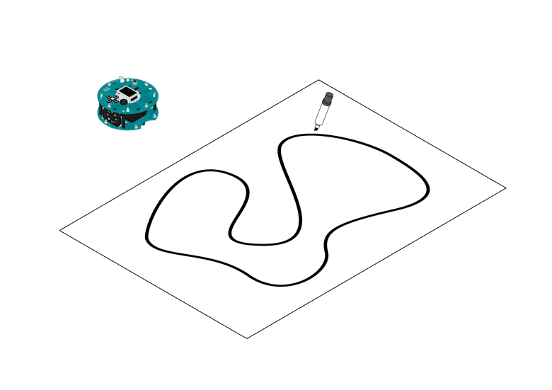
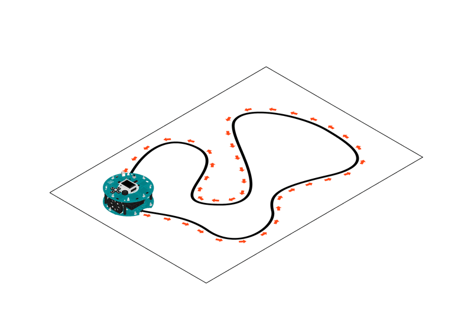

## Line Following

Take a large piece of paper (or tape smaller pieces together to make a big one) and draw a shape on it using a thick black marker. This shape will be your racing track.

Put the robot on top of the line and turn it on. It will scan the floor to detect the line. When it finds the line, it will start following it the path.

Compete with other robots to see which one makes it faster!

## Hardware Required

- Arduino Robot

- Large piece of white paper

- Thick black marker

- tape

## Instruction

1. Prepare the track. Draw a thick line on some white paper, making sure the ends of the line goes together. Use multiple pieces of paper if one is not big enough. The line should be around 3cm (1 inch) wide.

2. Tape the paper to the ground so the robot will not cause the paper to slip. The surface should have light color.

3. Upload the example, unplug USB and turn on power.

4. Place the robot on the track, so it is facing down the line.

5. After the starting screen, the robot will calibrate itself. It'll wag around a few times, detecting the line.

6. The robot will start following the line. If everything goes OK, it'll be continuously going around the track. If the robot goes off the line, see [lineFollowConfig](https://www.arduino.cc/en/Reference/RobotLineFollowConfig)() for details about how to calibrate it.

## Try it out







## Code

```arduino

/* Robot Line Follow

 This sketch demonstrates the line following capabilities

 of the Arduino Robot. On the floor, place some black

 electrical tape along the path you wish the robot to follow.

 To indicate a stopping point, place another piece of tape

 perpendicular to the path.

 Circuit:

 * Arduino Robot

 created 1 May 2013

 by X. Yang

 modified 12 May 2013

 by D. Cuartielles

 This example is in the public domain

 */

#include <ArduinoRobot.h> // include the robot library
#include <Wire.h>

long timerOrigin; // used for counting elapsed time

void setup() {

  // initialize the Robot, SD card, display, and speaker

  Robot.begin();

  Robot.beginTFT();

  Robot.beginSD();

  Robot.beginSpeaker();

  // show the logots on the TFT screen

  Robot.displayLogos();

  Robot.drawBMP("lf.bmp", 0, 0); // display background image

  Robot.playFile("chase.sqm");  // play a song from the SD card

  // add the instructions

  Robot.text("Line Following\n\n place the robot on\n the track and \n see it run", 5, 5);

  Robot.text("Press the middle\n button to start...", 5, 61);

  Robot.waitContinue();

  // These are some general values that work for line following

  // uncomment one or the other to see the different behaviors of the robot

  //Robot.lineFollowConfig(14, 9, 50, 10);

  Robot.lineFollowConfig(11, 7, 60, 5);

  //set the motor board into line-follow mode

  Robot.setMode(MODE_LINE_FOLLOW);

  // start

  Robot.fill(255, 255, 255);

  Robot.stroke(255, 255, 255);

  Robot.rect(0, 0, 128, 80); // erase the previous text

  Robot.stroke(0, 0, 0);

  Robot.text("Start", 5, 5);

  Robot.stroke(0, 0, 0); // choose color for the text

  Robot.text("Time passed:", 5, 21); // write some text to the screen

  timerOrigin = millis(); // keep track of the elapsed time

  while (!Robot.isActionDone()) { //wait for the finish signal

    Robot.debugPrint(millis() - timerOrigin, 5, 29); // show how much time has passed

  }

  Robot.stroke(0, 0, 0);

  Robot.text("Done!", 5, 45);
}
void loop() {

  //nothing here, the program only runs once. Reset the robot

  //to do it again!
}
```

## How it works

The Robot has five infrared sensors on the bottom of the motor board that detect where light reflects back. That information is be used to decide whether to continue straight or to change the wheel speeds to turn.

## Stopping

When the robot detects a black shape covering all the five sensors at once, it will stop. Use this feature to create tracks for the robot to stop and perform actions.
