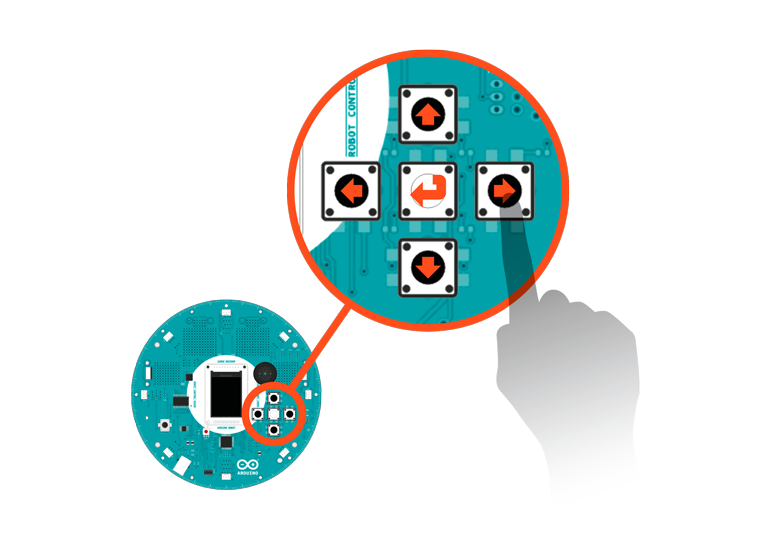
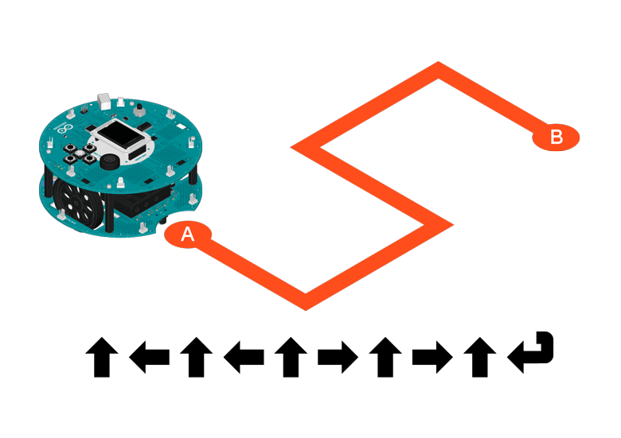

## Logo

This sketch shows you basic movement with the Robot. When the sketch starts, press the buttons ont he control board to indicate the direction you want the robot to move. After you've keyed in your sequence (up to 20 steps at a time), press the middle button to record the steps to memory. Put your robot on the floor for it to follow the directions you programmed.

## Hardware Required

- Arduino Robot

## Instruction

1. Upload the example, unplug USB and turn on power

2. Place the robot on the floor, in a clear space, so it can move around.

3. After the starting images on the screen, the robot will ask you to add commands.

4. Press the buttons according to how you want the robot to move; the commands will be stored and executed later.

5. Left makes the robot turn left for 90 degrees, right makes it turn right. Up makes the robot go forward for 1 second, down makes it go backwards for 1 second.

6. After you're done with the commands, press the middle button. The robot will start executing the commands in order. At most, the robot will remember 20 commands. If you fill them all, the robot will start executing before you press the middle button

7. After running the sequence, the robot will return to the 3rd step. Adjust your commands and do it again!

## Try it out







## Code

First, explain the code line by line

```arduino

/* Robot Logo

 This sketch demonstrates basic movement of the Robot.

 When the sketch starts, press the on-board buttons to tell

 the robot how to move. Pressing the middle button will

 save the pattern, and the robot will follow accordingly.

 You can record up to 20 commands. The robot will move for

 one second per command.

 This example uses images on an SD card. It looks for

 files named "lg0.bmp" and "lg1.bmp" and draws them on the

 screen.

 Circuit:

 * Arduino Robot

 created 1 May 2013

 by X. Yang

 modified 12 May 2013

 by D. Cuartielles

 This example is in the public domain

 */

#include <ArduinoRobot.h> // include the robot library
#include <Wire.h>

int commands[20];  //  array for storing commands

void setup() {

  // initialize the Robot, SD card, and display

  Robot.begin();

  Robot.beginTFT();

  Robot.beginSD();

  // draw "lg0.bmp" and "lg1.bmp" on the screen

  Robot.displayLogos();
}

void loop() {

  Robot.drawBMP("intro.bmp", 0, 0);  //display background image

  iniCommands(); // remove commands from the array

  addCommands(); // add commands to the array

  delay(1000); // wait for a second

  executeCommands(); // follow orders

  Robot.stroke(0, 0, 0);

  Robot.text("Done!", 5, 103); // write some text to the display

  delay(1500); // wait for a moment
}

// empty the commands array
void iniCommands() {

  for (int i = 0; i < 20; i++) {

    commands[i] = -1;

  }
}

// add commands to the array
void addCommands() {

  Robot.stroke(0, 0, 0);

  // display text on the screen

  Robot.text("1. Press buttons to\n add commands.\n\n 2. Middle to finish.", 5, 5);

  // read the buttons' state

  for (int i = 0; i < 20;) { //max 20 commands

    int key = Robot.keyboardRead();

    if (key == BUTTON_MIDDLE) { //finish input

      break;

    } else if (key == BUTTON_NONE) { //if no button is pressed

      continue;

    }

    commands[i] = key; // save the button to the array

    PrintCommandI(i, 46); // print the command on the screen

    delay(100);

    i++;

  }
}

// run through the array and move the robot
void executeCommands() {

  // print status to the screen

  Robot.text("Executing...", 5, 70);

  // read through the array and move accordingly

  for (int i = 0; i < 20; i++) {

    switch (commands[i]) {

      case BUTTON_LEFT:

        Robot.turn(-90);

        break;

      case BUTTON_RIGHT:

        Robot.turn(90);

        break;

      case BUTTON_UP:

        Robot.motorsWrite(255, 255);

        break;

      case BUTTON_DOWN:

        Robot.motorsWrite(-255, -255);

        break;

      case BUTTON_NONE:

        return;

    }

    // print the current command to the screen

    Robot.stroke(255, 0, 0);

    PrintCommandI(i, 86);

    delay(1000);

    // stop moving for a second

    Robot.motorsStop();

    delay(1000);

  }
}

// convert the button press to a single character
char keyToChar(int key) {

  switch (key) {

    case BUTTON_LEFT:

      return '<';

    case BUTTON_RIGHT:

      return '>';

    case BUTTON_UP:

      return '^';

    case BUTTON_DOWN:

      return 'v';

  }
}

// display a command
void PrintCommandI(int i, int originY) {

  Robot.text(keyToChar(commands[i]), i % 14 * 8 + 5, i / 14 * 10 + originY);
}
```
