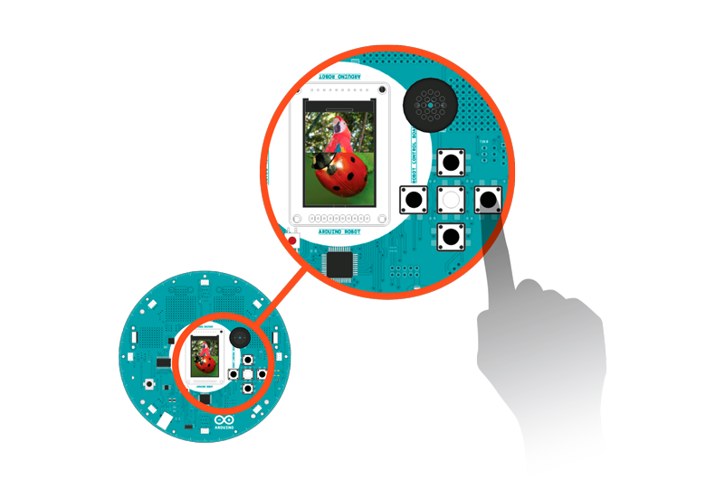

## Picture Browser

You can make your own gallery/picture show with help of the Robot. Put some pictures in the SD card, start the sketch, and you can see them showing up on the LCD. Use left and right button on the D-pad to go the previous or next image. Press up or down to enter the "tilt navigation" mode.

## Hardware Required

- Arduino Robot

- Some pictures on the SD card

## Instruction

1. Upload the example. You can keep the USB plugged in for power.

2. After the starting screen, you will see some instructions about the sketch.

3. A picture from the gallery will show up on the screen.

4. Press left/right/middle to navigate through the pictures

5. Press up/down to change the mode, you'll see the current mode showing up on top of the screen.

6. In tilt control mode, rotate your robot to navigate the gallery.

7. If you want to add your own pictures, make them 128*160, 24-bit bmp. Name them as "PicN.bmp" (where N is a number 1-9) and copy them onto the sd card.

8. The program only supports 10 pictures, Pic0.bmp to Pic9.bmp. Want to add more? Improve the program yourself!

## Try it out



 

You can change the picture navigation mode by pressing the down button and tilt the robot to check the next picture.


 

## Code

```arduino

/* Picture Browser

 You can make your own gallery/picture show with the

 Robot. Put some pictures on the SD card, start the

 sketch, they will display on the screen.

 Use the left/right buttons to navigate through the

 previous and next images.

 Press up or down to enter a mode where you change

 the pictures by rotating the robot.

 You can add your own pictures onto the SD card, and

 view them in the Robot's gallery!

 Pictures must be uncompressed BMP, 24-bit color depth,

 160 pixels wide, and 128 pixels tall.

 They should be named as "picN.bmp". Replace 'N' with a

 number between 0 and 9.

 The current code only supports 10 pictures. How would you

 improve it to handle more?

 Circuit:

 * Arduino Robot

 created 1 May 2013

 by X. Yang

 modified 12 May 2013

 by D. Cuartielles

 This example is in the public domain

 */

#include <ArduinoRobot.h> // include the robot library
#include <Wire.h>

const int NUM_PICS = 4;  //Total number of pictures in Gallery

// name the modes

const int CONTROL_MODE_KEY = 0;

const int CONTROL_MODE_COMPASS = 1;

char buffer[] = "pic1.bmp";  // current file name
int i = 1;  // Current gallery sequence counter
int mode = 0;  // Current mode

// text to display on screen
char modeNames[][9] = { "keyboard", "tilt    " };

void setup() {

  // initialize the Robot, SD card, display, and speaker

  Robot.beginSD();

  Robot.beginTFT();

  Robot.begin();

  // draw "lg0.bmp" and "lg1.bmp" on the screen

  Robot.displayLogos();

  // draw init3.bmp from the SD card on the screen

  Robot.drawBMP("init3.bmp", 0, 0);

  // display instructions

  Robot.stroke(0, 0, 0);

  Robot.text("The gallery\n\n has 2 modes, in\n keyboard mode, L/R\n key for switching\n pictures, U/D key\n for changing modes", 5, 5);

  delay(6000);

  Robot.clearScreen();

  Robot.drawBMP("pb.bmp", 0, 0);

  Robot.text("In tilt mode,\n quickly tilt the\n robot to switch\n pictures", 5, 5);

  delay(4000);
}

void loop() {

  buffer[3] = '0' + i; // change filename of the img to be displayed

  Robot.drawBMP(buffer, 0, 0); // draw the file on the screen

  // change control modes

  switch (mode) {

    case CONTROL_MODE_COMPASS:

      compassControl(3);

      break;

    case CONTROL_MODE_KEY:

      keyboardControl();

      break;

  }

  delay(200);
}

void keyboardControl() {

  //Use buttons to control the gallery

  while (true) {

    int keyPressed = Robot.keyboardRead(); // read the button values

    switch (keyPressed) {

      case BUTTON_LEFT:  // display previous picture

        if (--i < 1) {

          i = NUM_PICS;

        }

        return;

      case BUTTON_MIDDLE:  // do nothing

      case BUTTON_RIGHT:  // display next picture

        if (++i > NUM_PICS) {

          i = 1;

        }

        return;

      case BUTTON_UP:  // change mode

        changeMode(-1);

        return;

      case BUTTON_DOWN:  // change mode

        changeMode(1);

        return;

    }

  }
}

// if controlling by the compass
void compassControl(int change) {

  // Rotate the robot to change the pictures

  while (true) {

    // read the value of the compass

    int oldV = Robot.compassRead();

    //get the change of angle

    int diff = Robot.compassRead() - oldV;

    if (diff > 180) {

      diff -= 360;

    } else if (diff < -180) {

      diff += 360;

    }

    if (abs(diff) > change) {

      if (++i > NUM_PICS) {

        i = 1;

      }

      return;

    }

    // change modes, if buttons are pressed

    int keyPressed = Robot.keyboardRead();

    switch (keyPressed) {

      case BUTTON_UP:

        changeMode(-1);

        return;

      case BUTTON_DOWN:

        changeMode(1);

        return;

    }

    delay(10);

  }
}

// Change the control mode and display it on the LCD
void changeMode(int changeDir) {

  // alternate modes

  mode += changeDir;

  if (mode < 0) {

    mode = 1;

  } else if (mode > 1) {

    mode = 0;

  }

  // display  the mode on screen

  Robot.fill(255, 255, 255);

  Robot.stroke(255, 255, 255);

  Robot.rect(0, 0, 128, 12);

  Robot.stroke(0, 0, 0);

  Robot.text("Control:", 2, 2);

  Robot.text(modeNames[mode], 52, 2);

  delay(1000);
}
```
