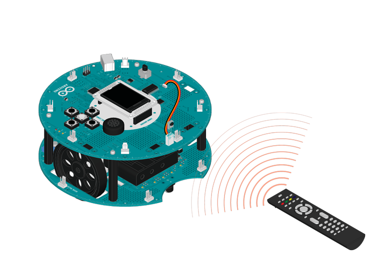

## Remote Control

*This example is considered experimental, you will need to install the IR-Remote library by Ken Shirriff on your IDE for it to run, read the code for more information*

If you connect a IR remote receiver to the robot, you can control it like controlling your TV set. Take a Sony compatible remote controller, map some buttons to different actions, and you can make the robot move around without  touching it!

## Hardware Required

- Arduino Robot

- Infrared sensor

- cable to connect the sensor

- Sony compatible remote control

## Instruction

1. Connect the IR sensor to TKD2 on the top board, using the cable provided.

2. Fix the sensor on the board

3. Upload the example, unplug USB and turn on power

4. After the starting screen, use the remote control to send it commands

5. Press the buttons you've coded to move the robot.

6. You can see received signals and commands (if recognized) on the LCD.

7. If you want to customize your commands:

1.  Press the buttons on remote control and write down the values showing up on LCD.

2. Locate these lines in the example code:
#define IR_CODE_FORWARD 0x2C9B
#define IR_CODE_BACKWARDS 0x6C9B
#define IR_CODE_TURN_LEFT 0xD4B8F
#define IR_CODE_TURN_RIGHT 0x34B8F

3. Change the values here to the ones you saw on the screen.

## Try it out



 

## Code

```arduino

/* 08 Remote Control

 If you connect a IR receiver to the robot,

 you can control it like a RC car.

 Using the remote control comes with sensor

 pack, You can make the robot move around

 without even touching it!

 Circuit:

 * Arduino Robot

 * Connect the IRreceiver to D2

 * Remote control from Robot sensor pack

 based on the IRremote library

 by Ken Shirriff

 http://arcfn.com

 created 1 May 2013

 by X. Yang

 modified 12 May 2013

 by D. Cuartielles

 This example is in the public domain

 */

// include the necessary libraries
#include <RobotIRremote.h>
#include <RobotIRremoteTools.h>
#include <ArduinoRobot.h>
#include <Wire.h>

// Define a few commands from your remote control
#define IR_CODE_FORWARD 284154405
#define IR_CODE_BACKWARDS 284113605
#define IR_CODE_TURN_LEFT 284129925
#define IR_CODE_TURN_RIGHT 284127885
#define IR_CODE_CONTINUE -1

bool isActing = false; //If the robot is executing command from remote
long timer;

const long TIME_OUT = 150;

void setup() {

  // initialize the Robot, SD card, display, and speaker

  Serial.begin(9600);

  Robot.begin();

  Robot.beginTFT();

  Robot.beginSD();

  // print some text to the screen

  beginIRremote(); // Start the receiver
}

void loop() {

  // if there is an IR command, process it

  if (IRrecived()) {

    processResult();

    resumeIRremote(); // resume receiver

  }

  //If the robot does not receive any command, stop it

  if (isActing && (millis() - timer >= TIME_OUT)) {

    Robot.motorsStop();

    isActing = false;

  }
}
void processResult() {

  unsigned long res = getIRresult();

  switch (res) {

    case IR_CODE_FORWARD:

      changeAction(1, 1); //Move the robot forward

      break;

    case IR_CODE_BACKWARDS:

      changeAction(-1, -1); //Move the robot backwards

      break;

    case IR_CODE_TURN_LEFT:

      changeAction(-0.5, 0.5); //Turn the robot left

      break;

    case IR_CODE_TURN_RIGHT:

      changeAction(0.5, -0.5); //Turn the robot Right

      break;

    case IR_CODE_CONTINUE:

      timer = millis(); //Continue the last action, reset timer

      break;

  }
}
void changeAction(float directionLeft, float directionRight) {

  Robot.motorsWrite(255 * directionLeft, 255 * directionRight);

  timer = millis();

  isActing = true;
}
```