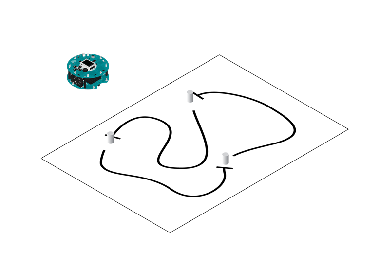
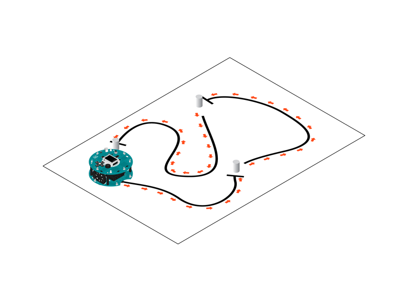
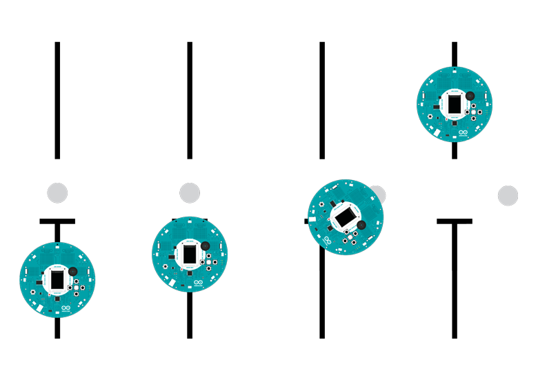

## Rescue

The Rescue challenge in robotics consists of getting your robot to follow a line until it reaches a location where it will perform a task. In this case, the robot makes it to an obstacle, pushes it out of the way, and continues along.

## Hardware Required

- Arduino Robot

- Large paper

- Thick black marker

- Obstacles, like empty cans, or not too-heavy toys

- "victim" objects

## Instruction

1. To prepare the track, follow the instructions in [line following example](https://arduino.cc/en/Tutorial/LibraryExamples/RobotLineFollowing). There are a few  differences:

1.  Add some end lines for the robot to stop. Create a gap in the line, and draw a rectangle about the size of the robot in the gap.

2. Put the "victim" object inside the rectangle.

2. Upload the example, unplug USB and turn on power.

3. Put robot on the track, on the line.

4. The robot will start following the line, and push the victim out of its location

5. If the robot does not follow the line well, see [lineFollowConfig](https://www.arduino.cc/en/Reference/RobotLineFollowConfig)() for details on calibration.

## Try it out

First, draw your racing track, adding the stops (perpendicular lines) for the robot to know where the obstacles will be.


Place your obstacles on the track. The robot can push some weight, like empty soda cans or small plastic toys make for good obstacles.



 

Put the robot on the track and turn it on to see if it can solve the challenge.



 

In front of an obstacle, the robot slows down, starts pushing the object, backs up and starts racing again.



 

## Code

```arduino

/* Robot Rescue

 In this example, the robot enters the line following mode and

 plays some music until it reaches its target. Once it finds the

 target, it pushes it out of the track. It then returns to the

 track and looks for a second target.

 You can make the robot push as many objects as you want to, just

 add more to calls to the rescue function or even move that code

 into the loop.

 Circuit:

 * Arduino Robot

 * some objects for the robot to push

 * a line-following circuit

 created 1 May 2013

 by X. Yang

 modified 12 May 2013

 by D. Cuartielles

 This example is in the public domain

 */

#include <ArduinoRobot.h> // include the robot library
#include <Wire.h>

void setup() {

  // initialize the Robot, SD card, display, and speaker

  Robot.begin();

  Robot.beginTFT();

  Robot.beginSD();

  Robot.beginSpeaker();

  // draw "lg0.bmp" and "lg1.bmp" on the screen

  Robot.displayLogos();

  // display the line following instructional image from the SD card

  Robot.drawBMP("lf.bmp", 0, 0);

  // play the chase music file

  Robot.playFile("chase.sqm");

  // add the instructions

  Robot.text("Rescue\n\n place the robot on\n the rescue track\n pushing the\n obstacles away", 5, 5);

  Robot.text("Press the middle\n button to start...", 5, 61);

  Robot.waitContinue();

  // start

  Robot.fill(255, 255, 255);

  Robot.stroke(255, 255, 255);

  Robot.rect(0, 0, 128, 80); // erase the previous text

  Robot.stroke(0, 0, 0);

  Robot.text("Start", 5, 5);

  // use this to calibrate the line following algorithm

  // uncomment one or the other to see the different behaviors of the robot

  // Robot.lineFollowConfig(14, 9, 50, 10);

  Robot.lineFollowConfig(11, 7, 60, 5);

  // run the rescue sequence

  rescueSequence();

  // find the track again

  goToNext();

  // run the rescue sequence a second time

  rescueSequence();

  // here you could go on ...

}

void loop() {

  //nothing here, the program only runs once.
}

// run the sequence
void rescueSequence() {

  //set the motor board into line-follow mode

  Robot.setMode(MODE_LINE_FOLLOW);

  while (!Robot.isActionDone()) { // wait until it is no longer following the line

  }

  delay(1000);

  // do the rescue operation

  doRescue();

  delay(1000);
}

void doRescue() {

  // Reached the endline, engage the target

  Robot.motorsWrite(200, 200);

  delay(250);

  Robot.motorsStop();

  delay(1000);

  // Turn the robot

  Robot.turn(90);

  Robot.motorsStop();

  delay(1000);

  // Move forward

  Robot.motorsWrite(200, 200);

  delay(500);

  Robot.motorsStop();

  delay(1000);

  // move backwards, leave the target

  Robot.motorsWrite(-200, -200);

  delay(500);

  Robot.motorsStop();
}

void goToNext() {

  // Turn the robot

  Robot.turn(-90);

  Robot.motorsStop();

  delay(1000);
}
```