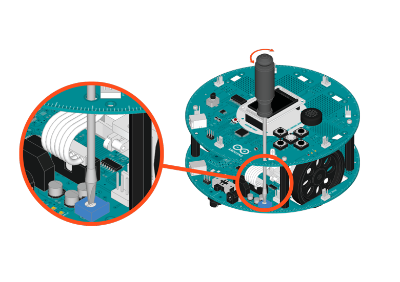

## Wheel Calibration

Use this sketch to calibrate the wheels of your robot. Your robot should move in a straight line when putting both motors at the same speed.

Run the software and follow the on-screen instructions. Use the potentiometer on the bottom board to adjust the calibration.

## Hardware Required

- Arduino Robot

- A long thin screwdriver

## Instruction

1. Upload the example, unplug USB and turn on power

2. Find a flat surface, on the ground. Have a screwdriver that fits into the pot on the Motor Board ready.

3. After the starting screen, a list of instructions will show up.

4. You can change the robot speed by adjusting the knob on Control Board.

5. Put the robot on the flat surface, and see if it's going a straight line

6. If the robot goes in a curve, you need to adjust the morto board's trimmer potentiometer with screwdriver.

1.  If the robot is turning left, screw it clockwise

2. If it's turning right, screw it counter-clockwise

7. If the robot is still turning,  repeat the process until it's moving in a straight line.

8. The number on the bottom-right corner of the LCD screen is the calibration value, ranging from -30% to 30%. It can help keep track of your process.

## Try it out




## Code

```arduino

/* 6 Wheel Calibration

*

* Use this sketch to calibrate the wheels in your robot.

* Your robot should drive as straight as possible when

* putting both motors at the same speed.

*

* Run the software and follow the on-screen instructions.

* Use the trimmer on the bottom board to make sure the

* robot is working at its best!

*

* (c) 2013 X. Yang

*/
#include "scripts_library.h"

#include <ArduinoRobot.h>
#include <Wire.h>

void setup() {

  Serial.begin(9600);

  Robot.begin();

  Robot.beginTFT();

  Robot.beginSD();

  Robot.setTextWrap(false);

  Robot.displayLogos();

  writeAllScripts();

}
void loop() {

  int val = map(Robot.knobRead(), 0, 1023, -255, 255);

  Serial.println(val);

  Robot.motorsWrite(val, val);

  int WC = map(Robot.trimRead(), 0, 1023, -20, 20);

  Robot.debugPrint(WC, 108, 149);

  delay(40);

}
```