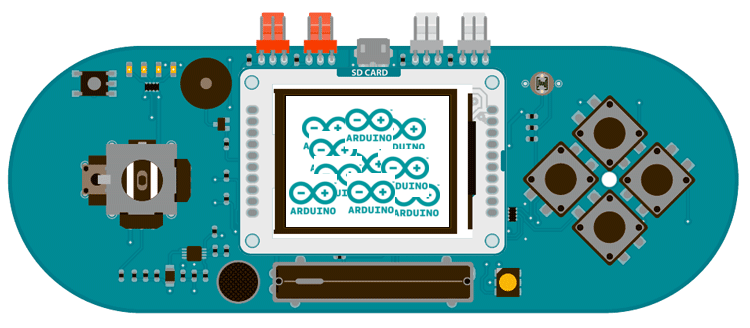

## Esplora TFT Bitmap Logo

This example for the Esplora with an Arduino screen reads a bitmap file from a SD card and displays it on screen in a random location.

For this example to work, you need to save an image named "logo.bmp" to the root of the SD card. The SD card needs to be FAT16 and FAT32 formatted. See the [SD library documentation](https://www.arduino.cc/en/Reference/SD) for more information on working with SD cards.

## Hardware Required

- Arduino Esplora

- Arduino TFT screen

- micro-SD card

- [image file](https://arduino.cc/en/uploads/Tutorial/logo.bmp)

## Circuit



Attach the TFT screen to the socket on your Esplora, with the label "SD Card" facing up. Insert the SD card with the "logo.bmp" file into the slot.

## Code

To use the screen you must first include the SPI and TFT libraries. Don't forget to include the Esplora library and the SD library to read the image from the card.

```arduino
#include <Esplora.h>
#include <TFT.h>
#include <SPI.h>
#include <SD.h>
```

You need to define the pin for the SD reader's chip select (CS). On the Esplora, it is mapped to pin 8.

```arduino
#define SD_CS    8
```

There is a special datatype called PImage for holding image information. Create a named version of PImage

```arduino
PImage logo;
```

In `setup()`, you're going to initialize the serial port and wait for it to become active before starting up. This means that you will need to turn on the serial monitor once the sketch has loaded. If you want to ignore the status information, comment out the `while()` loop.

Once serial communication has started, initialize the SD library. If there is an error, turn the Esplora's LED red.

```arduino
void setup() {

  Serial.begin(9600);

  while (!Serial) {

  }

  Serial.print("Initializing SD card...");

  if (!SD.begin(SD_CS)) {

    Serial.println("failed!");

    Esplora.writeRed(255);

    return;

  }

  Serial.println("OK!");
```

Initialize and clear the screen

```arduino
EsploraTFT.begin();

  EsploraTFT.background(255, 255, 255);
```

Try reading the image file into the PImage you named earlier with `loadimage()`. Check that it is a valid image, and turn the Esplora's LED green if everything is OK, red if there is an error.

```arduino
Esplora.writeRGB(0, 0, 0);

  logo = EsploraTFT.loadImage("logo.bmp");

  if (logo.isValid()) {

    Esplora.writeGreen(255);

  }

  else

    Esplora.writeRed(255);

}
```

If the image wasn't loaded correctly, stop the sketch before going any further.

```arduino
void loop() {

  if (logo.isValid() == false) {

    return;

  }
```

If the image information is valid, pick a random spot on the screen to display the image. To make sure all the image is drawn onscreen, take the dimensions of the image and subtract that from the screen's dimensions.

```arduino
int x = random(EsploraTFT.width() - logo.width());

  int y = random(EsploraTFT.height() - logo.height());
```

Draw the image onscreen starting at the random coordinates from the previous step, and wait for a little bit before entering the next `loop()`

```arduino
EsploraTFT.image(logo, x, y);

  delay(1500);
}
```

The complete sketch is below :

```arduino

/*

 Esplora TFT Bitmap Logos

 This example for the Arduino TFT screen is for use

 with an Arduino Esplora.

 This example reads an image file from a micro-SD card

 and draws it on the screen, at random locations.

 There is a .bmp file included with this sketch.

 - open the sketch folder (Ctrl-K or Cmd-K)

 - copy the "arduino.bmp" file to a micro-SD

 - put the SD into the SD slot of the Arduino LCD module.

 This example code is in the public domain.

 Created 19 April 2013 by Enrico Gueli

 http://www.arduino.cc/en/Tutorial/EsploraTFTBitmapLogo

 */

// include the necessary libraries
#include <Esplora.h>
#include <SPI.h>
#include <SD.h>
#include <TFT.h>            // Arduino LCD library

// the Esplora pin connected to the chip select line for SD card
#define SD_CS    8

// this variable represents the image to be drawn on screen

PImage logo;

void setup() {

  // initialize the GLCD and show a message

  // asking the user to open the serial line

  EsploraTFT.begin();

  EsploraTFT.background(255, 255, 255);

  EsploraTFT.stroke(0, 0, 255);

  EsploraTFT.println();

  EsploraTFT.println(F("Arduino LCD Bitmap Example"));

  EsploraTFT.stroke(0, 0, 0);

  EsploraTFT.println(F("Open serial monitor"));

  EsploraTFT.println(F("to run the sketch"));

  // initialize the serial port: it will be used to

  // print some diagnostic info

  Serial.begin(9600);

  while (!Serial) {

    // wait for serial port to connect. Needed for native USB port only

  }

  // try to access the SD card. If that fails (e.g.

  // no card present), the Esplora's LED will turn red.

  Serial.print(F("Initializing SD card..."));

  if (!SD.begin(SD_CS)) {

    Serial.println(F("failed!"));

    Esplora.writeRed(255);

    return;

  }

  Serial.println("OK!");

  // clear the GLCD screen before starting

  EsploraTFT.background(255, 255, 255);

  // now that the SD card can be access, try to load the

  // image file. The Esplora LED will turn green or red if

  // the loading went OK or not.

  Esplora.writeRGB(0, 0, 0);

  logo = EsploraTFT.loadImage("arduino.bmp");

  if (logo.isValid()) {

    Esplora.writeGreen(255);

  } else {

    Esplora.writeRed(255);

  }

}

void loop() {

  // don't do anything if the image wasn't loaded correctly.

  if (logo.isValid() == false) {

    return;

  }

  Serial.println(F("drawing image"));

  // get a random location where to draw the image.

  // To avoid the image to be draw outside the screen,

  // take into account the image size.

  int x = random(EsploraTFT.width() - logo.width());

  int y = random(EsploraTFT.height() - logo.height());

  // draw the image to the screen

  EsploraTFT.image(logo, x, y);

  // wait a little bit before drawing again

  delay(1500);
}
```