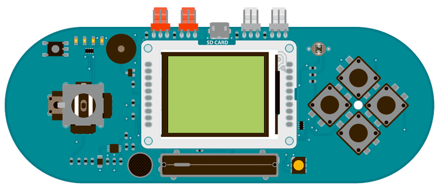

## Esplora TFT Color Picker

This example for the Esplora with an Arduino screen reads the input of the joystick's two axes and the slider, using the values to change the screen's color.

Color on the TFT screen screen is handled as 8-bit numbers (0-255). However, the library scales these values to 5-bits (32 levels) for red and blue, 6-bits (64 levels) for green.

## Hardware Required

- Arduino Esplora

- Arduino TFT screen

## Circuit



Attach the screen to the socket on your Esplora, with the label "SD Card" facing up.

## Code

To use the screen you must first include the SPI and TFT libraries. Don't forget to include the Esplora library as well.

```arduino
#include <Esplora.h>
#include <GLCD.h>
#include <SPI.h>
```

In `setup()`, start serial communication so you can read the values used for the background color. Also, start the screen and make the background white.

```arduino
void setup() {

  Serial.begin(9600);

  EsploraTFT.begin();

  EsploraTFT.background(255, 255, 255);
}
```

In `loop()`, read the values from the joystick axes and slider, mapping them to values between 0-255. with `background()`, set the mapped background colors and print the values to the serial monitor.

```arduino
void loop() {

  int xValue = map(Esplora.readJoystickX(), -512, 512, 0, 255);

  int yValue = map(Esplora.readJoystickY(), -512, 512, 0, 255);

  int slider = map(Esplora.readSlider(), 0, 1023, 0, 255);

  EsploraTFT.background(xValue, yValue, slider);

  Serial.print("background(");

  Serial.print(xValue);

  Serial.print(" , ");

  Serial.print(yValue);

  Serial.print(" , ");

  Serial.print(slider);

  Serial.println(")");

  delay(33);

}
```

The complete sketch is below :

```arduino

SORRY, There is an error at our code repository, please inform to web@arduino.cc
```