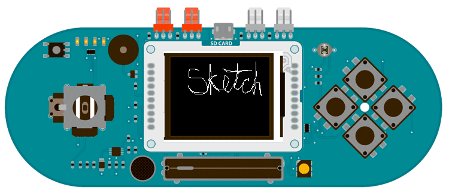

## Esplora TFT EtchASketch

This example for the Arduino TFT screen and Esplora draws a white line on the screen, based on the position of the joystick. To clear the screen, shake the Esplora. The values from the accelerometer will determine if the screen should be cleared or not.

## Hardware Required

- Arduino Esplora

- Arduino TFT screen

## Circuit



Attach the screen to the socket on your Esplora, with the label "SD Card" facing up.

## Code

To use the screen you must first include the SPI and TFT libraries. Don't forget to include the Esplora library as well.

```arduino
#include <Esplora.h>
#include <TFT.h>
#include <SPI.h>
```

Set up the cursor's x & y position. In the example, it starts in the center of the screen; determined by dividing the height and width of the screen by 2.

```arduino
int xPos = EsploraTFT.width()/2;
int yPos = EsploraTFT.height()/2;
```

In `setup()`, initialize the display and clear the screen's background.

```arduino
void setup() {

  EsploraTFT.begin();

  EsploraTFT.background(0,0,0);
}
```

Read the values of the joystick and map it to a smaller number. It's possible that your joystick doesn't read 0 when it is in the center position. To make sure the cursor only moves when the joystick is intentionally moved, use an if statement to check if it's position is inside a threshold (in this case -10 to 10). If it's within that range, son;t update the cursor position. However, if it is outside of that, move the cursor in the appropriate direction.

```arduino
void loop()
{

  int xAxis = Esplora.readJoystickX();

  int yAxis = Esplora.readJoystickY();

  if (xAxis<10 && xAxis>-10){

    xPos=xPos;

  }

  else{

    xPos = xPos + (map(xAxis, -512, 512, 2, -2));

  }

  if (yAxis<10 && yAxis>-10){

    yAxis=yAxis;

  }

  else{

    yPos = yPos + (map(yAxis, -512, 512, -2, 2));

  }
```

You'll want to keep the cursor from moving offscreen with a few `if()` statements before you draw the point.

```arduino
if(xPos > 159){

    (xPos = 159);

  }

  if(xPos < 0){

    (xPos = 0);

  }

  if(yPos > 127){

    (yPos = 127);

  }

  if(yPos < 0){

    (yPos = 0);

  }

  EsploraTFT.stroke(255,255,255);

  EsploraTFT.point(xPos,yPos);
```

Finally, check the value of the accelerometer. If the value of the x or y axis is over the threshold you determine, clear the screen with `background()`.

```arduino
if(abs(Esplora.readAccelerometer(X_AXIS))>200 || abs(Esplora.readAccelerometer(Y_AXIS))>200){

    EsploraTFT.background(0,0,0);

  }

  delay(33);
}
```

The complete sketch is below :

```arduino

/*

 Esplora TFT EtchASketch

 This example for the Arduino TFT and Esplora draws

 a white line on the screen, based on the position

 of the joystick. To clear the screen, shake the

 Esplora, using the values from the accelerometer.

 This example code is in the public domain.

 Created 15 April 2013 by Scott Fitzgerald

 http://www.arduino.cc/en/Tutorial/EsploraTFTEtchASketch

 */

#include <Esplora.h>
#include <TFT.h>  // Arduino LCD library
#include <SPI.h>

// initial position of the cursor
int xPos = EsploraTFT.width() / 2;
int yPos = EsploraTFT.height() / 2;

void setup() {

  // initialize the display

  EsploraTFT.begin();

  // clear the background

  EsploraTFT.background(0, 0, 0);
}

void loop() {

  int xAxis = Esplora.readJoystickX();    // read the X axis

  int yAxis = Esplora.readJoystickY();    // read the Y axis

  // update the position of the line

  // depending on the position of the joystick

  if (xAxis < 10 && xAxis > -10) {

    xPos = xPos;

  } else {

    xPos = xPos + (map(xAxis, -512, 512, 2, -2));

  }

  if (yAxis < 10 && yAxis > -10) {

    yAxis = yAxis;

  } else {

    yPos = yPos + (map(yAxis, -512, 512, -2, 2));

  }

  // don't let the point go past the screen edges

  if (xPos > 159) {

    (xPos = 159);

  }

  if (xPos < 0) {

    (xPos = 0);

  }

  if (yPos > 127) {

    (yPos = 127);

  }

  if (yPos < 0) {

    (yPos = 0);

  }

  // draw the point

  EsploraTFT.stroke(255, 255, 255);

  EsploraTFT.point(xPos, yPos);

  // check the accelerometer values and clear

  // the screen if it is being shaken

  if (abs(Esplora.readAccelerometer(X_AXIS)) > 200 || abs(Esplora.readAccelerometer(Y_AXIS)) > 200) {

    EsploraTFT.background(0, 0, 0);

  }

  delay(33);
}
```