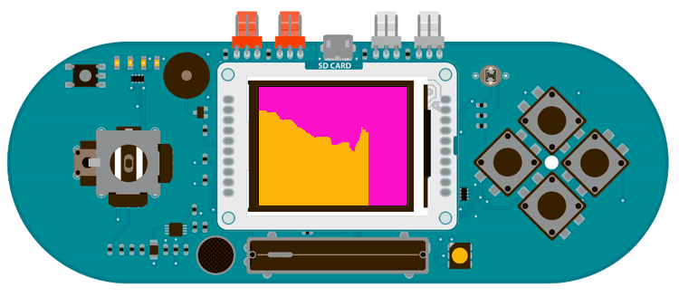

## Esplora TFT Graph

This example for the Esplora with an Arduino TFT screen reads the amount of brightness that falls on the onboard light sensor, and graphs it on screen. This is similar to the [serial communication Graph example](https://arduino.cc/en/Tutorial/BuiltInExamples/Graph).

## Hardware Required

- Arduino Esplora

- Arduino TFT screen

## Circuit



Attach the TFT screen to the socked on your Esplora, with the label "SD Card" facing up.

## Code

To use the screen you must first include the SPI and TFT libraries. Don't forget to include the Esplora library as well.

```arduino
#include <Esplora.h>
#include <TFT.h>
#include <SPI.h>
```

Create a variable for holding the position of the x-axis of the graph. You'll increment this each `loop()`. In `setup()`, initialize the screen and make the background a nice color.

```arduino
int xPos = 0;

void setup(){

  EsploraTFT.begin();

  EsploraTFT.background(250,16,200);
}
```

In `loop()`, read the value from the light sensor, and map it to a value that fits in the screen's height.

```arduino
void loop(){

  int sensor = Esplora.readLightSensor();

  int graphHeight = map(sensor,0,1023,0,EsploraTFT.height());
```

Set the stroke color to something that will stand out against the nice color you chose for the background, and draw a line from the bottom of the screen based on the value of the sensor

```arduino
EsploraTFT.stroke(250,180,10);

  EsploraTFT.line(xPos, EsploraTFT.height() - graphHeight, xPos, EsploraTFT.height());
```

Before closing up `loop()`, check to make sure the graph hasn't gone past the edge of the screen. If it has, erase everything, and start back at 0 on the x-axis.

```arduino
if (xPos >= 160) {

    xPos = 0;

    EsploraTFT.background(250,16,200);

  }

  else {

    xPos++;

  }

  delay(16);
}
```

The complete sketch is below :

```arduino

/*

 Esplora TFT Graph

 This example for the Esplora with an Arduino TFT reads

 the value of the light sensor, and graphs the values on

 the screen.

 This example code is in the public domain.

 Created 15 April 2013 by Scott Fitzgerald

 http://www.arduino.cc/en/Tutorial/EsploraTFTGraph

 */

#include <Esplora.h>
#include <TFT.h>  // Arduino LCD library
#include <SPI.h>

// position of the line on screen
int xPos = 0;

void setup() {

  // initialize the screen

  EsploraTFT.begin();

  // clear the screen with a nice color

  EsploraTFT.background(250, 16, 200);
}

void loop() {

  // read the sensor value

  int sensor = Esplora.readLightSensor();

  // map the sensor value to the height of the screen

  int graphHeight = map(sensor, 0, 1023, 0, EsploraTFT.height());

  // draw the line in a pretty color

  EsploraTFT.stroke(250, 180, 10);

  EsploraTFT.line(xPos, EsploraTFT.height() - graphHeight, xPos, EsploraTFT.height());

  // if the graph reaches the edge of the screen

  // erase it and start over from the other side

  if (xPos >= 160) {

    xPos = 0;

    EsploraTFT.background(250, 16, 200);

  } else {

    // increment the horizontal position:

    xPos++;

  }

  delay(16);
}
```