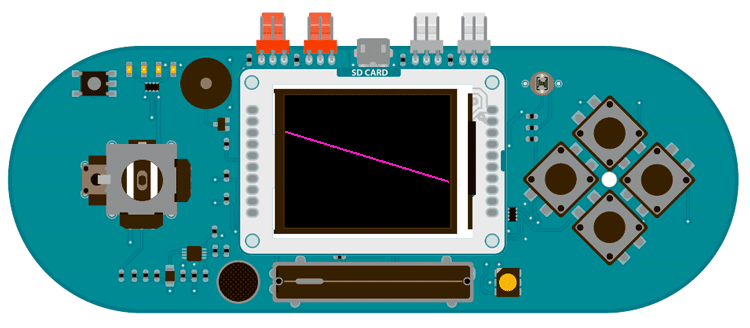

## Esplora TFT Horizon

This sketch for the TFT screen with an Arduino Esplora reads the value of the onboard accelerometer, and draws a line across the screen that stays parallel to the horizon.

As you tilt the Esplora, the accelerometer reports its orientation to the center of the earth. Mapping these values allows you to keel the line aligned with the horizon.

## Hardware Required

- Arduino Esplora

- Arduino TFT screen

## Circuit



Attach the TFT screen to the socket on your Esplora, with the label "SD Card" facing up.

## Code

To use the screen you must first include the SPI and TFT libraries. Don't forget to include the Esplora library as well.

```arduino
#include <Esplora.h>
#include <TFT.h>
#include <SPI.h>
```

Create variables for the start and end points of the line, as well as variables to hold the locations for the previous time through the `loop()`. You'll use these values to erase lines when it changes position.

```arduino
int yStart = EsploraTFT.height()/2;
int yEnd = EsploraTFT.height()/2;

int oldEndY;
int oldStartY;
```

In `setup()`, initialize the display and clear the screen's background.

```arduino
void setup() {

  EsploraTFT.begin();

  EsploraTFT.background(0,0,0);
}
```

In `loop()`, read the value from the accelerometer's x-axis. This is the axis oriented to the horizon when the Esplora is held in front of your face, perpendicular to the earth. Map the values from the accelerometer so that the line's starting point is between 0 and the screen's height. To find the end point, invert the output values

```arduino
void loop()
{

  int tilt = Esplora.readAccelerometer(X_AXIS);

  yStart = map(tilt,-100,100,EsploraTFT.height(),0);

  yEnd = map(tilt,-100,100,0,EsploraTFT.height());
```

Compare the current beginning and end points to the values from the previous time through `loop()`. If they are different, erase the line drawn previously. Then, draw the line in its new location, based on the mapped values.

```arduino
if (oldStartY != yStart || oldEndY != yEnd) {

    EsploraTFT.stroke(0,0,0);

    EsploraTFT.line(0, oldStartY, EsploraTFT.width(), oldEndY);

  }

  EsploraTFT.stroke(255,0,255);

  EsploraTFT.line(0,yStart,EsploraTFT.width(),yEnd);
```

Save the current start and end values as the previous values to compare next time through `loop()`.

```arduino
oldStartY= yStart;

  oldEndY = yEnd;

  delay(10);
}
```

The complete sketch is below :

```arduino

/*

 Esplora TFT Horizon

 This example for the Arduino TFT and Esplora draws

 a line on the screen that stays level with the ground

 as you tile the Esplora side to side

 This example code is in the public domain.

 Created 15 April 2013 by Scott Fitzgerald

 http://www.arduino.cc/en/Tutorial/EsploraTFTHorizon

 */

#include <Esplora.h>
#include <TFT.h>            // Arduino LCD library
#include <SPI.h>

// horizontal start and end positions
int yStart = EsploraTFT.height() / 2;
int yEnd = EsploraTFT.height() / 2;

// previous start and end positions
int oldEndY;
int oldStartY;

void setup() {

  // initialize the display

  EsploraTFT.begin();

  // make the background black

  EsploraTFT.background(0, 0, 0);
}

void loop() {

  // read the x-axis of the accelerometer

  int tilt = Esplora.readAccelerometer(X_AXIS);

  // the values are 100 when tilted to the left

  // and  -100 when tilted to the right

  // map these values to the start and end points

  yStart = map(tilt, -100, 100, EsploraTFT.height(), 0);

  yEnd = map(tilt, -100, 100, 0, EsploraTFT.height());

  // if the previous values are different than the current values

  // erase the previous line

  if (oldStartY != yStart || oldEndY != yEnd) {

    EsploraTFT.stroke(0, 0, 0);

    EsploraTFT.line(0, oldStartY, EsploraTFT.width(), oldEndY);

  }

  // draw the line in magenta

  EsploraTFT.stroke(255, 0, 255);

  EsploraTFT.line(0, yStart, EsploraTFT.width(), yEnd);

  // save the current start and end points

  // to compare int he next loop

  oldStartY = yStart;

  oldEndY = yEnd;

  delay(10);
}
```