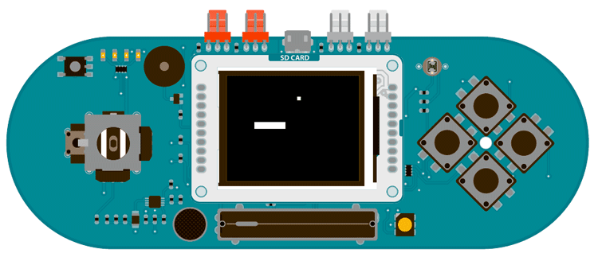

## Esplora TFT Pong

This sketch is a very basic implementation of pong for the TFT screen with an Arduino Esplora.

This version of the game creates a rectangular platform that can move in two directions, and a ball that bounces against the edges of the screen as well as the movable platform. The slider on the Esplora controls the speed of the ball bouncing.

The example demonstrates collision detection between objects on the screen, as well as how to quickly update images without erasing the entire screen every `loop()`

## Hardware Required

- Arduino Esplora

- Arduino TFT screen

## Circuit



Attach the TFT screen to the socket on your Esplora, with the label "SD Card" facing up.

## Code

To use the screen you must first include the SPI and TFT libraries. Don't forget to include the Esplora library as well.

```arduino
#include <Esplora.h>
#include <TFT.h>
#include <SPI.h>
```

Set up the variables for the ball and paddle x & y positions, the ball's direction, and the previous locations of the ball and paddle.

```arduino
int paddleX = 0;
int paddleY = 0;
int oldPaddleX, oldPaddleY;
int ballDirectionX = 1;
int ballDirectionY = 1;

int ballX, ballY, oldBallX, oldBallY;
```

In `setup()`, start serial communication, initialize the display and clear the screen's background.

```arduino
void setup() {

  Serial.begin(9600);

  // initialize the display

  EsploraTFT.begin();

  // set the background the black

  EsploraTFT.background(0,0,0);
}
```

`loop()` will hold the code for reading the joystick position, erasing the paddle's previous position, and drawing it in it's new location.

```arduino
void loop() {

  // save the width and height of the screen

  int myWidth = EsploraTFT.width();

  int myHeight = EsploraTFT.height();

  // map the paddle's location to the joystick's position

  paddleX = map(Esplora.readJoystickX(), 512, -512, 0, myWidth) - 20/2;

  paddleY = map(Esplora.readJoystickY(), -512, 512, 0, myHeight) - 5/2;

  Serial.print(paddleX);

  Serial.print(" ");

  Serial.println(paddleY);

  // set the fill color to black and erase the previous

  // position of the paddle if different from present

  EsploraTFT.fill(0,0,0);

  if (oldPaddleX != paddleX || oldPaddleY != paddleY) {

    EsploraTFT.rect(oldPaddleX, oldPaddleY, 20, 5);

  }

  // draw the paddle on screen, save the current position

  // as the previous.

  EsploraTFT.fill(255,255,255);

  EsploraTFT.rect(paddleX, paddleY, 20, 5);
```

Save the paddle's current location as the previous location, so the next time through you can check if it has moved.

```arduino
oldPaddleX = paddleX;

  oldPaddleY = paddleY;
```

At the end of `loop()`, read the slider's position to determine the speed of the ball. You'll call a custom function named `moveBall()` to update the ball's position.

```arduino
int ballSpeed = map(Esplora.readSlider(), 0, 1023, 0, 80)+1;

  if (millis() % ballSpeed < 2) {

    moveBall();

  }
}
```

`moveBall()` will update the ball's position, erase its previous location, and draw it in the new spot. It will also check to make sure it does not go off the screen, reversing direction when it hits the sides. This also calls a second custom function named `inPaddle()` which checks for intersections of the ball and paddle.

```arduino
void moveBall() {

  if (ballX > EsploraTFT.width() || ballX < 0) {

    ballDirectionX = -ballDirectionX;

  }

  if (ballY > EsploraTFT.height() || ballY < 0) {

    ballDirectionY = -ballDirectionY;

  }

  if (inPaddle(ballX, ballY, paddleX, paddleY, 20, 5)) {

    ballDirectionY = -ballDirectionY;

  }

  ballX += ballDirectionX;

  ballY += ballDirectionY;

  EsploraLCD.fill(0,0,0);

  if (oldBallX != ballX || oldBallY != ballY) {

    EsploraTFT.rect(oldBallX, oldBallY, 5, 5);

  }

  EsploraLCD.fill(255,255,255);

  EsploraLCD.rect(ballX, ballY, 5, 5);

  oldBallX = ballX;

  oldBallY = ballY;
}
```

`inPaddle()` check to see if the paddle and ball occupy the same space. If so, it returns `TRUE`, which reverses the ball's direction in `moveBall()`.

```arduino
boolean inPaddle(int x, int y, int rectX, int rectY, int rectWidth, int rectHeight) {

  boolean result = false;

  if ((x >= rectX && x <= (rectX + rectWidth)) &&

    (y >= rectY && y <= (rectY + rectHeight))) {

    result = true;

  }

  return result;
}
```

The complete sketch is below :

```arduino

/*

 Esplora TFT Pong


 This example for the Esplora with an Arduino TFT screen reads

 the value of the joystick to move a rectangular platform

 on the x and y axes. The platform can intersect with a ball

 causing it to bounce. The Esplora's slider adjusts the speed

 of the ball.


 This example code is in the public domain.


 Created by Tom Igoe December 2012

 Modified 15 April 2013 by Scott Fitzgerald


 http://arduino.cc/en/Tutorial/EsploraTFTPong


 */

#include <Esplora.h>
#include <Adafruit_GFX.h>    // Core graphics library
#include <Adafruit_ST7735.h> // Hardware-specific library
#include <TFT.h>            // Arduino LCD library
#include <SPI.h>

// variables for the position of the ball and paddle
int paddleX = 0;
int paddleY = 0;
int oldPaddleX, oldPaddleY;
int ballDirectionX = 1;
int ballDirectionY = 1;

int ballX, ballY, oldBallX, oldBallY;

void setup() {

  Serial.begin(9600);

  // initialize the display

  EsploraTFT.begin();

  // set the background the black

  EsploraTFT.background(0,0,0);
}

void loop() {

  // save the width and height of the screen

  int myWidth = EsploraTFT.width();

  int myHeight = EsploraTFT.height();

  // map the paddle's location to the joystick's position

  paddleX = map(Esplora.readJoystickX(), 512, -512, 0, myWidth) - 20/2;

  paddleY = map(Esplora.readJoystickY(), -512, 512, 0, myHeight) - 5/2;

  Serial.print(paddleX);

  Serial.print(" ");

  Serial.println(paddleY);

  // set the fill color to black and erase the previous

  // position of the paddle if different from present

  EsploraTFT.fill(0,0,0);

  if (oldPaddleX != paddleX || oldPaddleY != paddleY) {

    EsploraTFT.rect(oldPaddleX, oldPaddleY, 20, 5);

  }

  // draw the paddle on screen, save the current position

  // as the previous.

  EsploraTFT.fill(255,255,255);

  EsploraTFT.rect(paddleX, paddleY, 20, 5);

  oldPaddleX = paddleX;

  oldPaddleY = paddleY;

  // read the slider to determinde the speed of the ball

  int ballSpeed = map(Esplora.readSlider(), 0, 1023, 0, 80)+1;

  if (millis() % ballSpeed < 2) {

    moveBall();

  }
}

// this function determines the ball's position on screen
void moveBall() {

  // if the ball goes offscreen, reverse the direction:

  if (ballX > EsploraTFT.width() || ballX < 0) {

    ballDirectionX = -ballDirectionX;

  }

  if (ballY > EsploraTFT.height() || ballY < 0) {

    ballDirectionY = -ballDirectionY;

  }

  // check if the ball and the paddle occupy the same space on screen

  if (inPaddle(ballX, ballY, paddleX, paddleY, 20, 5)) {

    ballDirectionY = -ballDirectionY;

  }

  // update the ball's position

  ballX += ballDirectionX;

  ballY += ballDirectionY;

  // erase the ball's previous position

  EsploraTFT.fill(0,0,0);

  if (oldBallX != ballX || oldBallY != ballY) {

    EsploraTFT.rect(oldBallX, oldBallY, 5, 5);

  }

  // draw the ball's current position

  EsploraTFT.fill(255,255,255);

  EsploraTFT.rect(ballX, ballY, 5, 5);

  oldBallX = ballX;

  oldBallY = ballY;

}

// this function checks the position of the ball
// to see if it intersects with the paddle
boolean inPaddle(int x, int y, int rectX, int rectY, int rectWidth, int rectHeight) {

  boolean result = false;

  if ((x >= rectX && x <= (rectX + rectWidth)) &&

    (y >= rectY && y <= (rectY + rectHeight))) {

    result = true;

  }

  return result;
}
```