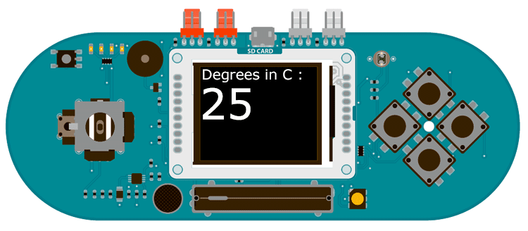

## Esplora TFT Temperature Display

This example for the Esplora with an Arduino TFT screen reads the temperature with the onboard thermisistor, and prints it out on screen.

## Hardware Required

- Arduino Esplora

- Arduino TFT screen

## Circuit



Attach the TFT screen to the socket on your Esplora, with the label "SD Card" facing up.

## Code

To use the screen you must first include the SPI and TFT libraries. Don't forget to include the Esplora library as well.

```arduino
#include <Esplora.h>
#include <TFT.h>
#include <SPI.h>
```

To update the screen with text, you'll need to store dynamic content in a char array.

`char tempPrintout[3];`

In `setup()`, initialize the screen and clear the background. Set the color for the font with `stroke()`, and write any static text to the screen. In this case, you'll write "Degrees in C :". This will stay at the top of the screen and not change as long as the sketch runs. Before entering the `loop()`, set the text size so you can really see the temperature stand out.

```arduino
void setup(void) {

  EsploraTFT.begin();

  EsploraTFT.background(0,0,0);

  EsploraTFT.stroke(200,20,180);

  EsploraTFT.setTextSize(2);

  EsploraTFT.text("Degrees in C :\n ",0,0);

  EsploraTFT.setTextSize(5);
}
```

In `loop()`, read the temperature in Celsius with `Esplora.readTemperature(DEGREES_C)`, storing it in a string. Convert the string content to a char array, storing it in the global array you declared int he beginning of your program.

```arduino
void loop() {

  String temperature = String(Esplora.readTemperature(DEGREES_C));

  temperature.toCharArray(tempPrintout, 3);
```

Set the text color (this would be a good place to change the color of the text depending on the value from the thermometer), and print it to the screen below the static text.

```arduino
EsploraTFT.stroke(255,255,255);

  EsploraTFT.text(tempPrintout, 0, 30);
```

Wait for one second, then erase the text you just wrote, so you can update it in the next run through `loop()`.

```arduino
delay(1000);

  // erase the text for the next loop

  EsploraTFT.stroke(0,0,0);

  EsploraTFT.text(tempPrintout, 0, 30);
}
```

The complete sketch is below :

```arduino

/*

 Esplora TFT Temperature Display

 This example for the Arduino TFT screen is for use

 with an Arduino Esplora.

 This example reads the temperature of the Esplora's

 on board thermisistor and displays it on an attached

 LCD screen, updating every second.

 This example code is in the public domain.

 Created 15 April 2013 by Scott Fitzgerald

 http://www.arduino.cc/en/Tutorial/EsploraTFTTemp

 */

// include the necessary libraries
#include <Esplora.h>
#include <TFT.h>            // Arduino LCD library
#include <SPI.h>

char tempPrintout[3];  // array to hold the temperature data

void setup() {

  // Put this line at the beginning of every sketch that uses the GLCD

  EsploraTFT.begin();

  // clear the screen with a black background

  EsploraTFT.background(0, 0, 0);

  // set the text color to magenta

  EsploraTFT.stroke(200, 20, 180);

  // set the text to size 2

  EsploraTFT.setTextSize(2);

  // start the text at the top left of the screen

  // this text is going to remain static

  EsploraTFT.text("Degrees in C :\n ", 0, 0);

  // set the text in the loop to size 5

  EsploraTFT.setTextSize(5);
}

void loop() {

  // read the temperature  in Celsius and store it in a String

  String temperature = String(Esplora.readTemperature(DEGREES_C));

  // convert the string to a char array

  temperature.toCharArray(tempPrintout, 3);

  // set the text color to white

  EsploraTFT.stroke(255, 255, 255);

  // print the temperature one line below the static text

  EsploraTFT.text(tempPrintout, 0, 30);

  delay(1000);

  // erase the text for the next loop

  EsploraTFT.stroke(0, 0, 0);

  EsploraTFT.text(tempPrintout, 0, 30);
}
```