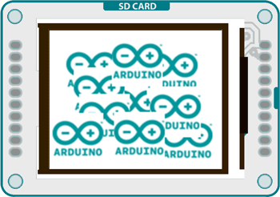
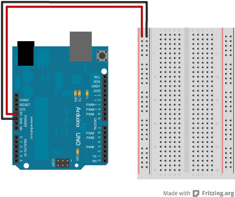
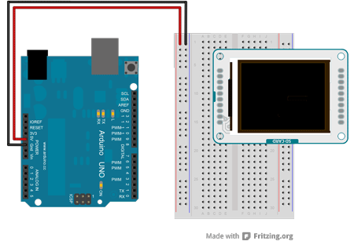

## TFT Bitmap Logo



This example for the Arduino TFT screen reads a bitmap file from a SD card and displays it on screen in a random location.

For this example to work, you need to save an image named "logo.bmp" to the root of the SD card. The SD card needs to be FAT16 and FAT32 formatted. See the [SD library documentation](https://www.arduino.cc/en/Reference/SD) for more information on working with SD cards.

## Hardware Required

- Arduino Uno

- Arduino TFT screen

- micro-SD card

- [image file](https://arduino.cc/en/uploads/Tutorial/logo.bmp)

## Circuit

Insert the SD card with the "logo.bmp" file into the SD card slot on the back of your screen.

Connect power and ground to the breadboard.



Connect the screen to the breadboard. The headers on the side of the screen with the small blue tab and arrow should be the ones that attach to the board. Pay attention to the orientation of the screen, in these images, it is upside down.



Connect the BL and +5V pins to power, and GND to ground. Connect CS-LD to pin 10, DC to pin 9, RESET to pin 8, MOSI to pin 11, MISO to pin 12, SD_CS to pin 4 and SCK to pin 13. If you're using a Leonardo, you'll be using different pins. see the [getting started page](http://arduino.cc/en/Guide/TFT) for more details.


Click the image for a larger version

## Code

To use the screen you must first include the SPI and TFT libraries. You also need to include the SD library to read the image from the card.

```arduino
#include <SD.h>
#include <SPI.h>
#include <TFT.h>
```

Define the pins you're going to use for controlling the screen, and a pin for the SD chip select. Create an instance of the TFT library named `TFTscreen`.

```arduino
#define sd_cs  4
#define lcd_cs 10
#define dc     9
#define rst    8

TFT TFTscreen = TFT(cs, dc, rst);
```

There is a special datatype called PImage for holding image information. Create a named version of PImage

```arduino
PImage logo;
```

In `setup()`, you're going to initialize the serial port and wait for it to become active before starting up. If you want to ignore the status information, comment out the `while()` loop.

Once serial communication has started, initialize the SD library. If there is an error, send a message to the serial monitor.

```arduino
void setup() {

  Serial.begin(9600);

  while (!Serial) {

  }

  Serial.print("Initializing SD card...");

  if (!SD.begin(SD_CS)) {

    Serial.println("failed!");

    return;

  }

  Serial.println("OK!");
```

Initialize and clear the screen

```arduino
TFTscreen.begin();

  TFTscreen.background(255, 255, 255);
```

Read the image file into the PImage you named earlier with `loadimage()`. `loadImage()` prints out some useful information about the image to the serial monitor.

```arduino
logo = TFTscreen.loadImage("logo.bmp");

  if (!logo.isValid()) {

    Serial.println("error while loading arduino.bmp");

  }
}
```

If the image wasn't loaded correctly, stop the sketch before going any further.

```arduino
void loop() {

  if (logo.isValid() == false) {

    return;

  }
```

If the image information is valid, pick a random spot on the screen to display the image. To make sure all the image is drawn onscreen, take the dimensions of the image and subtract that from the screen's dimensions.

```arduino
int x = random(TFTscreen.width() - logo.width());

  int y = random(TFTscreen.height() - logo.height());
```

Draw the image onscreen starting at the random coordinates from the previous step, and wait for a little bit before entering the next `loop()`

```arduino
TFTscreen.image(logo, x, y);

  delay(1500);
}
```

The complete sketch is below :

<iframe src='https://create.arduino.cc/example/library/tft_1_0_6/tft_1_0_6%5Cexamples%5CArduino%5CTFTBitmapLogo/TFTBitmapLogo/preview?embed' style='height:510px;width:100%;margin:10px 0' frameborder='0'></iframe>
