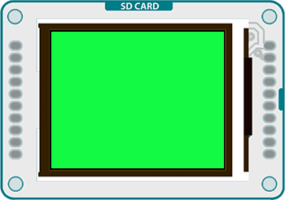

## TFT Color Picker



This example for the Arduino TFT screen reads the input of three analog sensors, using the values to change the screen's color.

Color on the TFT screen is handled as 8-bit numbers (0-255). However, the library scales these values to 5-bits (32 levels) for red and blue, 6-bits (64 levels) for green.

## Hardware Required

- Arduino Uno

- Arduino TFT screen

- breadboard

- hookup wire

- three 10-kilohm potentiometers

## Circuit

Connect power and ground to the breadboard.


Attach the three pots to the breadboard, connecting their outside legs to power and ground. the center legs should connect to A0-A2.


Connect the LCD screen to the breadboard. The headers on the side of the screen with the small blue tab and arrow should be the ones that attach to the board. Pay attention to the orientation of the screen, in these images, it is upside down.


Connect the BL and +5V pins to power, and GND to ground. Connect CS-LD to pin 10, DC to pin 9, RESET to pin 8, MOSI to pin 11, and SCK to pin 13. If you're using a Leonardo, you'll be using different pins. see the [getting started page](https://arduino.cc/en/Guide/TFT) for more details.


Click the image for a larger version

## Code

To use the screen you must first include the SPI and TFT libraries.

```arduino
#include <SPI.h>
#include <TFT.h>
```

Define the pins you're going to use for controlling the screen, and create an instance of the TFT library named `TFTscreen`. You'll reference that object whenever you're working with the screen.

```arduino
#define cs   10
#define dc   9
#define rst  8

TFT TFTscreen = TFT(cs, dc, rst);
```

In `setup()`, initialize the screen and clear the background. Start serial communication as well.

```arduino
void setup() {

  Serial.begin(9600);

  TFTscreen.begin();

  TFTscreen.background(255, 255, 255);
}
```

In `loop()`, read the values from the pots, mapping them to values between 0-255. with `background()`, set the mapped background colors and print the values to the serial monitor.

```arduino
void loop() {

  int redVal = map(analogRead(A0), 0, 1023, 0, 255);

  int greenVal = map(analogRead(A1), 0, 1023, 0, 255);

  int blueVal = map(analogRead(A2), 0, 1023, 0, 255);

  TFTscreen.background(redVal, greenVal, blueVal);

  Serial.print("background(");

  Serial.print(redVal);

  Serial.print(" , ");

  Serial.print(greenVal);

  Serial.print(" , ");

  Serial.print(blueVal);

  Serial.println(")");

  delay(33);

}
```

The complete sketch is below :

```arduino

/*

 TFT Color Picker

 This example for the Arduino screen reads the input of

 potentiometers or analog sensors attached to A0, A1,

 and A2 and uses the values to change the screen's color.

 This example code is in the public domain.

 Created 15 April 2013 by Scott Fitzgerald

 http://www.arduino.cc/en/Tutorial/TFTColorPicker

 */

// pin definition for the Uno
#define cs   10
#define dc   9
#define rst  8

// pin definition for the Leonardo
// #define cs   7
// #define dc   0
// #define rst  1

#include <TFT.h>  // Arduino LCD library
#include <SPI.h>

TFT TFTscreen = TFT(cs, dc, rst);

void setup() {

  // begin serial communication

  Serial.begin(9600);

  // initialize the display

  TFTscreen.begin();

  // set the background to white

  TFTscreen.background(255, 255, 255);

}

void loop() {

  // read the values from your sensors and scale them to 0-255

  int redVal = map(analogRead(A0), 0, 1023, 0, 255);

  int greenVal = map(analogRead(A1), 0, 1023, 0, 255);

  int blueVal = map(analogRead(A2), 0, 1023, 0, 255);

  // draw the background based on the mapped values

  TFTscreen.background(redVal, greenVal, blueVal);

  // send the values to the serial monitor

  Serial.print("background(");

  Serial.print(redVal);

  Serial.print(" , ");

  Serial.print(greenVal);

  Serial.print(" , ");

  Serial.print(blueVal);

  Serial.println(")");

  // wait for a moment

  delay(33);

}
```