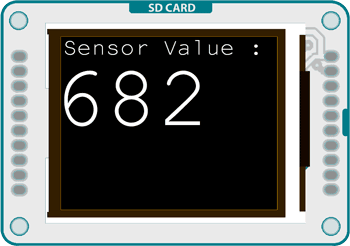
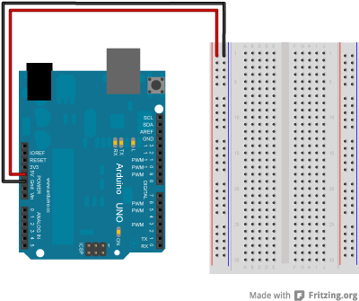
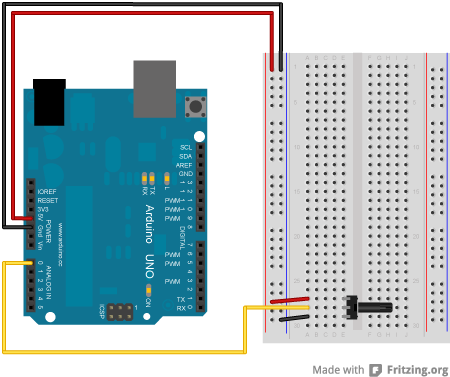
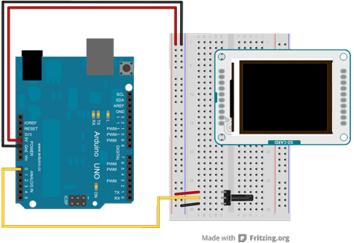
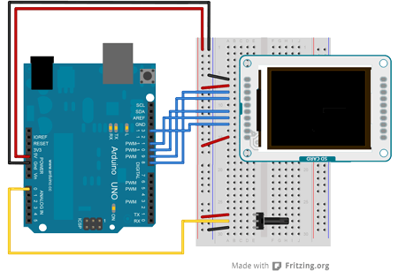

## TFT Display Text



This example demonstrates how to draw text on the Arduino GLCD screen when connected to an Arduino. The Arduino reads the value of an analog sensor attached to pin A0, and writes the value to the LCD screen, updating every quarter second.

## Hardware Required

- Arduino Uno

- Arduino TFT screen

- breadboard

- hookup wire

- one 10-kilohm potentiometer

## Circuit

Connect power and ground to the breadboard.



Place the potentiometer on the breadboard. Connect one side to ground, and the other to power. Connect the middle pin to A0.



Connect the screen to the breadboard. The headers on the side of the screen with the small blue tab and arrow should be the ones that attach to the board. Pay attention to the orientation of the screen, in these images, it is upside down.



Connect the BL and +5V pins to power, and GND to ground. Connect CS-LD to pin 10, DC to pin 9, RESET to pin 8, MOSI to pin 11, and SCK to pin 13. If you're using a Leonardo, you'll be using different pins. see the [getting started page](https://arduino.cc/en/Guide/TFT) for more details.


Click the image for a larger version

## Code

To use the screen you must first include the SPI and TFT libraries.

```arduino
#include <SPI.h>
#include <TFT.h>
```

Define the pins you're going to use for controlling the screen, and create an instance of the TFT library named `TFTscreen`. You'll reference that object whenever you're working with the screen.

```arduino
#define cs   10
#define dc   9
#define rst  8

TFT TFTscreen = TFT(cs, dc, rst);
```

To update the screen with text, you'll need to store dynamic content in a char array.

`char sensorPrintout[4];`

In `setup()`, initialize the screen and clear the background. Set the color for the font with `stroke()`, and write any static text to the screen. In this case, you'll write "Sensor Value :". This will stay at the top of the screen and not change as long as the sketch runs. Before entering the `loop()`, set the text size so you can really see the sensor values stand out.

```arduino
void setup() {

  TFTscreen.begin();

  TFTscreen.background(0, 0, 0);

  TFTscreen.stroke(255,255,255);

  TFTscreen.setTextSize(2);

  TFTscreen.text("Sensor Value : ",0,0);

  TFTscreen.setTextSize(5);
}
```

In `loop()`, read the value from the potentiometer and store it in a string. Convert the string content to a char array, storing it in the global array you declared int he beginning of your program.

```arduino
void loop() {

  String sensorVal = String(analogRead(A0));

  sensorVal.toCharArray(sensorPrintout, 4);
```

Set the text color (this would be a good place to change the color of the text depending on the value from the potentiometer), and print it to the screen below the static text.

```arduino
TFTscreen.stroke(255,255,255);

  TFTscreen.text(sensorPrintout, 0, 20);
```

Wait a quarter of a second, then erase the text you just wrote, so you can update it in the next run through `loop()`.

```arduino
delay(250);

  TFTscreen.stroke(0,0,0);

  TFTscreen.text(sensorPrintout, 0, 20);
}
```

The complete sketch is below :

<iframe src='https://create.arduino.cc/example/library/tft_1_0_6/tft_1_0_6%5Cexamples%5CArduino%5CTFTDisplayText/TFTDisplayText/preview?embed' style='height:510px;width:100%;margin:10px 0' frameborder='0'></iframe>