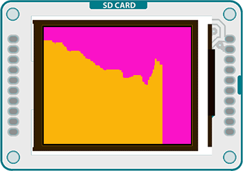
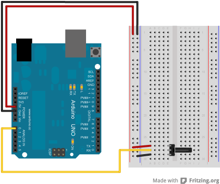

## TFT Graph



This example for the Arduino TFT screen reads the value of a potentiometer, and graphs it on screen. This is similar to the [serial communication Graph example](https://arduino.cc/en/Tutorial/BuiltInExamples/Graph).

## Hardware Required

- Arduino Uno

- Arduino TFT screen

- breadboard

- hookup wire

- one 10-kilohm potentiometer

## Circuit

Connect power and ground to the breadboard.


Place the potentiometer on the breadboard. Connect one side to ground, and the other to power. Connect the middle pin to A0.



Connect the TFT screen to the breadboard. The headers on the side of the screen with the small blue tab and arrow should be the ones that attach to the board. Pay attention to the orientation of the screen, in these images, it is upside down.


Connect the BL and +5V pins to power, and GND to ground. Connect CS-LD to pin 10, DC to pin 9, RESET to pin 8, MOSI to pin 11, and SCK to pin 13. If you're using a Leonardo, you'll be using different pins. see the [getting started page](http://arduino.cc/en/Guide/TFT) for more details.


Click the image for a larger version

## Code

To use the screen you must first include the SPI  and TFT libraries.

```arduino
#include <SPI.h>
#include <TFT.h>
```

Define the pins you're going to use for controlling the screen, and create an instance of the TFT library named `TFTscreen`. You'll reference that object whenever you're working with the screen.

```arduino
#define cs   10
#define dc   9
#define rst  8

TFT TFTscreen = TFT(cs, dc, rst);
```

Create a variable for holding the position of the x-axis of the graph. You'll increment this each `loop()`. In `setup()`, initialize the screen and make the background a nice color.

```arduino
int xPos = 0;

void setup(){

  TFTscreen.begin();

  TFTscreen.background(250,16,200);
}
```

In `loop()`, read the value from the potentiometer, and map it to a value that fits in the screen's height.

```arduino
void loop(){

  int sensor = analogRead(A0);

  int graphHeight = map(sensor,0,1023,0,LCDscreen.height());
```

Set the stroke color to something that will stand out against the nice color you chose for the background, and draw a line from the bottom of the screen based on the value of the sensor

```arduino
TFTscreen.stroke(250,180,10);

  TFTscreen.line(xPos, TFTscreen.height() - graphHeight, xPos, TFTscreen.height());
```

Before closing up `loop()`, check to make sure the graph hasn't gone past the edge of the screen. If it has, erase everything, and start back at 0 on the x-axis.

```arduino
if (xPos >= 160) {

    xPos = 0;

    TFTscreen.background(250,16,200);

  }

  else {

    xPos++;

  }

  delay(16);
}
```

The complete sketch is below :

<iframe src='https://create.arduino.cc/example/library/tft_1_0_6/tft_1_0_6%5Cexamples%5CArduino%5CTFTGraph/TFTGraph/preview?embed' style='height:510px;width:100%;margin:10px 0' frameborder='0'></iframe>
