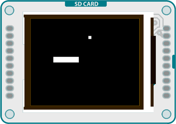
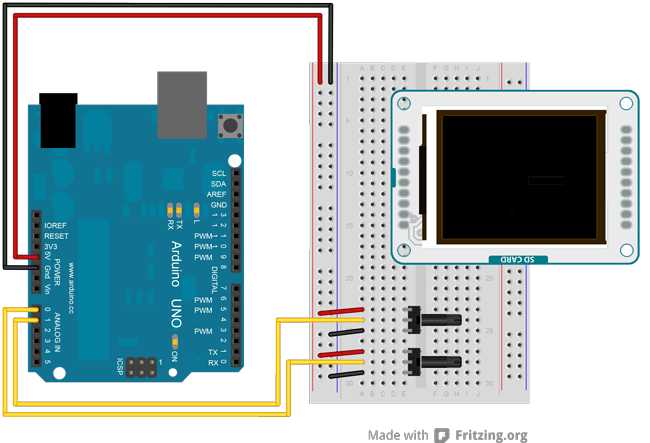

## TFT Pong



This sketch is a basic implementation of pong for the TFT screen with an Arduino Uno.

This version of the game creates a rectangular platform that can move in two directions, and a ball that bounces against the edges of the screen as well as the movable platform. Two potentiometers (or other analog sensor) control the position of the platform.

The example demonstrates collision detection between objects on the screen, as well as how to quickly update images without erasing the entire screen every `loop()`

## Hardware Required

- Arduino Uno

- Arduino TFT screen

- breadboard

- hookup wire

- two 10-kilohm potentiometers

## Circuit

Connect power and ground to the breadboard.


Place the potentiometers on the breadboard. On each pot, connect one side to ground, and the other to power. Connect the middle pin of one potentiometer to A0, the other one to A1.


Connect the TFT screen to the breadboard. The headers on the side of the screen with the small blue tab and arrow should be the ones that attach to the board. Pay attention to the orientation of the screen, in these images, it is upside down.



Connect the BL and +5V pins to power, and GND to ground. Connect CS-LD to pin 10, DC to pin 9, RESET to pin 8, MOSI to pin 11, and SCK to pin 13. If uyou're using a Leonardo, you'll be using different pins. see the [getting started page](https://arduino.cc/en/Guide/TFT) for more details.


Click the image for a larger version

## Code

To use the screen you must first include the SPI and TFT libraries.

```arduino
#include <SPI.h>
#include <TFT.h>
```

Define the pins you're going to use for controlling the screen, and create an instance of the TFT library named `TFTscreen`. You'll reference that object whenever you're working with the screen.

```arduino
#define cs   10
#define dc   9
#define rst  8

TFT TFTscreen = TFT(cs, dc, rst);
```

Set up the variables for the ball and paddle x & y positions, the ball's direction, and the previous locations of the ball and paddle.

```arduino
int paddleX = 0;
int paddleY = 0;
int oldPaddleX, oldPaddleY;
int ballDirectionX = 1;
int ballDirectionY = 1;

int ballX, ballY, oldBallX, oldBallY;
```

In `setup()`, initialize the display and clear the screen's background.

```arduino
void setup() {

  TFTscreen.begin();

  TFTscreen.background(0,0,0);
}
```

`loop()` starts by storing the width and height of the screen, an reading the values of the potentiometers, before mapping them to a useful range.

```arduino
void loop() {

  int myWidth = TFTscreen.width();

  int myHeight = TFTscreen.height();

  paddleX = map(analogRead(A0), 0, 1023, 0, myWidth) - 20/2;

  paddleY = map(analogRead(A1), 0, 1023, 0, myHeight) - 5/2;
```

Set the fill color to black, and erase the previous location of the paddle if it has moved.

```arduino
TFTscreen.fill(0,0,0);

  if (oldPaddleX != paddleX || oldPaddleY != paddleY) {

    TFTscreen.rect(oldPaddleX, oldPaddleY, 20, 5);

  }
```

Set the fill color to white, and draw the paddle.

```arduino
TFTscreen.fill(255,255,255);

  TFTscreen.rect(paddleX, paddleY, 20, 5);
```

Save the paddle's current location as the previous location, so the next time through you can check if it has moved.

```arduino
oldPaddleX = paddleX;

  oldPaddleY = paddleY;
```

At the end of `loop()`, use the value of the `ballSpeed` variable to determine how quickly the display will update. Once you've finished with the example, you could add another potentiometer and change the speed dynamically by changing the value of `ballSpeed`.

You'll call a custom function named `moveBall()` to update the ball's position.

```arduino
if (millis() % ballSpeed < 2) {

  moveBall();

  }
}
```

`moveBall()` will update the ball's position, erase its previous location, and draw it in the new spot. It will also check to make sure it does not go off the screen, reversing direction when it hits the sides. This also calls a second custom function named `inPaddle()` which checks for intersections of the ball and paddle.

```arduino
void moveBall() {

  if (ballX > TFTscreen.width() || ballX < 0) {

    ballDirectionX = -ballDirectionX;

  }

  if (ballY > TFTscreen.height() || ballY < 0) {

    ballDirectionY = -ballDirectionY;

  }

  if (inPaddle(ballX, ballY, paddleX, paddleY, 20, 5)) {

    ballDirectionY = -ballDirectionY;

  }

  ballX += ballDirectionX;

  ballY += ballDirectionY;

  TFTscreen.fill(0,0,0);

  if (oldBallX != ballX || oldBallY != ballY) {

    TFTscreen.rect(oldBallX, oldBallY, 5, 5);

  }

  TFTscreen.fill(255,255,255);

  TFTscreen.rect(ballX, ballY, 5, 5);

  oldBallX = ballX;

  oldBallY = ballY;
}
```

`inPaddle()` checks to see if the paddle and ball occupy the same space. If so, it returns `TRUE`, which reverses the ball's direction in `moveBall()`.

```arduino
boolean inPaddle(int x, int y, int rectX, int rectY, int rectWidth, int rectHeight) {

  boolean result = false;

  if ((x >= rectX && x <= (rectX + rectWidth)) &&

    (y >= rectY && y <= (rectY + rectHeight))) {

    result = true;

  }

  return result;
}
```

The complete sketch is below :

<iframe src='https://create.arduino.cc/example/library/tft_1_0_6/tft_1_0_6%5Cexamples%5CArduino%5CTFTPong/TFTPong/preview?embed' style='height:510px;width:100%;margin:10px 0' frameborder='0'></iframe>