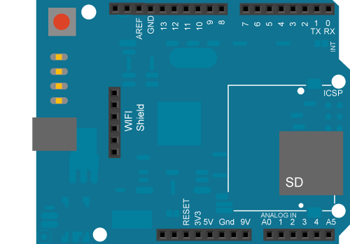

This example shows you how to connect to an open (not encrypted) 802.11b/g network with the Arduino WiFi shield.  Your Arduino Software (IDE) serial monitor will provide information about the connection once it has connected.

## Hardware Required

- Arduino WiFi Shield

- Shield-compatible Arduino board

## Circuit

The WiFi shield uses pins 10, 11, 12, and 13 for the SPI connection to the HDG104 module. Digital pin 4 is used to control the chip select pin on the SD card.

You should have access to a 802.11b/g wireless network that connects to the internet for this example. You will need to change the network settings in the sketch to correspond to your particular networks SSID.



image developed using [Fritzing](http://www.fritzing.org). For more circuit examples, see the [Fritzing project page](http://fritzing.org/projects/)

***In the above image, the board would be stacked below the WiFi shield.***

## Code

```arduino

/*

 This example connects to an unencrypted Wifi network.

 Then it prints the  MAC address of the Wifi shield,

 the IP address obtained, and other network details.

 Circuit:

 * WiFi shield attached

 created 13 July 2010

 by dlf (Metodo2 srl)

 modified 31 May 2012

 by Tom Igoe

 */
#include <SPI.h>
#include <WiFi.h>

char ssid[] = "yourNetwork";     // the name of your network
int status = WL_IDLE_STATUS;     // the Wifi radio's status

void setup() {

  //Initialize serial and wait for port to open:

  Serial.begin(9600);

  while (!Serial) {

    ; // wait for serial port to connect. Needed for native USB port only

  }

  // check for the presence of the shield:

  if (WiFi.status() == WL_NO_SHIELD) {

    Serial.println("WiFi shield not present");

    // don't continue:

    while (true);

  }

  String fv = WiFi.firmwareVersion();

  if (fv != "1.1.0") {

    Serial.println("Please upgrade the firmware");

  }

  // attempt to connect to Wifi network:

  while (status != WL_CONNECTED) {

    Serial.print("Attempting to connect to open SSID: ");

    Serial.println(ssid);

    status = WiFi.begin(ssid);

    // wait 10 seconds for connection:

    delay(10000);

  }

  // you're connected now, so print out the data:

  Serial.print("You're connected to the network");

  printCurrentNet();

  printWifiData();
}

void loop() {

  // check the network connection once every 10 seconds:

  delay(10000);

  printCurrentNet();
}

void printWifiData() {

  // print your WiFi shield's IP address:

  IPAddress ip = WiFi.localIP();

  Serial.print("IP Address: ");

  Serial.println(ip);

  Serial.println(ip);

  // print your MAC address:

  byte mac[6];

  WiFi.macAddress(mac);

  Serial.print("MAC address: ");

  Serial.print(mac[5], HEX);

  Serial.print(":");

  Serial.print(mac[4], HEX);

  Serial.print(":");

  Serial.print(mac[3], HEX);

  Serial.print(":");

  Serial.print(mac[2], HEX);

  Serial.print(":");

  Serial.print(mac[1], HEX);

  Serial.print(":");

  Serial.println(mac[0], HEX);

  // print your subnet mask:

  IPAddress subnet = WiFi.subnetMask();

  Serial.print("NetMask: ");

  Serial.println(subnet);

  // print your gateway address:

  IPAddress gateway = WiFi.gatewayIP();

  Serial.print("Gateway: ");

  Serial.println(gateway);
}

void printCurrentNet() {

  // print the SSID of the network you're attached to:

  Serial.print("SSID: ");

  Serial.println(WiFi.SSID());

  // print the MAC address of the router you're attached to:

  byte bssid[6];

  WiFi.BSSID(bssid);

  Serial.print("BSSID: ");

  Serial.print(bssid[5], HEX);

  Serial.print(":");

  Serial.print(bssid[4], HEX);

  Serial.print(":");

  Serial.print(bssid[3], HEX);

  Serial.print(":");

  Serial.print(bssid[2], HEX);

  Serial.print(":");

  Serial.print(bssid[1], HEX);

  Serial.print(":");

  Serial.println(bssid[0], HEX);

  // print the received signal strength:

  long rssi = WiFi.RSSI();

  Serial.print("signal strength (RSSI):");

  Serial.println(rssi);

  // print the encryption type:

  byte encryption = WiFi.encryptionType();

  Serial.print("Encryption Type:");

  Serial.println(encryption, HEX);
}
```


*Last revision 2018/08/23 by SM*
