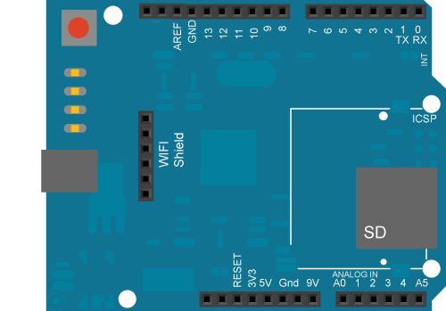

This example scans for 802.11b/g networks with the Arduino WiFi shield. Your Arduino Software (IDE) serial monitor will print out information about the board and the networks it can see. It will not connect to a network.

## Hardware Required

- Arduino WiFi Shield

- Shield-compatible Arduino board

## Circuit

The WiFi shield uses pins 10, 11, 12, and 13 for the SPI connection to the HDG104 module. Digital pin 4 is used to control the chip select pin on the SD card.

Open your serial monitor to view the networks the WiFi shield can see. The shield may not see as many networks as your computer.

Image developed using [Fritzing](https://fritzing.org). For more circuit examples, see the [Fritzing project page](https://fritzing.org/projects/).

> **Note:** In the above image, the board would be stacked below the WiFi shield.

## Code

<iframe src="https://app.arduino.cc/sketches/examples?nav=Examples&eid=wifi_1_2_7%2FScanNetworks&slid=WiFi%401.2.7&view-mode=embed" style="height:510px;width:100%;margin:10px 0" frameBorder="0"></iframe>

*Last revision 2018/08/23 by SM*