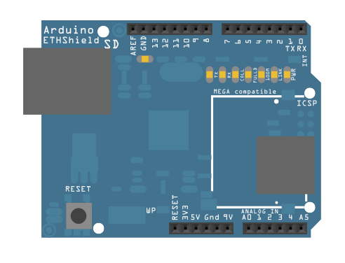

In this example, you will use your Ethernet Shield and your Arduino to query a Network Time Protocol (NTP) server. This way, your Arduino can get the time from the Internet.

## Hardware Required

- Arduino Board

- [Arduino Ethernet Shield](/hardware/ethernet-shield-rev2)

## Circuit

The Ethernet shield allows you to connect a WIZNet Ethernet controller to the Arduino boards via the SPI bus. It uses the ICSP header pins and pin 10 as chip select for the SPI connection to the Ethernet controller chip. Later models of the Ethernet shield also have an SD Card on board. Digital pin 4 is used to control the chip select pin on the SD card.

The shield should be connected to a network with an Ethernet cable.  You will need to change the network settings in the program to correspond to your network.

Image developed using [Fritzing](http://www.fritzing.org). For more circuit examples, see the [Fritzing project page](http://fritzing.org/projects/)

***In the above  image, the Arduino board would be stacked below the Ethernet shield.***

## Schematic

## Code

<iframe src='https://create.arduino.cc/example/library/ethernet_2_0_0/ethernet_2_0_0%5Cexamples%5CUdpNtpClient/UdpNtpClient/preview?embed' style='height:510px;width:100%;margin:10px 0' frameborder='0'></iframe>

*Last revision 2018/09/07 by SM*