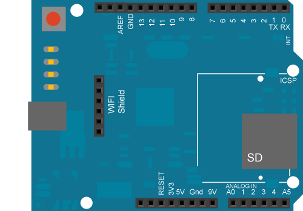

This example shows you how to make repeated HTTP requests using a WiFi shield.  It connects to  [http://www.arduino.cc/latest.txt](http://www.arduino.cc/latest.txt). The content of the page is viewable through your Arduino Software (IDE) serial window.

This example is written for a network using WPA encryption. For  WEP or WPA, change the Wifi.begin() call accordingly.

## Hardware Required

- Arduino WiFi Shield

- Shield-compatible Arduino board

## Circuit

The WiFi shield uses pins 10, 11, 12, and 13 for the SPI connection to the HDG104 module. Digital pin 4 is used to control the chip select pin on the SD card.

You should have access to a 802.11b/g wireless network that connects to the internet for this example. You will need to change the network settings in the sketch to correspond to your particular networks SSID.

For networks using WPA/WPA2 Personal encryption, you need the SSID and password. The shield will not connect to networks using WPA2 Enterprise encryption.

WEP network passwords are hexadecimal strings known as keys. A WEP network can have 4 different keys; each key is assigned a "Key Index" value. For WEP encrypted networks, you need the SSID, the key, and key number.



image developed using [Fritzing](http://www.fritzing.org). For more circuit examples, see the [Fritzing project page](http://fritzing.org/projects/)

***In the above image, the Arduino board would be stacked below the WiFi shield.***

## Code

```arduino

/*

  Repeating Wifi Web Client

 This sketch connects to a a web server and makes a request

 using an Arduino Wifi shield.

 Circuit:

 * WiFi shield attached to pins SPI pins and pin 7

 created 23 April 2012

 modified 31 May 2012

 by Tom Igoe

 modified 13 Jan 2014

 by Federico Vanzati

 https://docs.arduino.cc/library-examples/wifi-library/WiFiWebClientRepeating

 This code is in the public domain.

 */

#include <SPI.h>
#include <WiFi.h>

char ssid[] = "yourNetwork";      //  your network SSID (name)
char pass[] = "secretPassword";   // your network password
int keyIndex = 0;            // your network key Index number (needed only for WEP)

int status = WL_IDLE_STATUS;

// Initialize the Wifi client library

WiFiClient client;

// server address:
char server[] = "www.arduino.cc";
//IPAddress server(64,131,82,241);

unsigned long lastConnectionTime = 0;            // last time you connected to the server, in milliseconds

const unsigned long postingInterval = 10L * 1000L; // delay between updates, in milliseconds

void setup() {

  //Initialize serial and wait for port to open:

  Serial.begin(9600);

  while (!Serial) {

    ; // wait for serial port to connect. Needed for native USB port only

  }

  // check for the presence of the shield:

  if (WiFi.status() == WL_NO_SHIELD) {

    Serial.println("WiFi shield not present");

    // don't continue:

    while (true);

  }

  String fv = WiFi.firmwareVersion();

  if (fv != "1.1.0") {

    Serial.println("Please upgrade the firmware");

  }

  // attempt to connect to Wifi network:

  while (status != WL_CONNECTED) {

    Serial.print("Attempting to connect to SSID: ");

    Serial.println(ssid);

    // Connect to WPA/WPA2 network. Change this line if using open or WEP network:

    status = WiFi.begin(ssid, pass);

    // wait 10 seconds for connection:

    delay(10000);

  }

  // you're connected now, so print out the status:

  printWifiStatus();
}

void loop() {

  // if there's incoming data from the net connection.

  // send it out the serial port.  This is for debugging

  // purposes only:

  while (client.available()) {

    char c = client.read();

    Serial.write(c);

  }

  // if ten seconds have passed since your last connection,

  // then connect again and send data:

  if (millis() - lastConnectionTime > postingInterval) {

    httpRequest();

  }

}

// this method makes a HTTP connection to the server:
void httpRequest() {

  // close any connection before send a new request.

  // This will free the socket on the WiFi shield

  client.stop();

  // if there's a successful connection:

  if (client.connect(server, 80)) {

    Serial.println("connecting...");

    // send the HTTP PUT request:

    client.println("GET /latest.txt HTTP/1.1");

    client.println("Host: www.arduino.cc");

    client.println("User-Agent: ArduinoWiFi/1.1");

    client.println("Connection: close");

    client.println();

    // note the time that the connection was made:

    lastConnectionTime = millis();

  } else {

    // if you couldn't make a connection:

    Serial.println("connection failed");

  }
}

void printWifiStatus() {

  // print the SSID of the network you're attached to:

  Serial.print("SSID: ");

  Serial.println(WiFi.SSID());

  // print your WiFi shield's IP address:

  IPAddress ip = WiFi.localIP();

  Serial.print("IP Address: ");

  Serial.println(ip);

  // print the received signal strength:

  long rssi = WiFi.RSSI();

  Serial.print("signal strength (RSSI):");

  Serial.print(rssi);

  Serial.println(" dBm");
}
```


*Last revision 2018/08/23 by SM*
