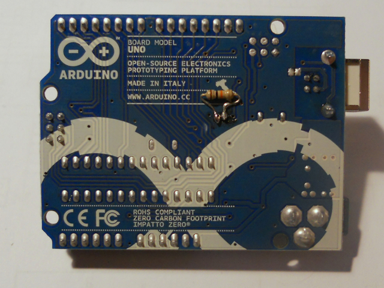
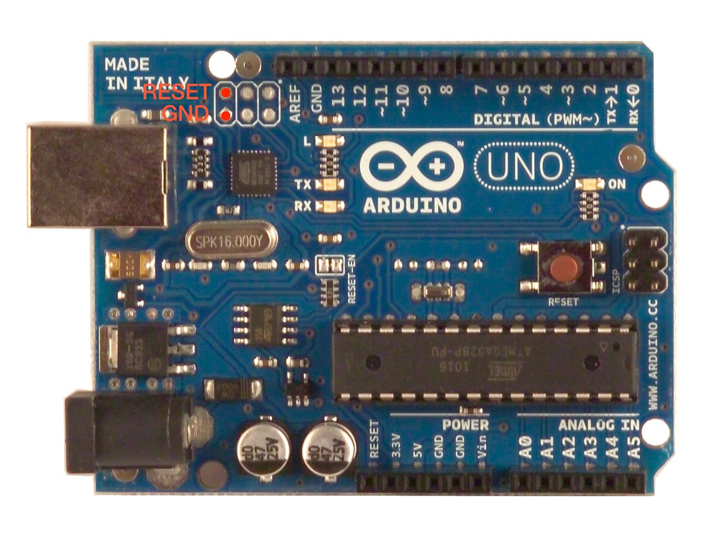

The ATmega16U2 chip on your Arduino board acts as a bridge between the computer's USB port and the main processor's serial port. Previous versions of the Uno and Mega2560 had an Atmega8U2. It runs software called firmware (so named because you couldn't change it once it had been programmed in the chip) that can be updated through a special USB protocol called DFU (Device Firmware Update).

Here's how to update the firmware on your 16u2 in a few steps.

## Check Whether You Need to Update the Firmware
The Arduino Uno and Mega 2560 have been shipping with the updated version of the ATmega16u2 firmware. To check which version of the firmware is on your board, connect it to your computer and follow the directions for your operating system:

- Windows (before 7): locate the board in the Device Manager (it should be under Ports), right click on it and select "Properties"; in the resulting dialog, click on "driver details" in the "Driver" tab ("Details" in Windows 7). In one of the properties, you should the VID, PID, and the revision number.
- Mac OS X: run the System Profiler application (e.g. by selecting "About This Mac" from the Apple menu and clicking the "More Info..." button); go to the USB sheet and click on the item for the Arduino board. The firmware version is listed as "version" (e.g. 0.01 for rev. 0001).
## Download a DFU Programmer
This is the software that will update the code :

**Windows:** Download Atmel's flip programmer from [here](http://www.microchip.com/developmenttools/productdetails.aspx?partno=flip)

**Mac:** Install MacPorts following [these instructions](http://www.macports.org/install.php#pkg): Once MacPorts is installed, in a Terminal window, type 
```
sudo port install dfu-programmer
```

NB: If you've never used sudo before, it will ask for your password. Use the password you login to your Mac with. Sudo allows you to run commands as the administrator of the computer

**Linux:** from a command line type
```
sudo apt-get install dfu-programmer
```
or
```
sudo aptitude install dfu-programmer
```
depending on your distribution

## Download Updated Firmware
The latest version is [here](https://github.com/arduino/ArduinoCore-avr/tree/master/firmwares/atmegaxxu2)

Choose the version that is suitable for your board, either **arduino-usbserial/Arduino-usbserial-uno.hex** or **arduino-usbserial/Arduino-usbserial-mega.hex**

The firmware is also located with the Arduino software in the /hardware/arduino/firmwares/arduino-usbserial folder. On OSX, right-click or command-click on the Arduino application and select "show package contents" to find this folder.

## If Your Board is Arduino UNO R1
You'll need to solder a 10k resistor (Brown-Black-Orange) at the back of your board in the same location as this picture.




## Connect the Arduino to Your Computer With a USB Cable
Just like you do whenever you're programming it.

## Reset the 8u2 or 16u2
To do this, briefly bridge the reset pin with the ground. The pins are located near the USB connector, as shown in this picture. Connect them briefly with a piece of wire.




To verify you have reset the 8u2 or 16u2 chip: In the Arduino programming environment, check the list of serial ports. The serial port for your board should no longer show up.

## Program the Chip
**Windows:** use flip to upload the hex file to your board

**Mac & Linux:** from a terminal window, change directories to get into the folder with the firmware. If you saved the firmware in your downloads folder on OSX, then you might type
```
cd Downloads/
```
Once there, type:
```
sudo dfu-programmer atmega16u2 erase
```
When this command is done and you get a command prompt again, type
```
sudo dfu-programmer atmega16u2 flash Arduino-usbserial-uno.hex
```
Finally, type
```
sudo dfu-programmer atmega16u2 reset
```
### Note
If your board has an atmega8u2 type **atmega8u2** instead of **atmega16u2** in the command lines above.

## Unplug Your Board and Plug It Back In
Your board should be ready and up to date. You can check this by looking in the serial port menu of the Arduino software. Your port should re-appear.

## Using Other Firmware
The 8u2 and 16u2's flexibility allows for other firmware so your board can appear as a different USB device (MIDI controller, HID, etc.). See the tutorials below for additional information.

- [MIDI Note Player using the MIDI firmware](/hacking/software/MidiWith8U2Firmware)
- [UnoJoy](https://code.google.com/p/unojoy/wiki/GettingStarted) : Turn you Arduino Uno into a PS3 compatible USB joystick