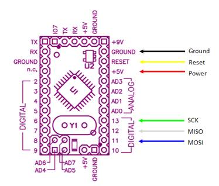
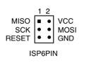
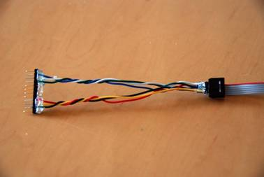
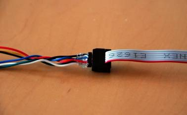
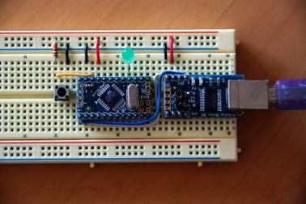
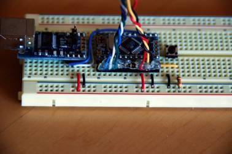
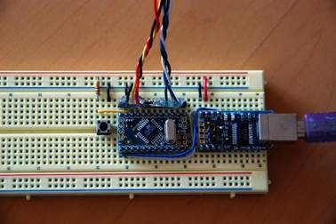
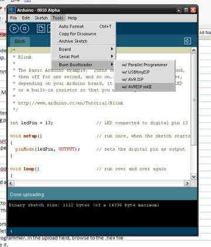
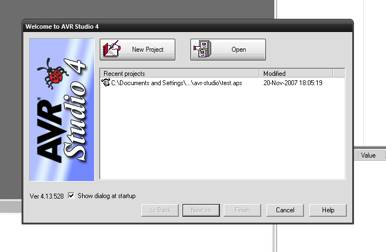
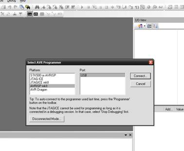

by Gian Pablo Vilamil

This document explains how to bootload an Arduino mini.

If you know what a [bootloader](/hacking/software/Bootloader) is, why you want to do it, and are just looking for specific instructions for the Arduino Mini, then skip ahead to the section called "bootload the Arduino Mini".

## What is a Bootloader, and What is Bootloading?
The bootloader is the little program that runs when you turn the Arduino on, or press the reset button. Its main function is to wait for the Arduino software on your computer to send it a new program for the Arduino, which it then writes to the memory on the Arduino. This is important, because normally you need a special device to program the Arduino. The bootloader is what enables you to program the Arduino using just the USB cable.

When we refer to "bootloading" the Arduino, we are talking about using a special device (called an In-System Programmer or ISP) to replace the bootloader software.

## Why do I Need to Bootload the Arduino?
There are at least four reasons why you might need to do this:

1. Your Arduino does not have a bootloader on it. This might happen if you have replaced the microcontroller with a new chip. This is unlikely to be the case with a Mini, since the chip is not replaceable, and all Minis have the bootloader installed when shipped.
2. Replace the existing bootloader with a different bootloader. The bootloader on Arduinos prior to the Diecimila imposes a 10 second delay after resetting, while it waits for information from the Arduino software. This delay also occurs when the Arduino is powered up, or after programming. There are alternative bootloaders that eliminate these delays, including the Diecimila bootloader, the Adaboot bootloader, the LilyPad bootloader, and others. You can also download the source code and modify the bootloader yourself (see [this page](/hacking/software/Bootloader) for more details and a link to the source). This is useful if you want your project to start up immediately, and especially useful if it receives serial input. If the bootloader receives any input during startup, it will think the Arduino software is trying to talk to it, and delay, possibly indefinitely, starting your program. Here is [some info on alternative bootloaders](http://www.ladyada.net/library/arduino/bootloader.html).
3. Not use a bootloader at all. The process for replacing the bootloader on the Arduino also lets you replace it entirely, with your own application. The advantages of doing this are that your application will start immediately, and it will give you an extra 2K of program memory. The disadvantage is that you will no longer be able to program your Arduino over USB - you will have to use the ISP (at least until you replace the bootloader).
4. The existing bootloader has somehow become corrupted. This is extremely unlikely. However, it is possible that under some circumstances the Arduino flash memory may become corrupted, and you may not be able to program the Arduino normally. Reinstalling the bootloader may fix these problems. It's kind of like reformatting your computer's hard drive.

## How is Bootloading the Arduino Mini Different From Programming Other Arduinos?
Regular-size Arduinos have a 6 pin connector for the ISP. The Arduino Mini does not have this, so you have to make a connector cable. Other than this, the procedure is the same. With slight variations on the process, you can bootload many different configurations of Atmel-based projects.

## What do I Need?
- An ISP (eg. AVR ISP MkII)
- 6 pieces of wire
- One piece of male header strip, with 12 pins
- Two pieces of male header strip, 3 pins each
- 8 AVR Studio software (from Atmel, [free download](http://www.atmel.com/dyn/products/tools_card.asp?tool_id=2725))

## How do I Make the Cable?
You need to connect 6 pins on the Arduino Mini to six pins on the ISP. The six pins are called MISO, MOSI, SCK, RESET, Power and Ground. Three of them correspond to digital I/O pins, numbered 11 - 13. The other three are the Reset, +5V and Ground pins you have probably already been using. (Note that you want to use the +5V pin, not the +9V pin. This is used to supply power to the ISP.)

    
These pins on the Arduino have to be connected to the corresponding pins on the 6-pin connector coming from the ISP, shown below.

   
Note that this is the view from the *back* of the connector. If you hold the connector by the ribbon, with the red stripe uppermost, and the connector facing *away* from you, this is what you will see.

A simple way to make the connecting cable is to start with 6 pieces of wire, a piece of male header strip with 12 pins, and two pieces of header strip with 6 pins. Remove the 2nd through the 4th pins of the long strip using needle nose pliers. Remove the 9th through the 11th pins as well. Remove all the pins from the two smaller sections of male header.

Insert the wires corresponding to ground, reset and power (in that order) in the holes left by the 2nd through 4th pins. Insert the wires corresponding to SCK, MISO and MOSI (in that order) into the holes left by the 9th through 11th pins. Then, take the other ends of the wires, and put MISO, SCK, and RESET into piece, and Power, MOSI, and Ground into the other pieces. (Note that MOSI and Reset "swap sides", so to speak.) Trim the wires so they are all the same length. It is a good idea to use some hot glue to keep everything in place. It is easiest do this by plugging the two segments with 3 headers into the ISP cable (double-check they are correct!) and adding a drop of glue. (Don't glue the ISP cable itself.) You should have a cable that looks like this:

  
Note that the pins on the ends are not connected to anything - I did this so that the header would be exact length of the Arduino Mini, making it easier to align. Note the order of the wires relative to the red strand on the programmer cable. When the red strand is on the top, and the cable is on the far side of the connector, the colors are white (MISO), green (SCK) and yellow (RESET). In the picture below, with the red strand on the bottom, and the ribbon cable on the near side, the cables are black (GND), blue (MOSI) and red (+5V):

Mount your Arduino Mini on a breadboard, as shown (note that you will have to remove the LED on pin 13 during programming):

Line up the male header with 12 pins along the side of the Arduino Mini, so that it lines up with the pins. The Power, Reset and Ground wires should line up. (Note that the LED has been removed.) It should look like this:

Here is a view from above:

If you are using a USB adapter with your Arduino Mini, plug it into your computer now. If you are not, plug in whatever power source you are using. The Arduino must be powered for ISP to work.

Plug the USB cable from the ISP into your computer now. You should see two green LEDs light up on the programmer. Note: you should not have anything plugged into pins 11-13 of the Arduino. This may interfere with the operation of the programmer.

From this point on, the instructions are exactly the same as those for bootloading any Atmel 168 microcontroller. You can use [the instructions elsewhere on this site](/hacking/software/Bootloader), or continue on.

## How to Load the Bootloader Using Arduino Environment?
You can now bootload the Arduino using the Arduino environment. Open Arduino on your computer, set the type of board you are using (Arduino Mini), open the Burn Bootloader menu and choose your programmer. (In this example, AVRISP MkII.)

   
Unlike regular Arduino programming, you don't have to press the reset switch. The programmer resets the Arduino for you. This will install (or restore) the original Arduino bootloader. However, this is of little benefit, unless you are trying repair the bootloader, or your mini somehow came without one.

## How to Load the Bootloader Using AVRStudio?
To install an alternative bootloader, you will need a piece of software called AVR Studio. Download it from [here](http://www.atmel.com/dyn/products/tools_card.asp?tool_id=2725). Unfortunately, AVR Studio only exists for the Windows environment. However, you can use the instructions for bootloading the Atmel168 on Mac OS/X.

Run AVR Studio. Press cancel to skip the opening screen.

Press the Con button. It is the tiny little button labeled "CON" that looks like a little chip. Then, select the type of ISP that you are using: in this example, AVR ISP Mk II.

You will see the firmware upload dialog box, as shown below. Confirm that all the settings are as shown in the dialog. In the field "input HEX file", browse to the file you want to upload. This can be either:

1. A new bootloader
2. A program of your own. The .hex file will be stored in the applet folder within your Arduino sketch's folder.

Press the "Program" button. You should see some activity in the status window. Press "Verify" if you want to confirm that everything is OK. Disconnect the ISP by removing its USB cable from the computer. If you want to play it safe, remove power from your Arduino. Disconnect the ISP header from your breadboard.

Your Arduino Mini is now bootloaded!