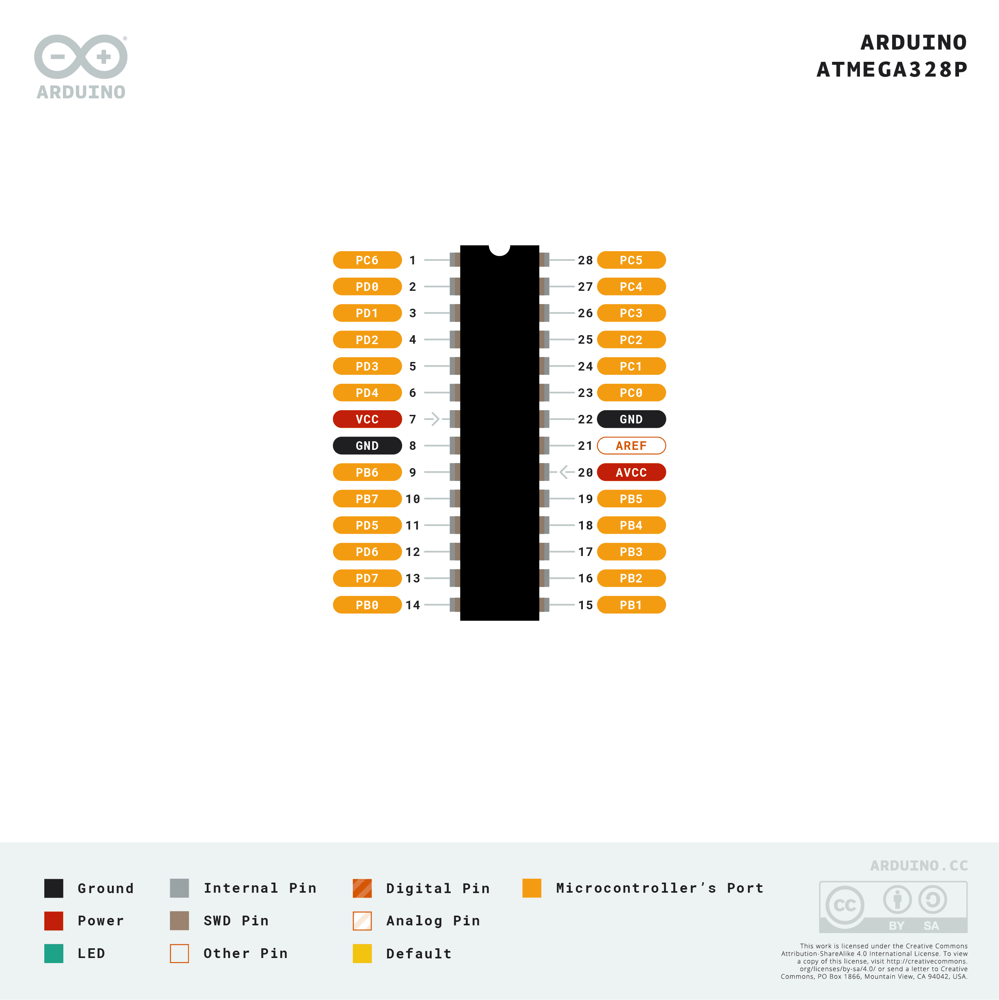

## Pin Mapping

## Files

-[ATMEGA328P Pinmapping PDF](https://content.arduino.cc/assets/Pinout-Atmega328p_latest.pdf?_gl=1*1wi129j*_ga*MTM0NzExNzAwOC4xNTg2MTYwMzQ4*_ga_NEXN8H46L5*MTYzNzMxNzEyMy4xMi4xLjE2MzczMTc5NDguMA..)
-[ATMEGA 328P Fritzing file](https://content.arduino.cc/assets/atmega328.fzpz?_gl=1*f7y47x*_ga*MTM0NzExNzAwOC4xNTg2MTYwMzQ4*_ga_NEXN8H46L5*MTYzNzMxNzEyMy4xMi4xLjE2MzczMTgwNjMuMA..)
-[Datasheet](https://content.arduino.cc/assets/ATmega328P_Datasheet.pdf?_gl=1*f7y47x*_ga*MTM0NzExNzAwOC4xNTg2MTYwMzQ4*_ga_NEXN8H46L5*MTYzNzMxNzEyMy4xMi4xLjE2MzczMTgwNjMuMA..)