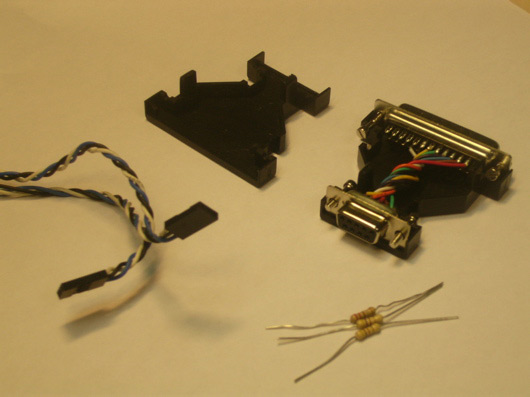

Instructions for building a parallel port programmer for the Arduino board (or any other Atmega8 chip). Allows you to program the board on Windows without any additional equipment. Cheap and fun. (Please note, however, that this doesn't allow for communication between the computer and programs running on the board. You'll need a serial cable for that.)

## Equipment
Tools:

- Soldering iron
- Hot glue gun (optional)

You'll need (parts):

- (2x) 470 ohm resistor (yellow-purple-brown)
- (1x) 220 ohm resistor (red-red-brown)
- (1x) parallel port cable or parallel-to-serial adapter
- (2x) three wire cables with female connectors on one end, unattached wires on the other

## Instructions
Remove any existing wires from the parallel connector.

Solder 470 ohm resistors to pins 1 and 2 of the parallel connector.

*Parallel connector with a 470 ohm resistor soldered to pin 1.* 

Solder a 220 ohm resistor to pin 11 of the connector.

Solder, in order, the three wires of one of the cables to the resistor on pin 11 (which goes to pin 18 on the Atmega8), to the resistor on pin 1 (which goes to pin 19 on the Atmega8), and directly to pin 16 (which goes to the reset, pin 1).

*Parallel connector with two of the three wires of a cable soldered to pins 11 and 1, respectively.*

Solder the middle wire of the second cable to the resistor on pin 2 (which goes to pin 17 on the Atmega8), and one of the other wires to pin 18 (which goes to ground). (The third wire is not used and may be cut short).

*Parallel connector with both cables soldered in place.*

Connect the ends of the two cables so that, when viewed from the connector end, the unused wire is to the upper left and the wire to pin 11 is to the upper right (this is considered pin 1 of the connector and should be matched with the pin 1 indicated on the Arduino board).

Hot glue the wires inside the case of the parallel-to-serial adapter, making sure that any uninsulated wires are kept apart. Or, if not using an adapter, wrap the exposed wires with electrical tape to keep them from touching.

Once the glue dries, reclose the case of the parallel-to-serial adapter.

## Software
You'll need to download [giveio](https://github.com/heise/GRBLMILL/tree/master/GRBL/giveio).

See the [bootloader page](/hacking/software/Bootloader) for details on using your new parallel port programmer to burn the bootloader onto the Arduino board.

Or, if you're programming using uisp directly, you can use a command line like:

uisp -dprog=dapa -dpart=ATmega8 if=prog.hex -dlpt=0x378 --erase --upload

@author: David A. Mellis IDII (with thanks to Erez Kikin-Gil for building one too and to Massimo Banzi for the request and the instructions)

@revised by: Marcos Yarza K3