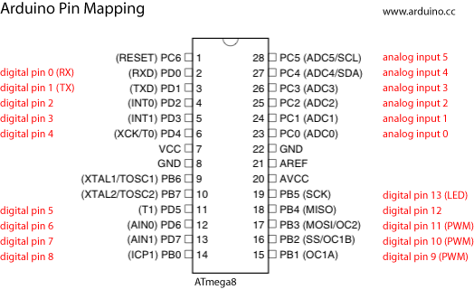

Below is the pin mapping for the Atmega8, the original chip used in early Arduinos. The [pin mapping for the Atmega168 and the 328P](http://arduino.cc/en/Hacking/PinMapping168?_gl=1*1okdvzs*_ga*NzAzNDc5MjcwLjE2MzM1MTExNTc.*_ga_NEXN8H46L5*MTYzNjcxMTcxMy4yOC4xLjE2MzY3MTQ5NjAuMA..) is roughly the same.

