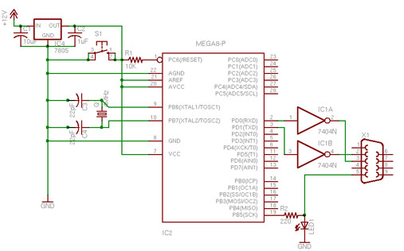

Here's a pictorial view of a standalone Arduino system on a breadboard. This version basically duplicates the Arduino serial model, with a slight change. You can see from the schematic that a few components have been removed, and a new one has been added. The 7404N hex inverter replaces the RX and TX transistor assemblies on the serial board. It's just a convenient way to invert the serial signal from a the programming computer to the ATMega8.

You'll need a chart to know the Arduino pin numbers of the ATmega8 pins. Here's one.

> note: programming header not included in schematic

> NOTE: there are 3 mistakes in the schematic: pin 1 and 2 of the 7404 (IC1) must be swapped / S1 (the reset switch) is connected between GND and pin 1 of IC2 (the atmega8) / pin 5 of X1 (serial connector) is connected to ground.

Here's a part list for this board:

| Part | Value     | Description                     | Digikey Part No.  | Unit Cost $USD |
| ---- | --------- | ------------------------------- | ----------------- | -------------- |
| C1   | 10uF      | 10UF 50V MINI ALUM ELECT (KA)   | P828-ND           | 0.16           |
| C2   | 1uF       | 1.0UF 50V MINI ALUM ELECT (KA)  | P824-ND           | 0.14           |
| C3   | 22pF      | CAP 22PF 200V 5% CER RADIAL     | 399-1926-ND       | 0.11           |
| C4   | 22pF      | CAP 22PF 200V 5% CER RADIAL     | 399-1926-ND       | 0.11           |
| IC   | MEGA168-P | IC AVR MCU 16K 20MHZ 28DIP      | ATMEGA168-20PU-ND | 4.11           |
| IC   | 7805      | IC REG 1A POS 0-125DEG C TO-220 | LM7805CT-ND       | 0.45           |
| LED1 |           | LED 3MM GREEN CLEAR             | 160-1144-ND       | 0.19           |
| Q1   | 16MHz     | CRYSTAL 16.000 MHZ HC49/US      | 300-8499-ND       | 0.63           |
| R1   | 10K       | RES 10K OHM 1/4W 5% CARBON FILM | 10KQBK-ND         | 0.06           |
| R2   | 220       | RES 220 OHM 1/4W 5% CARBON FILM | 220QBK-ND         | 0.06           |
| S1   |           | SWITCH TACT 6MM MOM 100GF       | SW400-ND          | 0.28           |
| X1   |           | CONN D-SUB RECPT 9POS AU FLASH  | A32510-ND         | 3.06           |

A few extra parts for bootloader programming:

| Qty. | Desc.                            | Digikey Part No. | Unit Cost $USD |
| ---- | -------------------------------- | ---------------- | -------------- |
| 1    | PROGRAMMER AVR IN SYSTEM         | ATAVRISP2-ND     | 34.00          |
| 1    | CONN HEADER RT/A 10POS .100 TIN  | A1920-ND         | 0.83           |
| 1    | CONN HEADR BRKWAY .100 20POS STR | A26509-20-ND     | 1.00           |

You will need an Atmel programmer to put the bootloader on your microcontroller, initially. In the board pictured below, space is left above the microcontroller to attach the programming cable.

I made a programming header connector to connect to an AVRISP programmer by soldering right-angle header pins to straight header pins. The cable attaches facing to the right of the board.

 
To program the bootloader, you'll need the bootloader files. In Arduino-0001, bootloading is not built into the interface, so you'll need to do a little extra work.

## Bootloader

Once the chip is bootloaded, you're ready to connect it to the Arduino software. To simplify the board, I removed the programming header and connecting wires and added a reset button in the space above the microcontroller. Here's the resulting board. This is accurate to the schematic, except for the 220-ohm resistor on the LED.

The serial connector's connection to ground is hidden under the connector itself in the photo above, so here's the same photo without the connector, to reveal the wires:

The serial connector is soldered to some straight headers so it can fit into the board like so:

Connect a serial cable to your computer, a 9-15V DC power supply to the board, and you're ready to program.