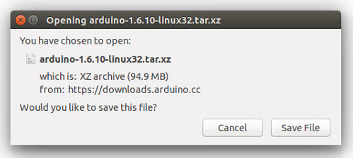
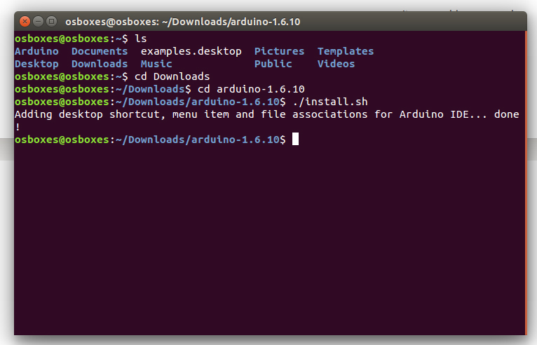

This document explains how to install the Arduino Software (IDE) on Linux machines.

## Quick Start

The Linux build of the Arduino Software (IDE) comes in different packages depending on your system architecture. There are no specific instructions needed for the different distributions of Linux (e.g. Ubuntu).

### Download the Arduino Software (IDE)

Get the latest version from the [download page](https://www.arduino.cc/en/Main/Software). You can choose between the 32, 64 and ARM versions. It is very important that you choose the right version for your Linux distro. Clicking on the chosen version brings you to the donation page and then you can either open or save the file. Please save it on your computer.



### Extract the package

The file is compressed and you have to extract it in a suitable folder, remembering that it will be executed from there.


### Run the Install Script

Open the **arduino-1.x.x** folder just created by the extraction process and spot the **install.sh** file. Right click on it and choose **Run in Terminal** from the contextual menu. The installation process will quickly end and you should find a new icon on your desktop.

If you don't find the option to run the script from the contextual menu, you have to open a Terminal window and move into the **arduino-1.x.x** root directory and run the following command:

```
sudo sh install.sh
```
***This method only works for versions greater or equal than 1.6.5.  Remove `sudo` keyword if already running the terminal with administrative rights.***


You should find a new icon on your desktop.



## Please Read

It might happen that when you upload a sketch - after you have selected your board and the serial port -, you get an error _Error opening serial port ..._
If you get this error, you need to set serial port permission.

Open Terminal and type:

`ls -l /dev/ttyACM*`

you will get something like:

`crw-rw---- 1 root dialout 188, 0 5 apr 23.01 ttyACM0`

The "0" at the end of ACM might be a different number, or multiple entries might be returned. The data we need is "dialout" (is the group owner of the file).

Now we just need to add our user to the group:

`sudo usermod -a -G dialout <username>`

where `<username>` is your Linux user name. **You will need to log out and log in again for this change to take effect.**


This is the procedure to access the serial port from the Arduino Software (IDE) if you get an error

After this procedure, you should be able to proceed normally and upload the sketch to your board or use the Serial Monitor.

The text of the Arduino getting started guide is licensed under a
[Creative Commons Attribution-ShareAlike 3.0 License](http://creativecommons.org/licenses/by-sa/3.0/). Code samples in the guide are released into the public domain.
