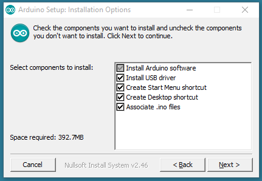
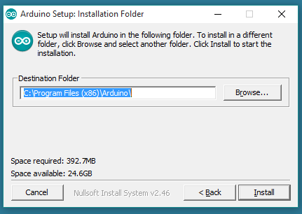

This document explains how to install the Arduino Software (IDE) on Windows machines.

## Download the Arduino Software (IDE)

Get the latest version from the [download page](https://www.arduino.cc/en/Main/Software). You can choose between the Installer (.exe) and the Zip packages. We suggest you use the first one that installs directly everything you need to use the Arduino Software (IDE), including the drivers. With the Zip package you need to install the drivers manually. The Zip file is also useful if you want to create a [portable installation](https://arduino.cc/en/Guide/PortableIDE).

When the download finishes, proceed with the installation and please allow the driver installation process when you get a warning from the operating system.

The process will extract and install all the required files to execute properly the Arduino Software (IDE)

The text of the Arduino getting started guide is licensed under a
[Creative Commons Attribution-ShareAlike 3.0 License](http://creativecommons.org/licenses/by-sa/3.0/). Code samples in the guide are released into the public domain.
