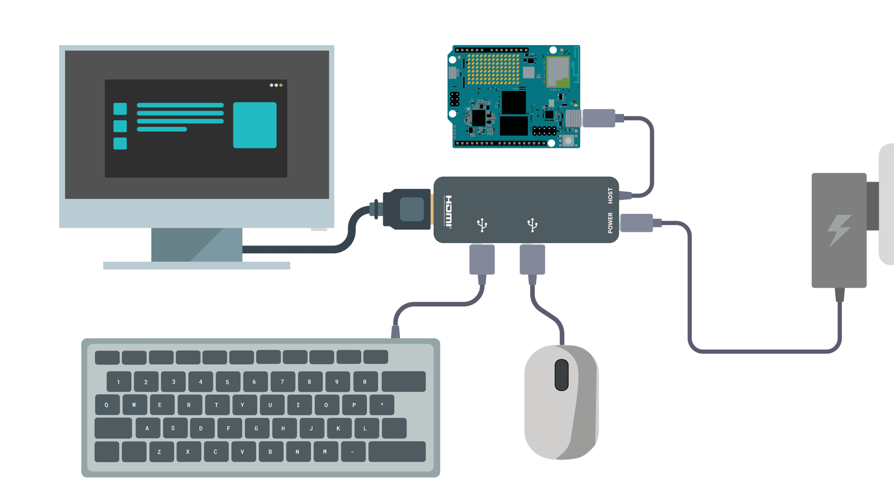

Compatible Arduino boards can operate as a **Single-Board Computer (SBC)** running a full Linux environment. In this mode, the board functions like a desktop computer, and you develop directly on the board without needing a separate host PC.

Because these boards run a standard Linux OS, they support a wide range of I/O configurations. You can connect peripherals via USB hubs, use monitors with built-in docking capabilities, or pair wireless accessories once the system is configured.

<Alert type="note">**Important:** To ensure smooth performance in Standalone Mode, use a board with at least 4 GB of RAM.</Alert>

## Setup in Single-Board Computer Mode

1. [Connect power, display, and input devices](#connect-power-display-and-input-devices)
1. [Boot into Linux](#boot-into-linux)
1. [Get Started with Arduino App Lab](../../getting-started/quickstart/)

## Connect power, display, and input devices

For the most reliable experience during initial setup and configuration, we recommend using a USB-C hub to connect a display and a wired USB mouse and keyboard. Once the system is configured, you can connect Bluetooth peripherals as needed.

### What You'll Need

- **Display:** Any monitor or TV with HDMI, DisplayPort, or USB-C input.
- **Input devices (USB):** A keyboard and mouse that can be connected to a USB port.
- **USB-C multiport hub:** A hub that connects to the board's USB-C port and includes ports for both your display and input devices.
- **Power supply:** The hub must be powered externally (USB-C or a standalone power supply).

### Setup Instructions

1. **Connect display and inputs to the hub:** Plug your monitor, keyboard, and mouse into the USB-C hub.
2. **Connect your board to the hub:** Your board should be connected to the hub as the host PC. Many "dongle"-style hubs have a built-in cable for this. If yours does not have a cable, look for a port with a computer icon, or check the documentation for your hub.
3. **Connect power:** Connect your power supply to the **PD (Power Delivery) port** on the hub, or use a dedicated power supply (if included with your hub).

<Alert type="warning">**Compatibility Note:** Most standard USB-C hubs work correctly, but **Apple USB-C Digital AV Multiport Adapters** are often incompatible with these boards and should be avoided for Standalone Mode.</Alert>

## Boot Into Linux

1. When booting into Linux for the first time, you'll be prompted to set a new password for the default **arduino** user account.
1. _Board Configuration._ Select a keyboard layout and set a name for your board.
1. _Network Setup._ Select an available wireless network (recommended) or choose **Skip** to configure later.
1. _Linux credentials._ Set a password for the **arduino** user account. You can use the same password you entered at boot, or change it by entering a different one.

If you connect to the Internet, Arduino App Lab may prompt you to install any available software updates. These updates are recommended, but can be skipped using the **Skip** button.

## Next Steps

- [Getting Started with Arduino App Lab](/software/app-lab/getting-started/quickstart/)

## Alternative Configurations

Once you are comfortable with the basic setup, you can explore other ways to connect your hardware.

### Direct USB-C Video

If you have a monitor that supports **USB-C Video (DisplayPort Alt Mode)** and features a built-in USB hub, you can connect the board directly to the monitor with a single USB-C cable. The monitor will provide video, data for peripherals, and often power to the board.

### Using Bluetooth Peripherals

While the board supports Bluetooth keyboards and mice, they require an initial setup using a wired connection.

1. Boot the board using a wired USB mouse.
2. Open the Linux Bluetooth settings and pair your wireless devices.
3. Once paired, they will reconnect automatically on future boots.
