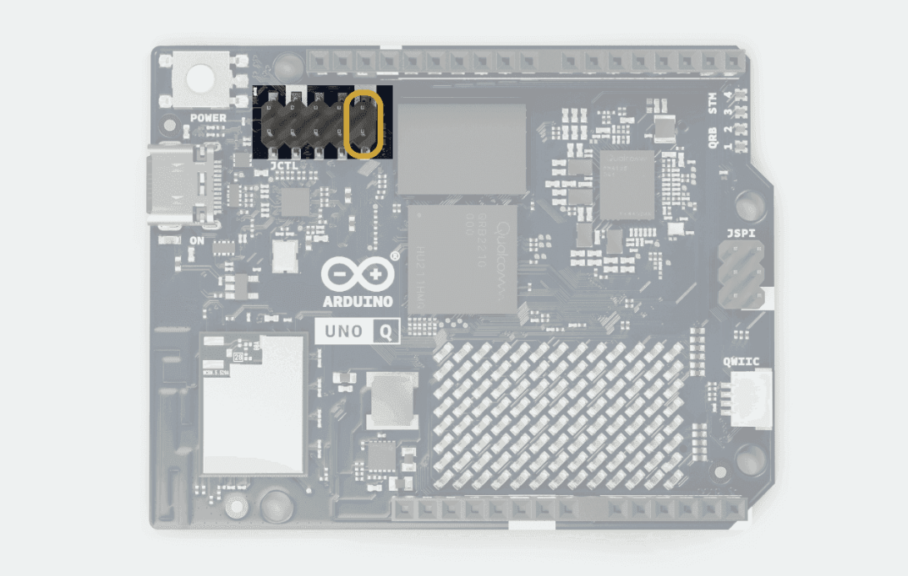

Flashing a new Linux image to your Arduino board allows you to install a fresh operating system, recover from system corruption, or switch between different supported Linux distributions. This process replaces the entire Linux OS and all stored data on the board.

There are two primary methods for flashing your board:

1. **Built-in Flasher in App Lab:** Use this method for boards already connected and recognized by App Lab.
2. **Arduino Flasher CLI:** A standalone command-line tool for recovering boards that cannot be reached via App Lab or for performing a low-level hardware reset.

## Use the Built-in Flasher in App Lab

If your Arduino UNO Q board is already discovered by Arduino App Lab, you can initiate a flash directly from the interface.

1. Open **Arduino App Lab** and ensure your board is connected.
2. Select **Settings** (gear icon) from the left sidebar.
3. Scroll down to the **Operating system** section.
4. Select the **Flash Board** button.
5. In the flashing dialog, check **Preserve user data during the board flashing process** if you want to keep the `userdata` partition (mounted at `/home/arduino`).
6. Follow the on-screen instructions to download the latest image and complete the flashing process.

   <Alert type="info">**Note:** The interface will guide you through putting the board into **Emergency Download Mode (EDL)**. For more details on this process, see [Set your board to EDL mode](#step-1-set-your-board-to-edl-mode).</Alert>

## Use the Arduino Flasher CLI

If you encounter errors that prevent the board from appearing in Arduino App Lab, or prefer using a command-line tool, use the **Arduino Flasher CLI**.

### Step 1: Set your board to EDL mode

To use the CLI tool, put the board into **Emergency Download Mode (EDL)**.

<Alert type="note">**Important:** Short the EDL pins **before** connecting the board to your computer. Failure to do so causes the flasher tool to hang indefinitely with a "Waiting for EDL device" message.</Alert>

1. Disconnect the Arduino UNO Q from your computer.
2. Locate the two **EDL pins** on the board.
   
3. Short these two pins together using a female-to-female jumper cable or a jumper cap.

   <Alert type="info">**Note:** If you do not have a jumper cable or cap, use a thin metal object like a wire, clip, or coin—take care not to bend the pins.</Alert>

4. With the jumper in place, connect the Arduino UNO Q to your computer using a USB-C cable.

<Alert type="success">**Tip:** After connecting the board, you can remove the short from the pins. Your board remains in EDL mode until you restart it without the EDL pins shorted. </Alert>

### Step 2: Download and Prepare the Tool

1. Open the [Arduino Software](https://www.arduino.cc/en/software/#flasher-tool) page and locate the **Arduino Flasher CLI** section.
2. Download the version corresponding to your operating system.
   <Alert type="note">**Important:** For macOS, ensure you select the correct architecture for your Mac (**Apple Silicon** for M1/M2/M3 chips or **Intel 64-bit** for older models).</Alert>
3. Extract the downloaded file.
   <Alert type="success">**Tip (macOS):** Right-click the ZIP file and select **Open With > Archive Utility**. This ensures the tool retains the necessary execution permissions.</Alert>
4. Open a terminal or command prompt and navigate to the extracted directory.

### Step 3: Flash the Image

1. Execute the following command to download and flash the latest OS image:

   **macOS / Linux:**

   ```bash
   ./arduino-flasher-cli flash latest
   ```

   **Windows:**

   ```powershell
   arduino-flasher-cli.exe flash latest
   ```

   <Alert type="success">**Tip:** To keep your stored data and configurations (the `userdata` partition mounted at `/home/arduino`), add the `--preserve-user` flag to the command.</Alert>

2. When the tool asks `Do you want to download it? (yes/no)`, type `y` and press **Enter**.
3. The tool downloads an image (approx. 1 GB), extracts it, and flashes the board. This process can take several minutes.

### Step 4: Finalize and Reboot

1. Once the tool reports a successful flash, unplug the board from your computer.
2. Remove the short from the EDL pins if they are still connected.
3. Re-connect the USB-C cable to your computer to boot the new Linux OS.

## Troubleshooting

### Waiting for EDL device

If the Flasher tool hangs at a `Waiting for EDL device` message, the board is not correctly in EDL mode. Unplug the board, ensure the jumper cable securely shorts the EDL pins, and then reconnect the USB cable.

### USB Write Failed / Communication Errors

If you encounter communication errors during flashing, try the following:

- Connect the board directly to a native USB port on your computer instead of using a USB hub or docking station.
- Use a different USB-C cable.

### "No space left on device"

Flashing requires significant temporary disk space (approx. 8 GB). If your system's default temporary partition is too small, use the `--temp-dir` flag to specify a different directory for extraction:

**macOS / Linux:**

```bash
./arduino-flasher-cli flash latest --temp-dir /path/to/larger/disk
```

**Windows:**

```powershell
arduino-flasher-cli.exe flash latest --temp-dir D:\path\to\larger\disk
```