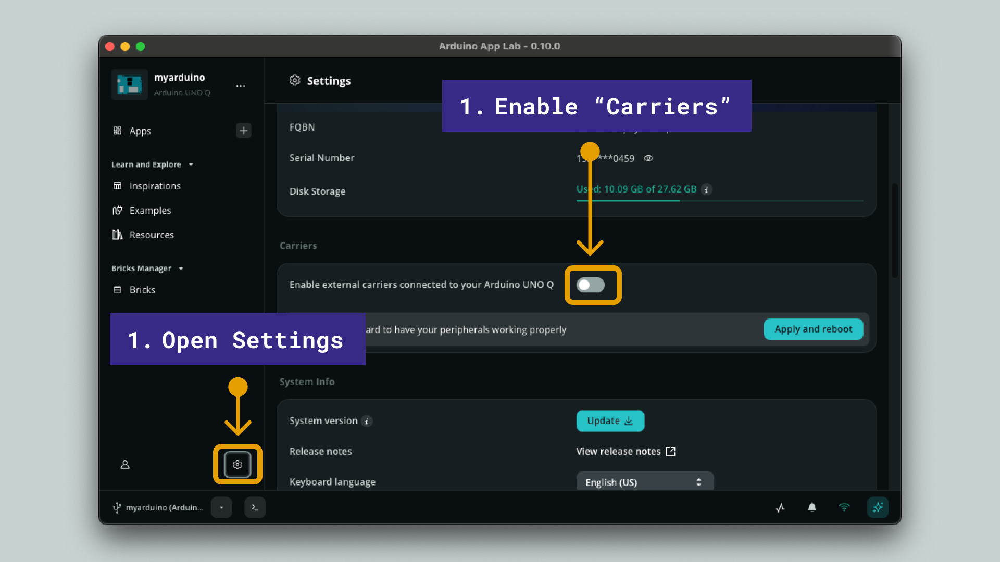
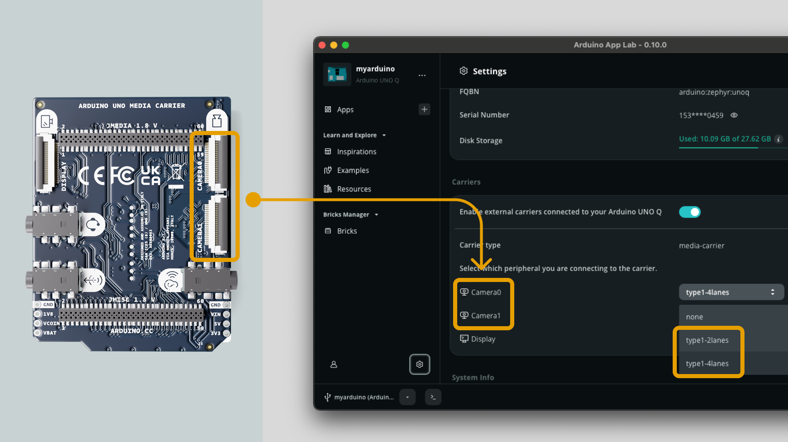

The **Arduino® UNO Media Carrier** provides two 22-pin MIPI-CSI connectors (CAMERA0 and CAMERA1) for attaching IMX219-based cameras, such as the Raspberry Pi Camera Module 2. Cameras must be connected to the carrier while the UNO Q is unpowered.

<Alert type="info">

Only IMX219-based cameras are supported at this time.

</Alert>

## Enable Carrier Mode

In the Arduino App Lab **Settings**, enable the **Media Carrier** under the **Carriers** section.

## Select Camera and Port

1. Select the camera port that is being used (CAMERA0 and/or CAMERA1)
2. Select the type of camera (1-2 lanes or 1-4 lanes).
3. Click **Apply and Reboot** to apply changes. This will reboot your board.

After rebooting, the camera is available to the Linux OS. Any App Lab example that uses camera input, such as the Object Detection example, will now use the camera connected via the Media Carrier's MIPI-CSI port instead.
