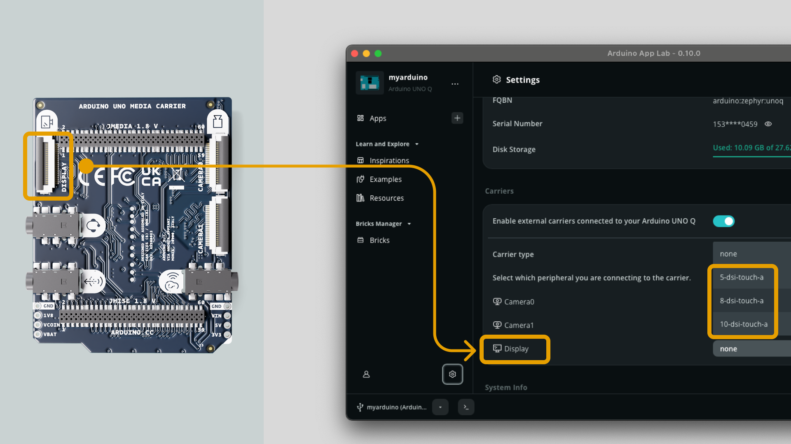

The **Arduino® UNO Media Carrier** provides a 22-pin MIPI-DSI connector (DISPLAY) for attaching touch displays. The display must be connected to the carrier while the UNO Q is unpowered.

<Alert type="info">

The supported displays are the Waveshare 5", 7", and 10" DSI touch displays.

</Alert>

## Enable Carrier Mode

In the Arduino App Lab **Settings**, enable the **Media Carrier** under the **Carriers** section.

## Select Display

1. Select the display size that matches your connected display (5", 7", 10" supported).
2. Click **Apply and Reboot** to apply changes. This will reboot your board.

After rebooting, the display is active and the desktop environment will render on it. Touch input is available immediately without additional configuration.

## Further Reading

- [UNO Media Carrier Hardware Page](https://docs.arduino.cc/hardware/uno-media-carrier/)
- [UNO Media Carrier User Manual](https://docs.arduino.cc/tutorials/uno-media-carrier/user-manual/)