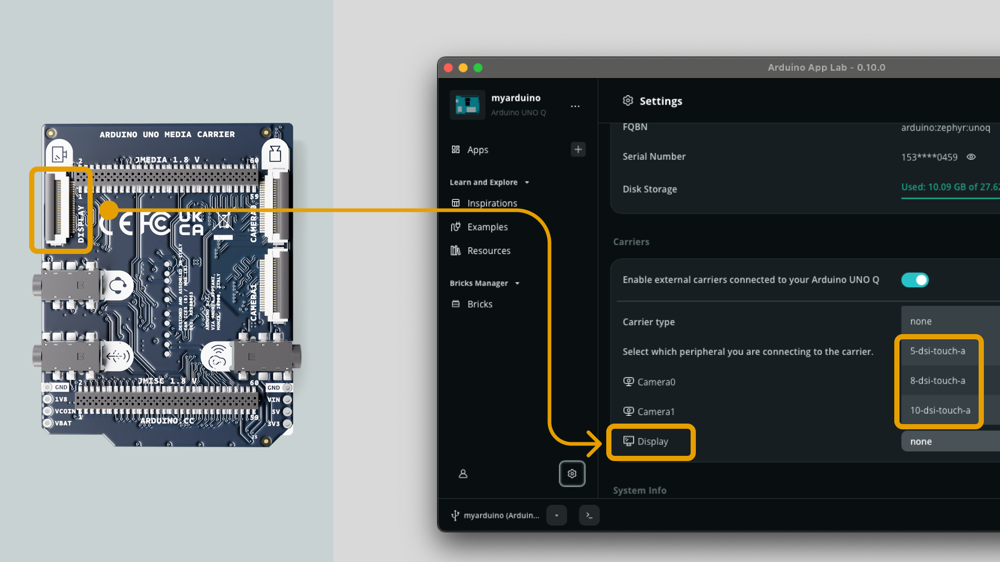

The **Arduino® UNO Media Carrier** provides a 22-pin MIPI-DSI connector (DISPLAY) for attaching touch displays. The display must be connected to the carrier while the UNO Q is unpowered.

The supported displays are the Waveshare DSI Touch "A" series:

| Preset Setting | Display Model | Specifications |
| :--- | :--- | :--- |
| `5-dsi-touch-a` | [Waveshare 5″ DSI LCD (A)](https://www.waveshare.com/5-dsi-touch-a.htm) | 800×480 resolution, capacitive touch |
| `8-dsi-touch-a` | [Waveshare 8″ DSI LCD (A)](https://www.waveshare.com/8-dsi-touch-a.htm) | 1280×800 IPS, capacitive touch |
| `10-dsi-touch-a` | [Waveshare 10.1″ DSI LCD (A)](https://www.waveshare.com/10.1-dsi-touch-a.htm) | 1280×800 IPS, capacitive touch |

## Enable Carrier Mode

In the Arduino App Lab **Settings**, enable the **Media Carrier** under the **Carriers** section.

## Select Display

1. Select the display size that matches your connected display (5", 8", 10" supported).
2. Click **Apply and Reboot** to apply changes. This will reboot your board.

After rebooting, the display is active and the desktop environment will render on it. Touch input is available immediately without additional configuration.

## How Carrier Configuration Works

MIPI-DSI displays do not support plug-and-play detection, so the Linux kernel must be told explicitly what hardware is attached. When you select a display size and click **Apply and Reboot**, App Lab stages a Device Tree Overlay (`.dtbo`) that is merged onto the board's base device tree. The Qualcomm kernel reads the device tree only once at startup to configure the display drivers, which is why a full reboot is required for any change to take effect.

<Alert type="info">

These settings apply to the **UNO Q** used with the UNO Media Carrier. The **VENTUNO Q** instead provides a native HDMI port that handles EDID autodiscovery, so no configuration or reboot is required and the display does not appear in the **Carriers** settings.

</Alert>

## Further Reading

- [UNO Media Carrier Hardware Page](https://docs.arduino.cc/hardware/uno-media-carrier/)
- [UNO Media Carrier User Manual](https://docs.arduino.cc/tutorials/uno-media-carrier/user-manual/)
