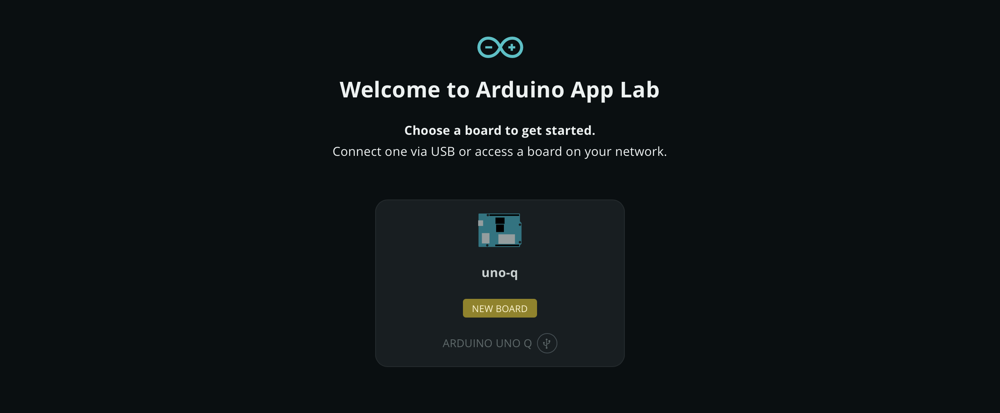
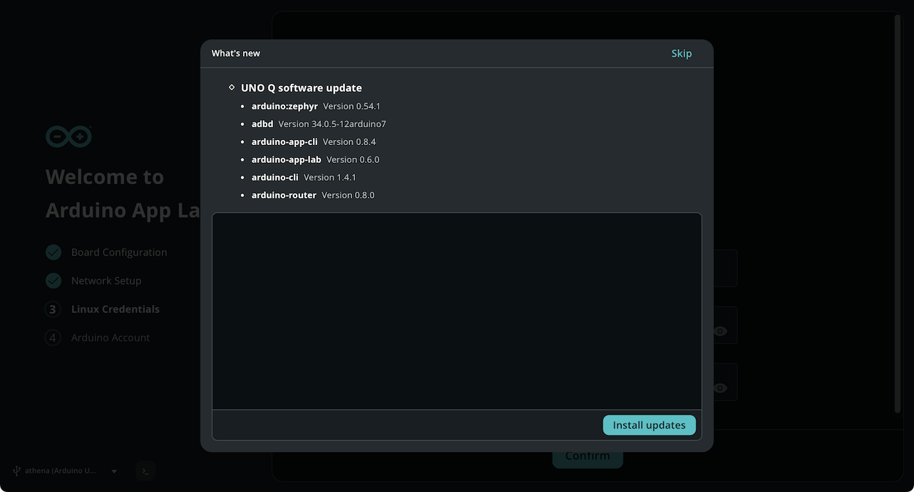

Once your Arduino UNO Q is connected to your computer and Arduino App Lab is running, you must complete a one-time configuration process. This setup prepares your board for advanced features like Network Mode deployment and remote access via SSH.

## Prerequisites

* [Setup Arduino App Lab](../../1.setup/1.overview/)

## 1. Board Selection

   <Alert type="info">**Note:** Skip this step if you are running Arduino App Lab in [Single Board Computer mode](../5.standalone/standalone.md).</Alert>

1. Connect your board to your computer using a USB-C cable.
1. Wait for the board to boot (this may take up to 60 seconds).
1. If prompted by your system, allow the board to connect to your computer.
1. Detected boards will appear in Arduino App Lab. Depending on the board configuration, they may have one or more connection options:
   * **USB:** Indicated by a USB icon next to the board model.
   * **Network:** Indicated by a WiFi icon next to the board model.
   
1. Select a board to connect to it.

## 2. Board Configuration

A setup wizard will automatically launch if the board has not been configured, is missing network working network credentials, or requires a Linux password.

Follow these steps to complete the setup:

1. **Board Configuration:**
   * _Keyboard Layout._ Choose your preferred keyboard layout. This is essential if you plan to use the board in Standalone (SBC) mode with a physical keyboard.
   * _Board Name._ Assign a unique name to your UNO Q. This name will identify your board in the App Lab interface and on your local network (e.g., `my-uno-q.local`).
   
1. **Network Setup:** Select your local Wi-Fi network and enter the password. An internet connection is required for downloading "Bricks" and system updates. When your board connects to the Internet, it will automatically check for software updates.
1. **Set Linux Password:** Create a custom password for the default `arduino` user account.
   <Alert type="warning">**Important:** The Linux password is required for Network Mode, SSH access, and logging into the Debian desktop in SBC mode. Ensure you save it securely.</Alert>
1. **Arduino Account:** Sign in with your Arduino account to enable additional features. If Arduino App Lab does not prompt you to sign in, you can do this later from the **Account** tab in the sidebar.

## 3. Manage Software Updates

Arduino App Lab automatically manages the software ecosystem on your board to ensure you have the latest features, security patches, and performance improvements.

If updates are available, Arduino App Lab will ask if you want to install the available updates. Select **Install** to download and install the updates, or **Skip** if you don't want to update the board.

<Alert type="info">**Note:** An active internet connection is required for the board to download update packages.</Alert>

## Next Steps

* [Get Started with Arduino App Lab](../../2.getting-started/1.quickstart/quickstart.md)
